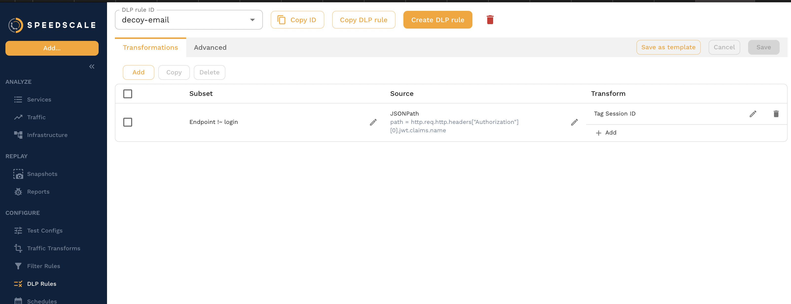

Speedscale can be configured to redact sensitive data and personally indentifiable information (PII) from
traffic via it's data loss preventiion (DLP) features. This redaction happens _before_ data leaves your
network, preventing Speedscale from seeing the data at all. However, the overall shape or structure of the
data is retained in order to facilitate useful testing against systems.

:::caution Note
Speedscale's DLP engine is focused mostly on HTTP traffic at this time. If you find that this is inadequate
for your needs, get in touch with us on the [community Slack](https://slack.speedscale.com) to discuss your
specific requirements.
:::

## Prerequisites

To follow the guide below, you will need:

1. [speedctl](/setup/install/cli)
2. An [installed Speedscale Operator](../quick-start.md).
3. An [active sidecar capturing traffic](/setup/sidecar/install/)


## How It Works

Speedscale's DLP engine orks by inspecting key/value elements in recorded traffic, removing the value from
keys considered to be sensitive and instead replacing it with a placeholder string `-REDACTED-`. This
redaction only applies to data that can be coerced as a string value; numerics, booleans, etc. are not
supported at this time.

The built-in standard behavior operates exclusively on HTTP traffic, inspecting and redacting data in the
following locations:

 * HTTP headers
 * HTTP query paramaters
 * HTTP URIs
 * HTTP forms
 * HTTP JSON bodies

To see the keys that are redacted by default, you may view the Speedscale-maintained `standard` DLP
configuration in the main [UI](https://app.speedscale.com/dlpConfig/standard). Or via the command line using
`speedctl`:

```shell
speedctl get dlp-config standard
```


## Enabling

DLP features are **NOT** enabled by default and must be turned on and configured to match your specific needs.
Use the following `speedctl` command, which will apply configuration to your operator installation that enable
DLP features:

```shell
speedctl infra dlp enable
```

The above command is interactive and will present you with the option to select a specific installation
connected to your Speedscale account.

### Enabling at Install Time

If you are installing the Speedscale operator via the Helm chart, it is possible to enable DLP at install
time. When running `helm install`, use the following additional argument to the command:

```
--set dlp.enabled=true
```

Alternatively, edit the helm chart `values.yaml` file to set the following:

```yaml
dlp:
    enabled: true

    # Optionally: specify the DLP configuration to use
    config: "standard"
```

### Enabling Manually

:::caution Note
Manually enabling DLP as described below requires access and permissions to edit ConfigMaps in your kubernetes
cluster.
:::

Using `speedctl` as previously shown is the recommended method for enabling DLP. However, it is still possible
to enable DLP manually. In the `speedscale-operator` ConfigMap located in the `speedscale` namespace, set the
key `WITH_DLP: "true"`:

```shell
kubectl patch -n speedscale configmap speedscale-operator -p '{"data":{"WITH_DLP":"true"}}'
```

After patching the ConfigMap, the operator must be restarted in order to receive the change:

```shell
kubectl rollout restart deployment speedscale-operator -n speedscale
```


## Configuring

DLP configurations consist of a set of redaction rules or instructions that will be applied to specific fields
or attributes of recorded traffic. Each configuration follows the same structure:

```json
{
  "id": "my-custom-dlp-config",
  "redactlist": {
    "entries": {}
  }
}
```

The `entries` key contains a mapping of protocol to a list of rules to be applied only for that protocol. For
example, a configuration that redacts the values for HTTP headers `Authorization` and `X-Auth-Token`:

```json
{
  "id": "my-custom-dlp-config",
  "redactlist": {
    "entries": {
      "http": [
        "authorization",
        "x-auth-token"
      ]
    }
  }
}
```

To create a new DLP configuration, navigate to the `DLP Rules` section listed on the UI sidebar (shown below).


From this screen, you will be presented with a simple editor that allows you to view existing configurations,
make copies, or create new ones.



Alternatively, if you prefer to create or edit DLP configuration in your own editor, you can use `speedctl` to
manage obtaining and uploading them:

```shell
# download
speedctl get dlp-config my-config > my-config.json

# upload
speedctl put dlp-config my-config.json
```

### Configuration Caveats

Some redaction behavior for HTTP could differ from your expectations, particularly with JSON data, where
blocked keys will have values that are complex data types like a JSON array or object. In these cases, the
number of entries and the sub-keys will remain, but each value will be set to `-REDACTED-`.

For example, with a nested JSON object:

```json
{
  "token": [
    {"key": "value"},
    {"key2": "value2"},
    {"key3": "value3"}
  ]
}
```

A configuration setting to redact `token` will result in the following:

```json
{
    "token": [
        {"key": "-REDACTED-"},
        {"key2": "-REDACTED-"},
        {"key3": "-REDACTED-"}
    ]
}
```

Similarly, an array or list value behaves the same way:

```json
{
  "unredacted": "value",
  "country": {
    "list": [
      "US",
      "CA",
      "GB",
      "JP
    ]
  }
}
```

Configuring `list` to be redacted:

```json
{
  "unredacted": "value",
  "country": {
    "list": [
      "-REDACTED-",
      "-REDACTED-",
      "-REDACTED-",
      "-REDACTED-"
    ]
  }
}
```

:::caution Note
Redacting individual or specific elements in an array or list is unsupported at this time.
:::


## Verifying

Recorded traffic is viewable directly from the Speedscale [traffic viewer](https://app.speedscale.com/analyze)
and can be used to verify if DLP configurations are working as expected.


Click on one of the rows in the traffic list to expand and view the request, response, and metadata associated
with the transaction. For example, the following transaction contains an `Authorization` header with a
potentially sensitive JWT bearer token as its value.


With DLP enabled and configured to redact the `Authorization` header, the recorded transaction will insted be
shown like the following:


Note, that it is still possible to manipulate redacted data during a replay using traffic
[transforms](../reference/transform-traffic/README.md). However, we may not want to ever capture or record
this data, or even let it leave your cluster, which is what DLP provides.


## DLP Cookbook

Other than the `standard` DLP configuration, which is relatively trivial, there are no predefined behaviors
configured since DLP policies are typically organization specific. The following are some configuration
examples of how DLP can be configured to fit your specific needs.

### Redact KMS Data

[Amazon KMS](https://aws.amazon.com/kms) provides keys that can be used to encrypt or digitally sign data. If
your application uses KMS directly, redacting potentially sensitive information in KMS requests and responses
may be desirable. The following DLP configuration will scrub both encrypted and decrypted data present in
observed KMS traffic (as well as any `Authorization` header):

```json
{
  "id": "kms-redaction",
  "redactlist": {
    "entries": {
      "all": [
        "authorization",
        "CiphertextBlob",
        "Plaintext"
      ]
    }
  }
}
```

Refer to the [KMS documentation](https://docs.aws.amazon.com/kms/index.html) for more information about data
that you may wish to have redacted.
