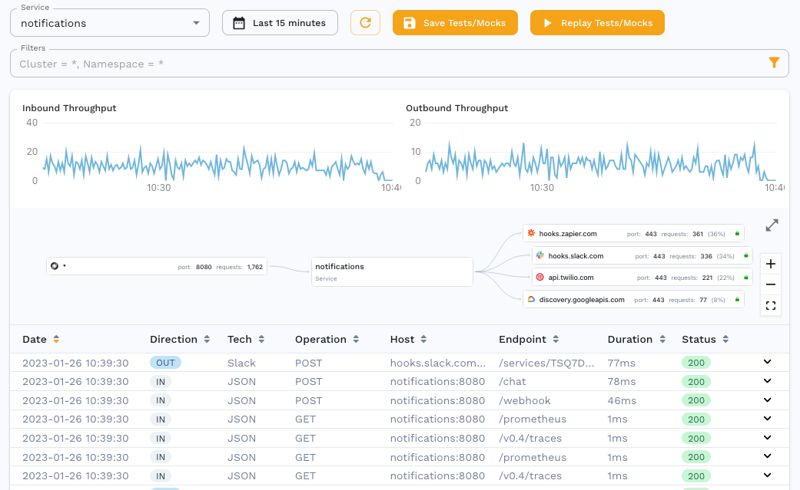

## Prerequisites
1. [The Operator is installed](../quick-start.md).
2. [A sidecar has been installed and traffic is being captured](../setup/sidecar/README.md)

## Viewing traffic



Since we are capturing traffic from our service, we can observe individual request data in the traffic viewer. When we drill down into requests, we can see that we are capturing some sensitive information such as an API key in the authorization header for a request to a third party.


Although we can manipulate this during a replay using [transforms](../reference/transform-traffic/README.md), we may not want to ever capture this data or let it leave the cluster. This is where [Data Loss Prevention](../reference/dlp.md) comes in. We can configure the Operator to redact this data.

## Configure Data Loss Prevention


Navigate to the DLP config section and select the standard config. Here you can see that the standard config comes with a default set of fields to redact such as `authorization`, `apikey`, `jwt` and so on. If you want to make a custom config, you can [create your own](../reference/dlp.md).


## Enable Data Loss Prevention

DLP is not enabled by default so you must configure it during or after installation. If you have installed via the Helm chart, you can see the corresponding values that need to be edited here:

```yaml
# Data Loss Prevention settings.
dlp:

    # Instructs operator to enable data loss prevention features
    enabled: false

    # Configuration for data loss prevention
    config: "standard"
```
Simply flip `enabled: true` and put in whichever config you want to use in the `config` field. If you installed the Operator via `speedctl`, you have to edit the `speedscale-operator` configmap in the `speedscale` namespace with `kubectl -n speedscale edit cm speedscale-operator`.

```yaml
apiVersion: v1
data:
  CLI_VERSION: v1.0.130
  CLUSTER_NAME: my-cluster
  DLP_CONFIG: standard
  IMAGE_PULL_POLICY: Always
  IMAGE_PULL_SECRETS: ""
  IMAGE_REGISTRY: gcr.io/speedscale
  IMAGE_TAG: v1.1.22
  INSTALL_SOURCE: deploy
  INSTANCE_ID: 27128055-eac3-4238-bc2c-4044e14cffbf
  LOG_LEVEL: info
  TELEMETRY_INTERVAL: 2s
  WITH_DLP: "false"
  WITH_INSPECTOR: "true"
kind: ConfigMap
```

Edit the fields `WITH_DLP` and `DLP_CONFIG` to the desired values and then make sure to restart the Operator in order for it to pick up on the new settings. This can be done via `kubectl -n speedscale delete pod -l app=speedscale-operator`.

## Confirm redaction


After making this change, we can see for the same request that the field has been redacted. This happens at the Operator level and not in our cloud sytem so the `Authorization` header value never left your cluster and was never seen by Speedscale.
