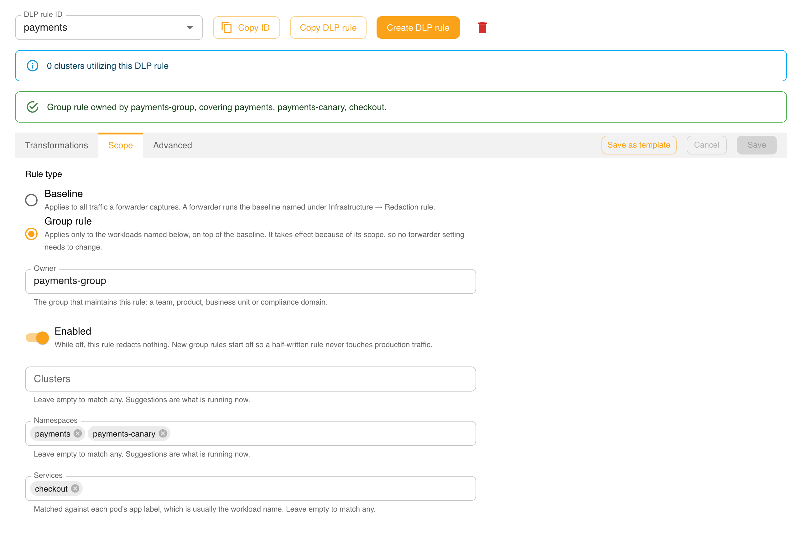
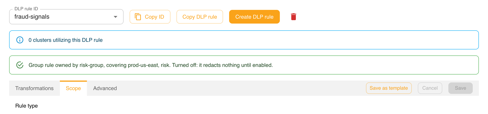
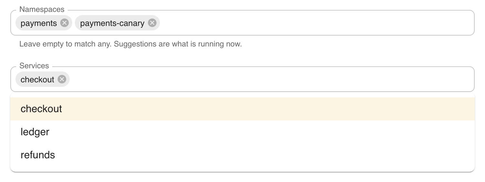

# Managing Group Rules in the Dashboard

The dashboard edits the DLP rules stored in Speedscale Cloud. Once a group rule is saved and enabled there, the
cloud combines it with the baseline and delivers it to every cluster it covers — nobody has to change a forwarder
setting.

This page is the how-to. For what a group rule is, how it relates to the baseline named by
`SPEEDSCALE_DLP_CONFIG`, and how rules combine, read [DLP Rules for Multiple Groups](./group-rules.md) first.
To author and test rules against local recordings, see
[Managing Group Rules in proxymock web](./group-rules-proxymock.md).

:::info Requirements
Editing DLP rules in the dashboard requires the **admin** role.
:::

## Find a rule

Open **DLP Rules** and pick a rule from **DLP rule ID**. Two banners sit above the editor.



- **The summary line** says what the rule is: a baseline that applies to all captured traffic, or a group rule with
  its owner and the workloads it covers.
- **The cluster-usage banner** counts the clusters whose forwarder names this rule in
  `SPEEDSCALE_DLP_CONFIG` — that is, the clusters using it as their **baseline**. A group rule is never named there,
  so it shows **0 clusters** even while it redacts traffic. That is expected; the summary line and its scope tell you
  where a group rule applies.

A group rule that is switched off says so in its summary line:



## Create a group rule

1. Click **Create DLP rule** and enter an id, for example `payments`.
2. Open the **Scope** tab and choose **Group rule** under **Rule type**. A rule switched to a group rule starts
   disabled, so it cannot touch production traffic while you are still writing it.
3. Fill in **Owner** with your group's name — a team, product, business unit or compliance domain.
4. Name the workloads the rule covers in **Clusters**, **Namespaces** and **Services**. A field you leave empty
   matches anything, but at least one must name something.
5. Add the fields to redact on the **Transformations** tab, or edit `redactlist` on the **Advanced** tab.
6. Turn on **Enabled** when you are ready, and click **Save**.

## The Scope tab

The **Scope** tab holds everything that makes a rule a group rule.

| Control | What it sets |
|---|---|
| **Rule type** | *Baseline* applies to all captured traffic. *Group rule* applies only to the workloads named below, on top of the baseline. |
| **Owner** | The `owner` field: which group maintains the rule. |
| **Enabled** | The `enabled` field. While off, the rule redacts nothing. |
| **Clusters**, **Namespaces**, **Services** | The rule's `scope`. Each accepts several values. |

### Suggestions come from what is running now

The scope fields suggest names from your live infrastructure — the same lists the **Infrastructure** pages show —
not from every name that has ever appeared in recorded traffic:

- **Clusters** suggests the connected clusters.
- **Namespaces** suggests the namespaces in the clusters the rule names, or in every connected cluster if it names
  none.
- **Services** suggests the workloads running in the namespaces the rule names. Name a namespace first to see them.



Every field also accepts a name that is not running yet, so you can scope a rule before a service is deployed. A
service is matched against each pod's `app` label, which is usually the workload name.

### Save is refused for an empty scope

A group rule whose scope names nothing is refused, with the message *Name at least one cluster, namespace or
service*. A rule that applies everywhere is what the baseline is for; an empty scope would redact every other group's
traffic. The check applies on the Advanced tab too, where Save looks at the JSON exactly as typed.

## Editing on the Advanced tab

The **Advanced** tab holds the whole rule as JSON, including `scope`, `owner` and `enabled`:

```json
{
  "id": "payments",
  "name": "payments group redaction",
  "owner": "payments-group",
  "enabled": true,
  "scope": {
    "namespaces": ["payments", "payments-canary"],
    "services": ["checkout"]
  },
  "redactlist": { "entries": { "all": ["cardnumber", "cvv"] } }
}
```

Edits carry over when you switch tabs: a change typed here shows up on the Scope and Transformations tabs, and the
other way round. If the JSON does not parse when you leave the tab, you are asked before it is discarded.

## Baseline rules

A rule whose **Rule type** is *Baseline* has no scope, owner or enabled switch. Whichever baseline a forwarder runs
is chosen per cluster under **Infrastructure → your forwarder → Redaction rule**, which sets
`SPEEDSCALE_DLP_CONFIG`. Rules maintained by Speedscale, such as `standard`, are read-only; copy one with **Copy DLP
rule** to change it.

:::warning
Do not point **Redaction rule** at a group rule to make it apply. The forwarder treats whatever that setting names as
the baseline and ignores its scope, so the rule's redaction lands on every workload.
:::

## When a saved rule takes effect

Saving an enabled group rule is all it takes:

1. Speedscale Cloud combines each cluster's baseline with every enabled group rule that covers it.
2. It tells every connected cluster to reload its DLP rules. Each forwarder resolves its own set again, so only
   clusters the rule covers end up redacting differently.
3. Each forwarder restarts to pick up its rules, which briefly pauses capture. Because the reload is not limited to
   the clusters a rule covers, batch your edits rather than saving many small changes during busy periods.

Editing or disabling a group rule works the same way, and `SPEEDSCALE_DLP_CONFIG` does not change at any point.

:::caution Deleting a rule
Deleting a rule does not tell clusters to reload, so forwarders keep redacting with it until they next restart. To
retire a group rule, turn **Enabled** off and save first — that change is delivered — then delete it.
:::

If a cluster has a rule applied directly from proxymock web (the `speedscale-forwarder-dlp` ConfigMap), its forwarder
uses that document and ignores the cloud until the ConfigMap is removed.

## Limitations

- **The rule list shows ids only.** Owner and coverage appear in the summary line once a rule is open.
- **No preview of the resolved rules.** The dashboard cannot yet show everything a cluster receives; use
  [Preview effective](./group-rules-proxymock.md#preview-what-a-cluster-receives) in proxymock web.
- **Ownership is advisory.** `owner` records who maintains a rule; any admin can still edit it.

## Related documentation

- [DLP Rules for Multiple Groups](./group-rules.md) — the model: baseline, scope, owner and how rules combine
- [Managing Group Rules in proxymock web](./group-rules-proxymock.md) — author and test rules against recordings
- [Applying DLP Rules](./applying-rules.md) — choosing a forwarder's baseline
