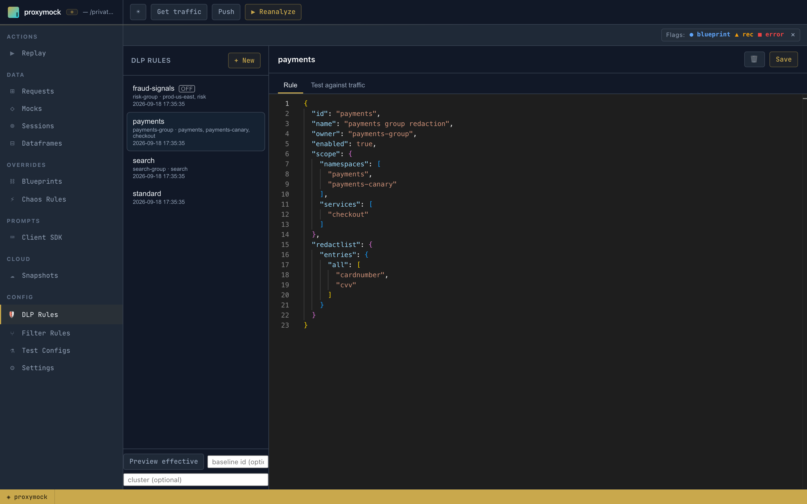
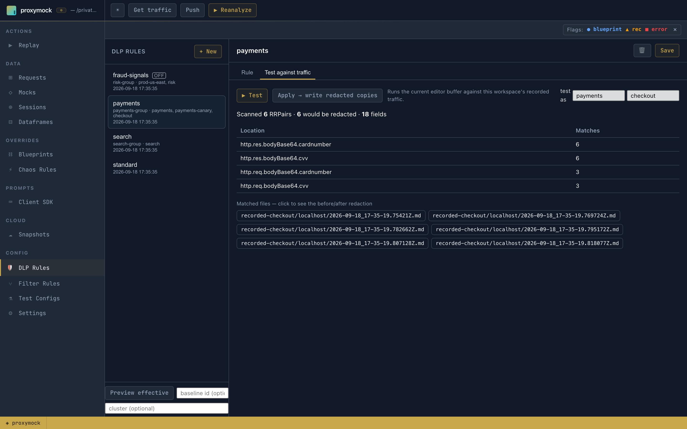
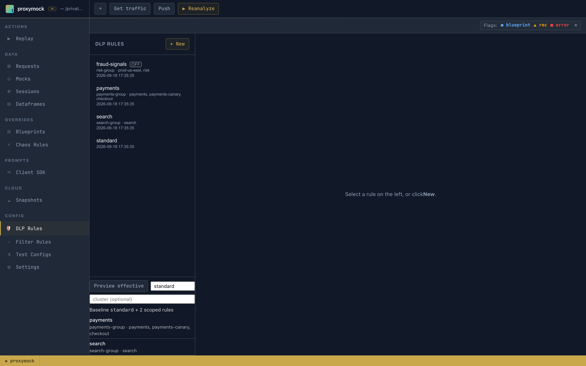

# Managing Group Rules in proxymock web

proxymock web is where you author a group rule next to the traffic it has to redact. You write the rule, test it against recordings in your workspace, check how it combines with every other group's rules, and optionally write the result straight into a cluster.

This page is the how-to. For what a group rule is, how it relates to the baseline named by `SPEEDSCALE_DLP_CONFIG`, and how rules combine, read [DLP Rules for Multiple Groups](./group-rules.md) first. To manage the same rules in Speedscale Cloud, see [Managing Group Rules in the Dashboard](./group-rules-dashboard.md).

## Where the rules live

Rules are workspace files, one per rule, at `proxymock/dlprules/<id>.json`. They travel with the repository, can be reviewed in a pull request like any other change, and are the same documents `proxymock cloud push dlp` and `proxymock cloud pull dlp` move to and from Speedscale Cloud.

Open **DLP Rules** in the **Config** section of the sidebar.

## The rule list



Each row shows the rule id and, for a group rule, its owner and what it covers, so you can pick out your own rule at a glance:

- **payments**: owned by `payments-group`, covering the `payments` and `payments-canary` namespaces and the
  `checkout` service.
- **fraud-signals**: a group rule marked **OFF**. It has a scope, but `enabled` is `false`, so it redacts nothing.
- **standard**: no coverage line. A rule without a scope is a baseline rule.

## Create a rule

**+ New** asks for an id and starts from a template that is already a group rule: scoped to one namespace, `enabled` set to `false`, and an empty `owner` for you to fill in.

```json
{
  "id": "payments",
  "name": "payments",
  "owner": "",
  "enabled": false,
  "scope": { "namespaces": ["my-namespace"] },
  "redactlist": { "entries": { "all": ["authorization", "email", "password"] } },
  "discoverPatterns": true
}
```

1. Set `owner` to your group's name.
2. Replace `my-namespace` with the namespaces your group owns. Add `services` or `clusters` to narrow it further.
   A dimension you leave out matches anything.
3. List the fields to redact under `redactlist`. Fields every group needs redacted belong in the baseline, not
   here.
4. Press **Save**.

Saving validates the rule the way the capture path will use it. A document that cannot build a redactor, or a `scope` that names nothing, is refused at save time instead of failing later on a forwarder.

To author a baseline rule instead, delete the `scope`, `owner` and `enabled` fields.

## Test it against your traffic

Open **Test against traffic**. It runs the rule in the editor over the recordings in the workspace and reports what would be redacted, and where. Nothing on disk changes.



Locally recorded traffic has no namespace or service, so a scoped rule matches nothing on its own and looks broken. Fill in the **test as** fields beside the **Test** button with a workload inside the rule's scope (here `payments` / `checkout`), and the recordings are treated as coming from that workload. Leave both fields empty when testing a baseline rule.

The results table lists every location that matched and how often. Click a file under **Matched files** to see that request before and after redaction.

**Apply → write redacted copies** writes redacted copies of the workspace recordings into a new results directory. Use it to inspect the outcome on real traffic; it does not deploy anything.

## Preview what a cluster receives

Your rule is one part of what a forwarder runs. **Preview effective**, under the rule list, resolves the whole set the way a cluster would. Enter the baseline rule id and, optionally, a cluster name.



The result names the baseline and every enabled group rule that would apply, with its owner and coverage. `fraud-signals` is missing because it is switched off. With a cluster filled in, rules scoped to other clusters drop out as well.

The preview is read-only. Use it to confirm your rule is included, and to see what other groups already redact, before you enable or apply anything.

## Enable it and apply it to a cluster

When the tests look right, set `"enabled": true` and save.

What happens next depends on how your clusters get their rules:

- **Rules managed in Speedscale Cloud.** Push the rule with `proxymock cloud push dlp`. The cloud resolves the baseline plus every enabled group rule for each forwarder and tells connected clusters to reload. See [When a saved rule takes effect](./group-rules-dashboard.md#when-a-saved-rule-takes-effect).
- **Rules applied from proxymock web.** Open **Settings**. **Redaction rule** is `SPEEDSCALE_DLP_CONFIG` and **Redact sensitive data** is `WITH_DLP`. Applying writes the resolved document (the baseline plus the group rules that cover the cluster) into the cluster's `speedscale-forwarder-dlp` ConfigMap, and the forwarder reads it directly instead of downloading a rule. This needs a connected cluster; without one the panel is read-only.

A rule applied from proxymock web takes precedence over the cloud: while the ConfigMap exists, the forwarder ignores what the cloud would resolve for it.

## Checklist

1. Find the sensitive fields in your own traffic with [Discovering PII](./discovering-pii.md) and
   [Recommendations](./recommendations.md).
2. **+ New**, fill in `owner`, scope the rule to your workloads, leave `enabled` at `false`.
3. **Test against traffic** with **test as** set to a workload in your scope.
4. **Preview effective** with your baseline, to see your rule next to everyone else's.
5. Enable the rule and push it or apply it.
6. Take a snapshot and confirm your fields are redacted and other groups' traffic is unchanged.

## Related documentation

- [DLP Rules for Multiple Groups](./group-rules.md): the model: baseline, scope, owner and how rules combine
- [Managing Group Rules in the Dashboard](./group-rules-dashboard.md): the same rules in Speedscale Cloud
- [Applying DLP Rules](./applying-rules.md): getting a rule onto a forwarder
