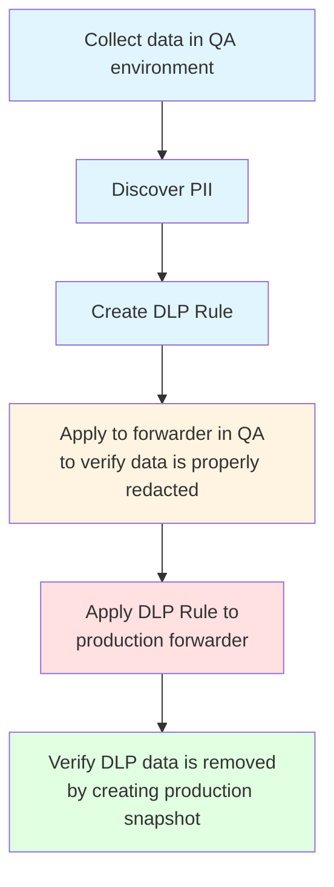

# Introduction to Data Loss Prevention (DLP)

## What is DLP?

Data Loss Prevention (DLP) in Speedscale is a comprehensive feature that enables organizations to automatically discover, mask, and manage Personally Identifiable Information (PII) and sensitive data in their API traffic. DLP ensures compliance with regulations like GDPR, HIPAA, and PCI DSS while maintaining the ability to test with realistic data.

### Understanding PII

**Personally Identifiable Information (PII)** refers to any data that can be used to identify, contact, or locate a specific individual. The protection of PII is critical for privacy, security, and regulatory compliance. To learn more about PII and its importance:

- [NIST Guidelines on Protecting PII](https://csrc.nist.gov/publications/detail/sp/800-122/final) - National Institute of Standards and Technology's comprehensive guide on protecting PII
- [What is PII? (FTC)](https://www.ftc.gov/business-guidance/privacy-security/consumer-privacy) - Federal Trade Commission's overview of PII and consumer privacy
- [OWASP Privacy Risks](https://owasp.org/www-community/vulnerabilities/Privacy_Violation) - Open Web Application Security Project's information on privacy violations and risks

### Two-Phase Workflow

DLP operates through a two-phase workflow:

1. **Discovery and Redaction Phase**: Identify PII in test environments and create rules to mask it in production
2. **Test Data Generation Phase**: Generate realistic test data to replace redacted tokens for testing purposes

### Key Concepts

- **PII Discovery**: Automatically identifies sensitive data patterns in captured traffic
- **Data Redaction**: Replaces PII with `REDACTED-` prefixed tokens before data reaches Speedscale cloud
- **Test Data Generation**: Creates realistic but safe test data to replace redacted tokens
- **DLP Rules**: Configurable rules that define how data should be redacted and transformed

## Why Use DLP?

### Compliance Requirements

Many organizations must comply with strict data protection regulations:

- **GDPR (General Data Protection Regulation)**: Protects EU citizens' personal data
  - [Official GDPR Text](https://gdpr-info.eu/) - Complete text of the General Data Protection Regulation
  - [GDPR.eu Guide](https://gdpr.eu/what-is-gdpr/) - Comprehensive guide to understanding GDPR requirements
- **HIPAA (Health Insurance Portability and Accountability Act)**: Protects health information
  - [HHS HIPAA Information](https://www.hhs.gov/hipaa/index.html) - U.S. Department of Health and Human Services HIPAA resources
  - [HIPAA Compliance Guide](https://www.hhs.gov/hipaa/for-professionals/security/index.html) - HIPAA Security Rule compliance information
- **PCI DSS (Payment Card Industry Data Security Standard)**: Protects credit card data
  - [PCI Security Standards Council](https://www.pcisecuritystandards.org/) - Official PCI DSS standards and resources
  - [PCI DSS Quick Reference Guide](https://www.pcisecuritystandards.org/document_library/) - PCI DSS requirements and guidance
- **Other Regulations**: Various industry-specific and regional requirements
  - [CCPA (California Consumer Privacy Act)](https://oag.ca.gov/privacy/ccpa) - California's comprehensive privacy law
  - [PIPEDA (Canada)](https://www.priv.gc.ca/en/privacy-topics/privacy-laws-in-canada/the-personal-information-protection-and-electronic-documents-act-pipeda/) - Canada's federal privacy law

DLP helps ensure that sensitive data never reaches Speedscale's cloud storage, maintaining compliance automatically. For security and compliance information, see the [Security](../../security/data_protection.md) documentation.

:::note Enterprise Data Deletion
If PII is accidentally sent to Speedscale's cloud storage, Enterprise customers can request data deletion. The SLA for data deletion depends on your support level. Contact your Speedscale account representative or support team for assistance with data deletion requests.
:::

### Security Benefits

- **Prevents Data Exposure**: Sensitive data is redacted before leaving your infrastructure
- **Reduces Risk**: Eliminates the risk of accidentally exposing PII in logs, snapshots, or analytics
- **Maintains Privacy**: Ensures customer and user data remains private throughout the testing process

### Testing with Realistic Data

DLP enables you to:

- Capture production-like traffic patterns without exposing real PII
- Generate realistic test data that maintains data relationships and formats
- Test applications with data that behaves like production data but contains no sensitive information
- Maintain test data quality while ensuring security

## Key Benefits

### Automated PII Discovery

Speedscale's DLP engine automatically discovers over 30+ types of sensitive data patterns, including:

- Contact information (emails, phone numbers)
- Identity information (SSNs, UUIDs)
- Financial information (credit card numbers)
- Authentication tokens (JWTs)
- Location data (coordinates)
- Network information (IP addresses)
- And many more

### Real-Time Data Redaction

DLP rules are applied in real-time as traffic flows through your forwarders:

- Data is redacted before it reaches Speedscale cloud
- Original data never leaves your infrastructure
- Redaction happens at the network level using eBPF technology
- No application code changes required

### Maintained Test Data Quality

When generating test data:

- Data formats match original patterns
- Data relationships are preserved
- Test scenarios remain realistic
- No degradation in test effectiveness

### Performance Optimization

DLP rules can be optimized for performance:

- Narrow filter criteria reduce processing overhead
- Targeted redaction minimizes impact
- Efficient pattern matching algorithms
- Configurable performance vs. security trade-offs

## DLP Workflow Overview

DLP follows a three-phase workflow designed to protect data while enabling effective testing:

### Phase 1: Discovery and Rule Creation (Test Environment)

In your test environment:

1. **Set Up Speedscale**: Install Speedscale's eBPF collector to capture traffic (see [Installation Guide](../../getting-started/quick-start.md) and [CLI Installation](../../getting-started/installation/install/cli.md))
2. **Capture Traffic**: Collect representative traffic from your test environment
3. **Create Snapshot**: Generate a snapshot containing the captured traffic
4. **Review PII Discovery**: Examine recommendations identifying discovered PII
5. **Create DLP Rules**: Accept recommendations and create DLP rules for production use

This phase happens in a controlled test environment where you can safely analyze traffic patterns and identify sensitive data.

### Phase 2: Production Redaction (Production Environment)

In your production environment:

1. **Apply DLP Rules**: Assign DLP rules to forwarders in your Infrastructure configuration
2. **Verify Redaction**: Confirm that PII is being replaced with `REDACTED-` prefixed tokens
3. **Monitor Traffic**: Ensure redaction is working correctly without impacting performance
4. **Validate Compliance**: Verify that no PII reaches Speedscale cloud storage

This phase protects your production data in real-time, ensuring sensitive information never leaves your infrastructure.

### Phase 3: Test Data Generation (Testing Environment)

For testing purposes:

1. **Create Snapshot from Production**: Capture traffic from production (now containing REDACTED tokens)
2. **Generate Test Data Recommendations**: System analyzes REDACTED tokens and suggests appropriate test data types
3. **Apply Test Data Recommendations**: Select and apply recommendations to replace REDACTED tokens with test data
4. **Use Snapshot for Testing**: Use the snapshot with realistic test data for comprehensive testing

This phase enables you to test with realistic data patterns while maintaining security and compliance.

## Additional Resources

### Learn More About Data Protection

- [NIST Cybersecurity Framework](https://www.nist.gov/cyberframework) - Framework for improving critical infrastructure cybersecurity
- [ISO/IEC 27001](https://www.iso.org/isoiec-27001-information-security.html) - International standard for information security management
- [Cloud Security Alliance](https://cloudsecurityalliance.org/) - Best practices for secure cloud computing
- [SANS Data Protection Resources](https://www.sans.org/white-papers/data-protection/) - Security training and research on data protection

## Next Steps

Now that you understand what DLP is and why it's valuable, you can proceed to:

- [Discovering PII in Test Environment](./discovering-pii.md) - Start the DLP workflow by discovering PII in your test environment

## Related Documentation

- [Creating Snapshots](../creating-a-snapshot.md) - Learn about creating and managing snapshots
- [Capturing Traffic](../../concepts/capture.md) - Traffic capture concepts
- [Cluster Inspector](../capture/infra.md) - Infrastructure and forwarder configuration
- [Traffic Transforms Documentation](../../concepts/transforms.md) - Deep dive into transform chains
