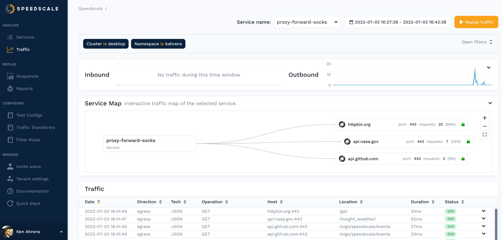

:::danger
This is not a natively supported workflow. Speedscale works best inside a Kubernetes cluster using the operator and this workaround is subject to change.
:::


### Pre-Requisites

1. [Speedctl is installed](../setup/install/cli.md)
1. Docker with compose.
1. Root CA Certificate and Key (this was tested using the `speedscale-certs` which are installed as part of the Speedscale operator installation)
1. Access to the client application to configure proxy settings and trust certificates.

### Root CA Certificate and Key

If you don’t already have a Root CA Certificate handy, one is always generated when you install the Speedscale operator. This tutorial was created using a keyset from an operator install. To download this you run the following commands:

```bash
kubectl -n speedscale get secret speedscale-certs -o=jsonpath='{.data.tls\.crt}' | base64 --decode > tls.crt
kubectl -n speedscale get secret speedscale-certs -o=jsonpath='{.data.tls\.key}' | base64 --decode > tls.key
```

### Environment Prep

Using the [manifests](#manifests)

- Populate the values inside `config.env` from your `~/.speedscale/config.yaml` file
- Edit `docker-compose.yml` and modify:
    - `volumes` should point to the location where the `tls.key` and `tls.crt` can be found
    - `APP_LABEL` if you want to change the service name that will be shown in the Speedscale Traffic Viewer.
    - `REVERSE_PROXY_{HOST/PORT}` depending on where your app is running. `host.docker.internal` will connect to any service you have running locally with an exposed port.

Bring up the containers using `docker compose up -d` and it should start 2 containers for goproxy and forwarder. The goproxy will capture traffic and send to the forwarder which will push the data to Speedscale cloud. In a larger configuration you can run multiple goproxy sidecar containers against a single forwarder.

Now you have to configure your application to use the socks proxy running on `*:4140` on your server, and you need it to [trust the certificates as well](../setup/sidecar/sidecar-http-proxy.md#configuring-your-application-proxy-server)

You can now run requests against your service through `localhost:4143` instead of the normal port as our goproxy is acting as the entrypoint for the app now.

### Analyze Traffic



You should be able to see traffic in the Speedscale UI after a few minutes and now you can using this traffic to [create a snapshot](./creating-a-snapshot.md).

### Replaying traffic

If you've created a snapshot, you can replay it in Docker as well. Take the ID of the snapshot you created (something like `b973b5e2-651f-4a30-8c69-7bd62a678544`) and fill it in the `SCENARIO_ID` variable shown in the [generator snippet](#manifests). You can also change the `TEST_CONFIG_ID` to a [custom config](../reference/configuration/README.md) you may have created. Paste that snippet into your `docker-compose.yaml` file and run `docker compose up -d` again to start the test.

This will generate a report which you can find more details for [here](./reports/README.md).

## Manifests
config.env
```
LOG_LEVEL=info
FORWARDER_ADDR=forwarder:8888
REDIS_SERVICE_HOST=redis
SPEEDSCALE_API_KEY=
SPEEDSCALE_APP_URL=app.speedscale.com
SUB_TENANT_NAME=default
SUB_TENANT_STREAM=
TENANT_REGION=us-east-1
TENANT_BUCKET=
```

docker-compose.yaml
```yaml
services:
  goproxy:
    image: gcr.io/speedscale/goproxy:v1.1
    ports:
      - "4140-4144:4140-4144"
    env_file:
      - config.env
    environment:
      - TLS_OUT_UNWRAP=true
      - CAPTURE_MODE=proxy
      - PROXY_TYPE=dual
      - PROXY_PROTOCOL=tcp:socks
      - REVERSE_PROXY_HOST=host.docker.internal
      - REVERSE_PROXY_PORT=80
      - APP_LABEL=proxy-forward-socks
      - APP_POD_NAME=proxy-forward-socks
      - APP_POD_NAMESPACE=${USER}
    volumes:
      - "/tmp/speedscale:/etc/ssl/speedscale"
    logging:
      options:
        max-size: "1000k"
        max-file: "10"
  forwarder:
    image: gcr.io/speedscale/forwarder:v1.1
    env_file:
      - config.env
    environment:
      - CLUSTER_NAME=desktop
    logging:
      options:
        max-size: "1000k"
        max-file: "10"
```

generator snippet
```yaml
  generator:
    image: gcr.io/speedscale/generator:v1.1
    env_file:
      - config.env
    environment:
      - SCENARIO_ID=b973b5e2-651f-4a30-8c69-7bd62a678544
      - TEST_CONFIG_ID=standard
      - CUSTOM_URL=goproxy:4143
      - LOCAL_REPLAY_MODE=true
```
