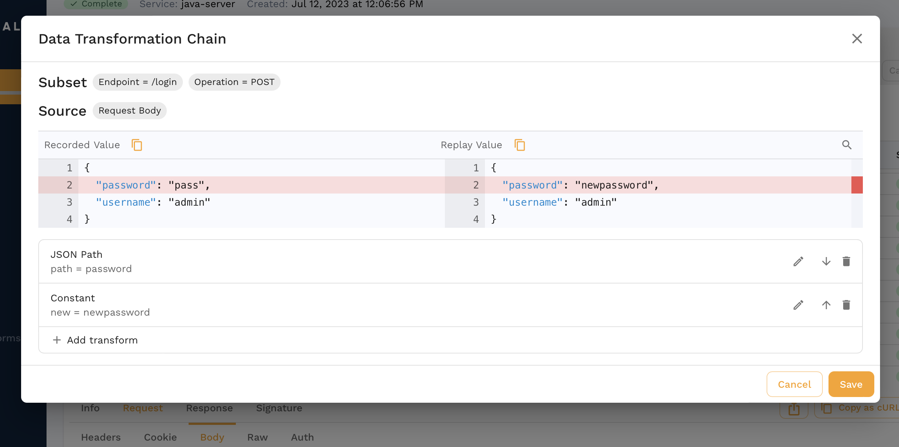
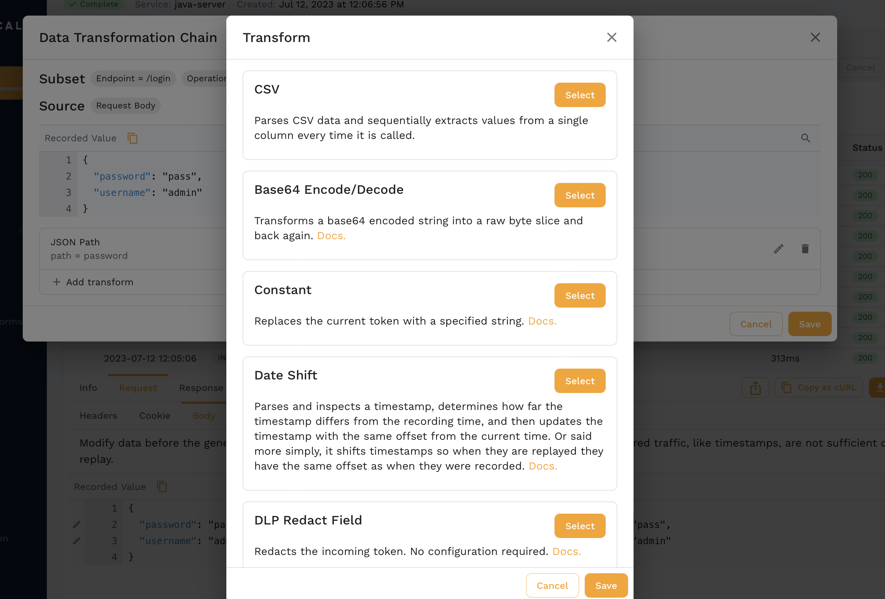

# End-to-End Testing Guide

This section provides comprehensive end-to-end testing workflows using Speedscale to validate your APIs with real-world traffic scenarios.

## Overview

End-to-end testing with Speedscale involves capturing production traffic, transforming it for testing environments, and replaying it to validate system behavior. This approach ensures your tests reflect actual user patterns and data flows.

## Key Workflows

### Authentication & Security Testing
- **JWT Token Handling**: Transform and validate JWT tokens in test scenarios
- **Login Flow Testing**: Capture and replay authentication sequences
- **Security Redaction**: Manage sensitive data during testing

### Traffic Analysis & Validation
- **Request/Response Validation**: Compare expected vs actual API responses
- **Traffic Pattern Analysis**: Understand and reproduce real usage patterns
- **Performance Testing**: Load test with realistic traffic volumes

### Mock Services & Virtualization
- **Service Mocking**: Create mocks from captured traffic
- **Third-party Service Simulation**: Replace external dependencies with mocks
- **Test Environment Isolation**: Ensure consistent test conditions

## Visual Guides

The screenshots in this section demonstrate:

*JWT token transformation and validation*

*User authentication flow capture*

*Data transformation configuration*

*Real-time traffic monitoring and analysis*

*Comprehensive test result reporting*

*Service mock setup and configuration*

## Getting Started

1. **Capture Traffic**: Begin by capturing production or staging traffic
2. **Transform Data**: Configure data transformations for your test environment
3. **Create Mocks**: Set up service mocks for external dependencies
4. **Run Tests**: Execute end-to-end test scenarios
5. **Analyze Results**: Review reports and validate system behavior

## Related Documentation

- [Capture Traffic](/guides/capture/traffic)
- [Transform Data](/guides/transformation/overview)
- [Service Mocking](/guides/mocking/mocks)
- [Test Configuration](/reference/configuration/)
- [Reports & Analysis](/guides/reports/)

For detailed implementation guides, see the specific sections for [Setup](/getting-started/installation/install/), [Transform](/guides/transformation/transforms/), and [Replay](/guides/replay/).