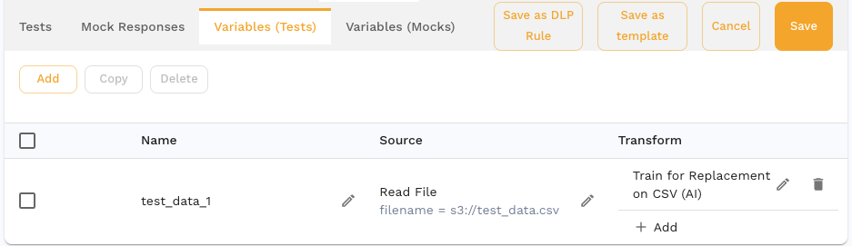

# Bulk Data Extraction

Bulk Data Extraction is a powerful feature that allows you to identify a piece of data from a collection of HTTP request/response pairs (rrpairs) and export it for mass modification. After editing the extracted data, you can feed the updated values back into Speedscale to customize behaviors during replay. This workflow combines the speedctl CLI tool with the Speedscale UI to simplify large-scale data manipulation.

# When to Use Bulk Data Extraction
* **Test Data Generation:** Need to replace user IDs, tokens, or other request parameters across a large number of test requests.
* **Mass Parameter Modification:** Want to quickly alter header values, query parameters, or JSON fields in multiple rrpairs at once.
* **Experimentation:** Quickly iterate on test data scenarios without modifying your original snapshot repeatedly by hand.

# Prerequisites
	1.	**Speedctl Installed:** Ensure you have the latest speedctl CLI tool installed and configured.
	2.	**Snapshot UUID:** Have the UUID of the snapshot containing the requests you’d like to extract data from.
	3.	**Access to the Speedscale UI:** You will need UI access to add transforms after modifying the data.

# Overview of Steps
	1.	**Extract Data:** Use speedctl extract data to pull a specific piece of data (identified by a JSONPath) from all rrpairs in the snapshot.
	2.	**Edit CSV:** Insert or modify values in the exported CSV file.
	3.	**Re-upload Edited Data:** Upload the modified CSV back into Speedscale using speedctl push user-data.
	4.	**Add Transform:** Apply a smart_replace transform to your snapshot in the UI to utilize the newly provided data.

# Detailed Procedure

## Step 1: Extract Data from RRPairs

Use the speedctl extract data command to identify and export data from the snapshot. This command outputs a CSV file containing all instances of the specified data.

### Command Syntax:

```bash
speedctl extract data --snapshot SNAPSHOT_UUID --path JSONPATH --filter FILTER
```
### Example:

```bash
speedctl extract data 4532e576-302a-471e-8c46-97600f282b80 --path http.req.bodyBase64.UserName --filter '(location CONTAINS "/api/user/ai/welcome")'
```

Remember the name of the CSV file that is outputted.

### What This Does:
* Queries every HTTP request in the given snapshot.
* Extracts the value at the specified JSONPath (for example, $.http.req.headers.Authorization.0).
* Outputs a CSV file containing one row per rrpair, along with the extracted values.

## Step 2: Edit the CSV File

Open the CSV file using a text editor or a spreadsheet editor. The CSV will contain at least one column with the extracted data. You can now:
* **Insert a New Column:** Insert a new column next to the existing data (second column). It is possible to insert the column elsewhere but this is the easiest way to do it.
* **Populate New Values:** For each row, add or modify the values you want Speedscale to use during replay.

### Example CSV before editing:

```csv
http.req.bodyBase64.UserName,RRPair UUID
cXEuOVj,43d00ae1-f043-4050-a766-494a272f0151|...
stephen.foster@yahoo.com,43d00ae1-f043-4050-a766-494a272f0151|...
charlotte.walker@example.com,afd01ae4-d033-1110-8861-454123490135|...
```
### Example CSV after editing:

```csv
http.req.bodyBase64.UserName,New Value,RRPair UUID
cXEuOVj,ZXh0cmFjdGVkX2RhdGEuY3N2,43d00ae1-f043-4050-a766-494a272f0151|...
stephen.foster@yahoo.com,joe.smith@gmail.com,43d00ae1-f043-4050-a766-494a272f0151|...
charlotte.walker@example.com,agatha.christie@gmail.com,afd01ae4-d033-1110-8861-454123490135|...
```
:::tip
Ensure you maintain a consistent number of rows and do not alter the structure of the original CSV columns beyond adding your new column of data.
:::

## Step 3: Upload the Modified CSV

Once you have the new values in place, upload the CSV back to Speedscale as user data. This makes the data available for use in transforms.

### Command:

```bash
speedctl push user-data modified_data
```

Keep in mind that the CSV file will be stored in Speedscale’s user data repository but you only reference it's id here.

### Result:
* This command stores the CSV file in Speedscale’s user data repository.
* Returns a reference to the stored file that you’ll use in the next step.

## Step 4: Add the Smart Replace Transform in the UI

Navigate to the Speedscale UI and locate the snapshot you used in Step 1.
1.	**Open the Snapshot:** Find your snapshot in the Speedscale dashboard.
2.	**Go to Transform Tab:** Click on the snapshot’s transform tab and then the `Variables (Tests)` tab.
4.  **Create a transform chain:** consisting of these components `source=read_file("s3://<userdata id>") : train_csv()`. In the UI it should look like this:


4.	**Save and Apply:**

### What This Does:
* During replay, Speedscale will replace the original values with the new ones you provided in the CSV.
* The smart_replace transform automatically looks up rows in your user data file and substitutes values as configured.

## Step 5: Validate and Run Replays

After applying the transform, run a replay of your snapshot. The requests that previously contained the original values should now feature the updated values provided in the CSV.
* Validation: Confirm that the transformed requests contain the expected new data.
* Adjustments: If something is off, you can adjust the CSV or the JSONPath and run through these steps again.

# Troubleshooting
* Incorrect JSONPath: Double-check the JSONPath if no data is extracted. Make sure it correctly references the field you are trying to capture.
* CSV Format Issues: Ensure the CSV is properly formatted and that you inserted the new column in the correct location.
* Transform Configuration: Verify that the transform’s JSONPath and CSV column references match exactly.

# Conclusion

Bulk Data Extraction combined with smart_replace transforms provides a flexible, scalable way to manipulate test data at scale. By following these steps, you can pinpoint, extract, edit, and re-inject data into Speedscale, streamlining your testing and replay workflows.
