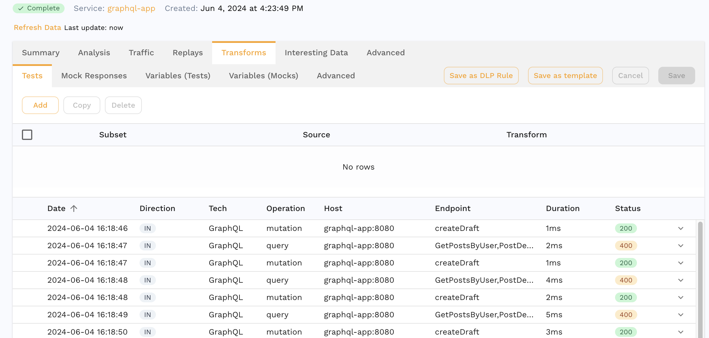
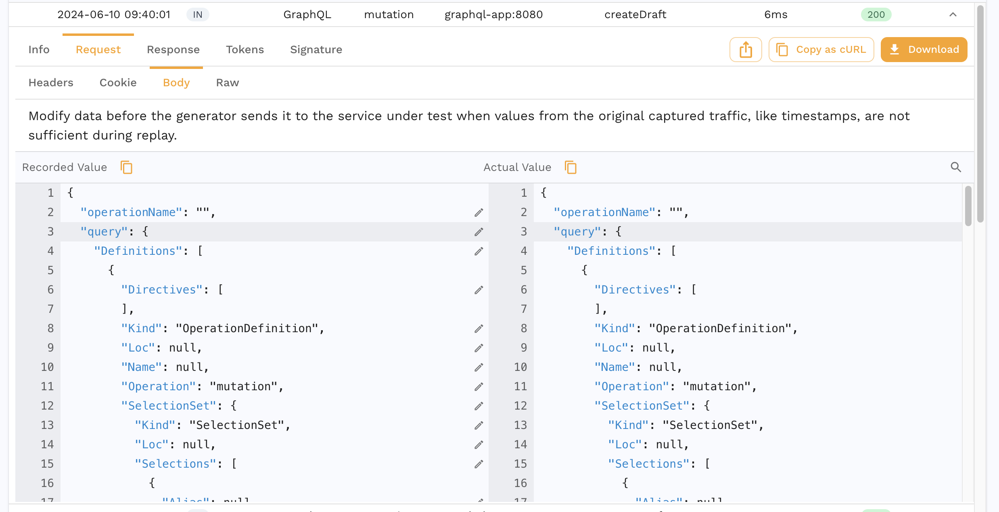
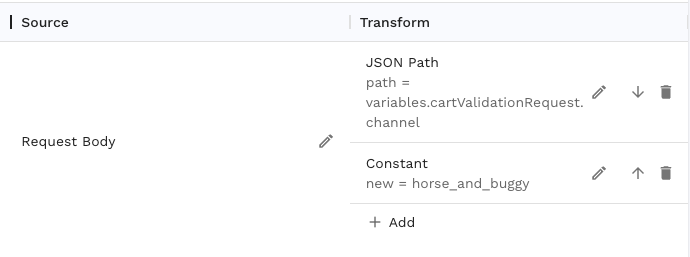
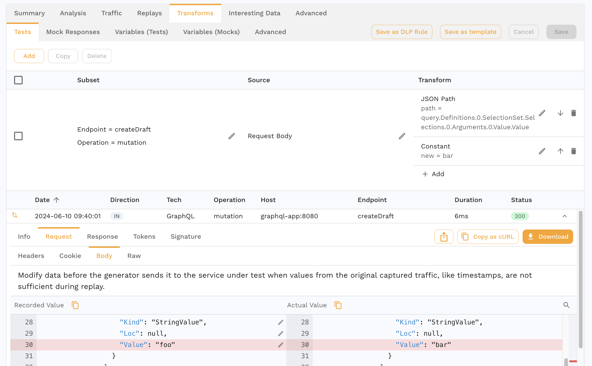
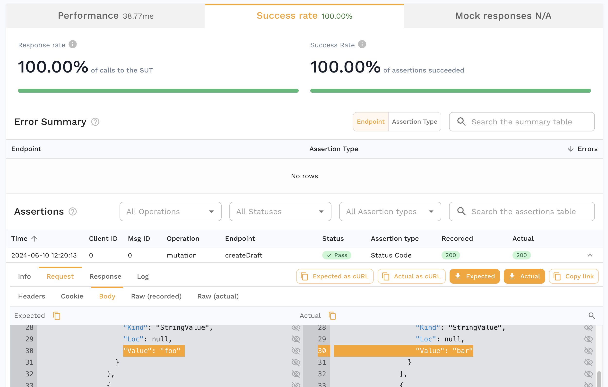

# GraphQL

## Overview

GraphQL services work automatically in the same way HTTP services work. All functionality including Capture, Analyze and Replay work the same because of translations done by Speedscale. GraphQL introduces a couple of new concepts that may be unfamiliar to those used to REST but all of the usual Speedscale how-tos and tricks apply to GraphQL.

GraphQL responses are supported natively without translation. Fortunately, GraphQL responses are JSON formatted and Speedscale's normal data analysis tools like [transformers](../concepts/transforms.md) will work without issue.

However, GraphQL Queries are very different because they are constructed from a proprietary domain specific language called an Abstract Syntax [Tree](https://adamhannigan81.medium.com/understanding-the-graphql-ast-f7f7b8e62aa4). The topic of ASTs is beyond the scope of this document but a little bit of knowledge should make testing GraphQL straightforward.

Let's look at a sample snapshot to explain how Speedscale handles GraphQL queries. In the following Snapshot, we can see that the `Operation` and `Endpoint` are populated differently than with HTTP requests. For GraphQL, `Operation` shows the type of query and `Endpoint` shows the function(s) that has been called in this query. This data is mined from inside the query and displayed in this way for convenience.



## AST JSON

In order to be able to modify GraphQL payloads the Speedscale UI shows a JSON representation of the GraphQL query. This JSON format is not based on an industry standard because none currently exists for GraphQL Query->JSON. As a consequence, this AST is generally messy and difficult for humans to read. However, you can still see the actual GraphQL in the `raw` tab. The important thing to note is that you must modify the JSON representation and Speedscale will reconstruct it into GraphQL AST syntax at replay.

The following is an example of what you will see for this mutation query:
```graphql
mutation {
  createDraft(title:"foo", content:"bar"){
    id,
    title,
    content,
  }
}
```



To change one of the query options, find it in the response body JSON and modify it using a [JSONPath](/transform/transforms/json_path) transform with a `response body` extractor. Alternatively, just click on the pencil icon next to the field in the Speedscale UI and it will format this transform automatically (highly recommended).

## Testing Example (Simple)

Most of the time, testers don't actually need to modify the AST query itself. Don't worry, we'll still show an example below. However, be aware that testers usually just need to edit the `variables` section of the query and not the AST. In a perfect world, developers intentionally externalize data that should be modiifed in the `variables` section. If you are not currently in a perfect world then skip ahead to the Advanced section below.

Otherwise, focus on modifying the variables section in the Request Body. If you recorded GraphQL traffic, it will contain a request body section similar to this:

```json
"variables": {
  "cartValidationRequest": {
    "address": {
      "country": "US"
    },
    "basketType": "ShipToFoo",
    "channel": "warp_drive",
    "examplePromo": "widgets"
  }
}
```

In the UI, you can click on the pencil icon next to value you want to change and Speedscale will target the value in the transform editor. Something like this should appear:



In text from this transform chain translates into `req_body()->json_path("variables.cartValidationRequest.channel") -> constant("horse_and_buggy")`.

Once we save this transform chain, every instance of "channel" within the GraphQL query variables will be translated into "horse and buggy". Combine this procedure with the existing how to guides for different types of transformations. We're using a constant value here for simplicity but real apps will need something more complex like a [csv](../transform/transforms/csv.md).

## Transform Example (Advanced)


Now let's say we have a collection of GraphQL requests like the screenshot above and we want to change an AST query field. An AST field called `title` is contained in the request body of each of these calls. Let's use the transforms to modify the JSON representation of our AST query.



Now that we've instructed Speedscale on how to change this field, we're ready to replay against our workload. Initiate a replay using one of the methods listed in the [tutorial](../tutorial.md).

## Replay Results
When we replay the Snapshot, we can see the "Actual" replayed payload. Again you will be able to see the GraphQL query in Raw(recorded) and Raw(Actual) tabs. The following screenshot shows the original and replaced value in the replay initiated in the previous step.


