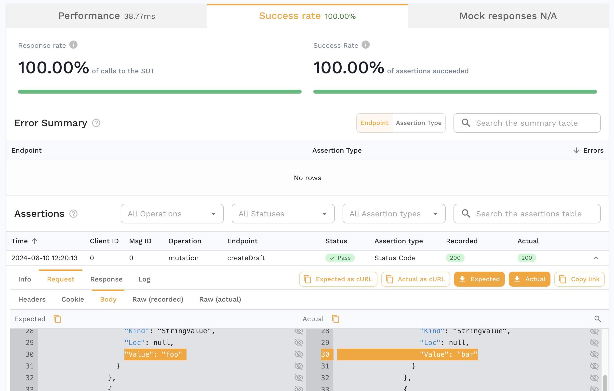

# Editing GraphQL requests

A GraphQL request body is stored as a parsed document, so its lines are positions in a tree rather than fields you can click. Speedscale therefore offers a separate surface for GraphQL: a panel listing exactly the values a transform can address, each already labelled with the [semantic path](./semantic-paths.md) that reaches it.

## The GraphQL panel

Open a GraphQL request in proxymock's web interface and select **Request → Body**. Above the body you get four groups, and only the ones that apply to the request are shown:

| Group | Contents |
|---|---|
| **Operation** | One chip per operation the document defines, plus a chip per named fragment. The chip for the operation this request actually runs is filled; a document may define others it does not run. |
| **Variables** | Each variable with its declared type and current value. Path: `variables.<name>`. |
| **Arguments** | Each argument literal written into the query, by semantic path. |
| **Supplied by a variable** | Arguments that hold no literal of their own. The row points at the `variables.` path that feeds them, because that is where the value can actually be changed. |

The split between the last two groups is the panel's most useful feature: it tells you at a glance which values are the client's to change and which are baked into the query text.

## Click to transform

Each row carries the same wand button the Headers and Query tables use. Clicking it opens the **Choose a transform** chooser, and picking one writes a transform chain into a blueprint — no chain editing by hand:

```
req_body() → graphql(path="variables.token") → smart_replace()
```

The semantic path comes from the row you clicked, so the only thing you supply is the transform and its value. The operation is carried along when the document defines more than one, so the chain stays unambiguous.

Two options in the chooser behave specially for GraphQL:

- **Extract JSONPath from embedded JSON field** appends a [`json_path`](../transformation/transforms/json_path.md) after the `graphql` transform, which is how you reach a JSON document embedded in a string argument.
- **Remove from the GraphQL document** writes a [`graphql_delete`](../transformation/transforms/graphql_delete.md) instead. Left empty it removes the value you clicked; given a field name it removes that name everywhere in the document, which is how `__typename` noise is stripped. This option only appears for a field that has a semantic path.

Chains created this way land in a blueprint named **Field Transforms**, where they can be reviewed, edited or deleted like any other.

## Building a chain by hand

Anywhere transform chains are edited directly — the dashboard's chain editor, a snapshot's tokenizer config, a blueprint file — a GraphQL chain is an ordinary chain:

```json
{
  "extractor": { "type": "req_body" },
  "transforms": [
    { "type": "graphql", "config": { "path": "createUser.args.input.plan", "op": "CreateUser" } },
    { "type": "constant", "config": { "new": "enterprise" } }
  ]
}
```

The `graphql` transform is the narrowing step: it extracts the value the path names, hands it to the rest of the chain, and writes the result back into the document. Everything downstream sees a plain value and needs to know nothing about GraphQL.

Scope the chain with an endpoint filter as usual. For GraphQL the endpoint is the operation name, not `/graphql` — see [Operation and endpoint](./index.md#operation-and-endpoint).

## Reading the raw request

The **Raw** tab always shows the request as it was sent, which is the fastest way to confirm what an edit produced. After a replay, the recorded and the actual request are both available, so an edit can be read as a before and after:



On replay the document is printed back to query text from the parsed form, so whitespace may differ from the recording. Selections and arguments keep the order the client sent them in; only the layout is the printer's. The document is semantically identical, and consumers parse GraphQL rather than byte-comparing it.
