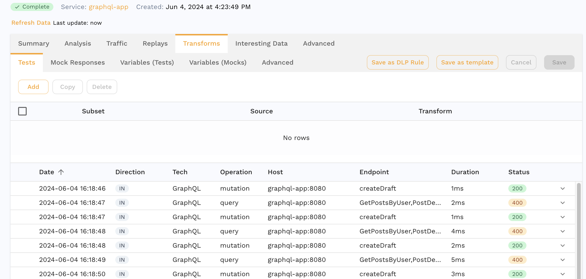

# GraphQL

GraphQL services work the same way HTTP services do. Capture, analyze, mock and replay all function without special configuration, because Speedscale recognizes GraphQL traffic and translates the request body into a form its transform engine can edit.

Two properties of GraphQL shape everything on this page:

- **Responses are ordinary JSON.** Nothing special is needed to read or transform them — [`json_path`](../transformation/transforms/json_path.md) and friends work as they do anywhere else.
- **Requests are a document, not a data structure.** The query is written in GraphQL's own language and parsed into an abstract syntax tree. Addressing a value inside it is what the [`graphql`](../transformation/transforms/graphql.md) transform exists for.

## How Speedscale recognizes GraphQL

A request/response pair is tagged `GraphQL` when both are true:

1. the request URL path ends in `/graphql`, and
2. the response body is JSON — or there is no response yet, which is the case inside the responder, where a live inbound request is classified before anything has been sent back.

This is a convention, not a protocol sniff. GraphQL has no distinguishing content type, and the `/graphql` endpoint is what the GraphQL project itself recommends. Traffic served from another path is captured and replayed correctly as ordinary JSON HTTP, but is not indexed by operation and cannot be addressed with semantic paths.

## Operation and endpoint

For GraphQL, the columns that normally carry a URL and a method carry the operation instead. `Operation` (internally, the RRPair's command) shows the operation type — `query`, `mutation` or `subscription` — and `Endpoint` (the location) shows the operation name. An anonymous operation falls back to the top-level field names it selects.



This is what makes GraphQL traffic navigable at all: every operation multiplexes over one URL, so grouping by URL would put an entire API into a single row. It also means an endpoint filter — the kind a transform chain or a mock is scoped with — matches on the operation name, not on `/graphql`.

## What capture stores

A GraphQL request body is stored as a JSON representation of the parsed document:

```json
{
  "operationName": "CreateUser",
  "query": { "Kind": "Document", "Definitions": [ ... ] },
  "variables": { "email": "user@example.com" }
}
```

There is no industry standard for GraphQL-to-JSON, so this AST JSON is Speedscale's own shape, and it is verbose. You rarely need to read it: the **Raw** tab shows the request as it was sent, and semantic paths address the document by meaning. On replay the document is printed back into query text, so what leaves Speedscale is a normal GraphQL request.

Editing the AST JSON positionally with `json_path` still works and older transform chains that do so keep running. See [Migrating legacy AST-path chains](./recipes.md#migrating-legacy-ast-path-chains) for what to move them to.

## Responses

GraphQL responses are plain JSON and are stored verbatim — no conversion, no AST. Extract from them with `res_body()` and [`json_path`](../transformation/transforms/json_path.md), exactly as with a REST API. A field's location in a GraphQL response mirrors the query that asked for it, so `data.createUser.id` addresses what the `createUser` selection returned.

## Persisted queries

Clients using automatic persisted queries (APQ) send a hash instead of the query text:

```json
{
  "operationName": "Session",
  "variables": { "token": "..." },
  "extensions": { "persistedQuery": { "version": 1, "sha256Hash": "8a1c..." } }
}
```

There is no document in such a request, so Speedscale leaves the body exactly as it was sent — it is not converted to AST JSON, and it replays byte-for-byte. The consequences are worth knowing:

- Transforms that address the document (a selection, an argument, `operationName`) find nothing and pass the request through untouched. Chains sweeping a whole snapshot skip these requests rather than failing on them.
- `variables.<key>` paths still work, because the variables travel with the request even when the query does not.
- The operation is not indexed from the document, since there is no document to read.

A request whose first APQ attempt misses the server's cache is normally followed by a second request carrying the full query text; that second request behaves like any other GraphQL request here.

## Where to go next

- [Semantic paths](./semantic-paths.md) — the grammar for addressing values inside a GraphQL request.
- [Editing GraphQL requests](./editing.md) — the GraphQL panel and click-to-transform.
- [Recipes](./recipes.md) — replacing a variable, re-signing a JWT, stripping `__typename`, JSON embedded in an argument, and migrating legacy chains.
- [`graphql`](../transformation/transforms/graphql.md) and [`graphql_delete`](../transformation/transforms/graphql_delete.md) — the transform reference pages.
