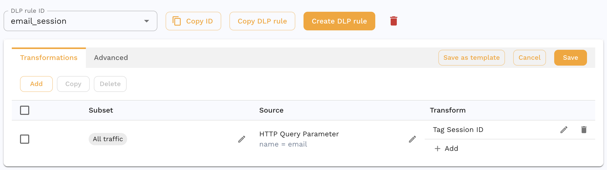
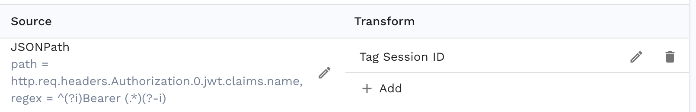
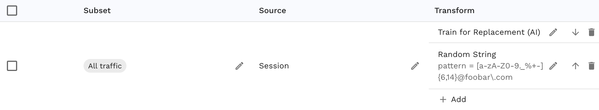

## Sessions

Speedscale utilizes the concept of *sessions* to identify individual users or client connections. A *session* represents a stream of requests run in sequence. You can think of it like a conversation between a single client and the service. Typically, sessions are automatically discovered by Speedscale for common patterns like JWT Bearer tokens. However, this guide covers what to do when you need to do some off roading and identify a unique identifier in an usual location. Once Speedscale is aware of an ID a variety of features are enabled, including AI powered replacement so taking a minute to tag IDs is worth the effort.

## Identify a Unique ID

Let's use an example HTTP request where the client's email address is embedded as a query parameter. Let's not make any judgments about whether this is best practice - it definitely happens in the real world.

```
GET /foo-platform/pdt/foo/management&email=foo@bar.com HTTP/1.1
User-Agent: Apache-HttpClient/4.5.6 (Java/1.8.0_392)
Accept-Encoding: gzip,deflate
```

This is not a common pattern so we need to tell the Speedscale transform system to tag this data as a session. From now on, every time this particular query parameter is seen it should be treated as a unique ID.

## Tag the Session ID

For this exercise we want to tag the session ID using the `tag_session` transform. If you're unfamiliar with transforms you can read more about them on the [reference page](../concepts/transforms.md). For this example we'll implement tagging as the data is ingested. It is also possible to use this same transform on a snapshot after it has been recorded. The advantage of adding the transform to the ingest pipeline is that the data is tagged early enough that you can filter it in the traffic viewer. It's pretty simple to do either but we'll focus on tagging in the forwarder (Speedscale's ingest system) here.

1. We start by creating a new DLP Rule. For this example you can call it `email_session`. DLP Rules are interpreted at the forwarder before data leaves the cluster. This is an excellent place to identify the session so that all RRPairs will have their correct session ID tagged early.
2. Identify the `email` HTTP Query Paramter and use it as the source for the transformation chain.
3. Add a `tag_session` transform to smart replace the Speedscale model on this data.

In the end, you will have a DLP rule that looks like this:


This transform cahin will isolate the `email` HTTP Query Parameter and use it as the session identifier.

:::note
If your app relies on JWTs then you can think them as being interchangeable with sessions. However, if you have a human readable user ID tucked into the JWT claims then that could also be considered a session. To extract an ID like this you can use the [JSONPath](../reference/transform-traffic/extractors/json_path.md) extractor pointed at the claim:

:::

## Apply to Forwarder

Now that you have a rule that identifies the email query parameter, we need to tell the Speedscale forwarder to use it. You can do this by re-installing the speedscale operator using the helm chart flag `--set dlp.config=email_session`. Alternatively if you're managing the containers directly you can change the operator environment variables directly:

```
SPEEDSCALE_DLP_CONFIG=email_session
```

## View and Filter in Traffic Viewer

1. Open your service in traffic viewer.
2. Select an RRPair and look at it's Info Tab. You'll notice that the Session ID entry is populated with the email address.
3. Create a filter for only that Session ID. All requests from that client are indentified in sequence.

## (Optional) Replace During Replay

:::caution
The following instructions should be used on your snapshot during playback. Don't add them to your forwarder configuration.
:::

During playback, you may want to take the additional step of replacing the session with a new value. For instance, many testing scenarios require replacing a real email address with a test one. To do this, we'll introduce one new transform and apply it to a new transform chain.

The [smart replace](../reference/transform-traffic/transforms/smart_replace.md) tells the Speedscale AI model to replace the incoming value with a new value wherever it occurs in your traffic. For example, if you recorded a query parameter containing a user ID you may want to replace it with one that works in a test environment instead of production. Think of this transform like a very sophisticated find and replace that is able to peer deep inside payloads and parameters within your traffic. The `smart_replace` transform has no configuration because once Speedscale knows of the desired replacement it does the work of finding it embedded within fields automatically.

To make `smart_replace` work you need to assign a new ID later in the transform chain. For instance, we can replace a user's login email with a new random one. In Speedscale terms that means using [rand_string](../reference/transform-traffic/transforms/rand_string.md) with an appropriate regex. It's also common to use defined test data and the [csv](../reference/transform-traffic/transforms/csv.md) transform. For this example we'll use a simple email regular expression to create a random string `^[a-zA-Z0-9._%+-]{6,14}@foobar\.com`

This is what your transform chain might look like with the complete set:



The source is the session of the rrpair. If you did the first set of steps correctly then this should be populated. Keep in mind that you can pull the data to replace from anywhere, session is just one choice. The first transform tells Speedscale to identify the current and new values. The last transform creates a random string matching an email in the `foobar.com` domain.

Moving forward, Speedscale will now replace every occurence of the recorded email address with a new one. That includers maintaining consistency, meaning that once a random email is matched to a new value it will be replaced everywhere with the same value.
