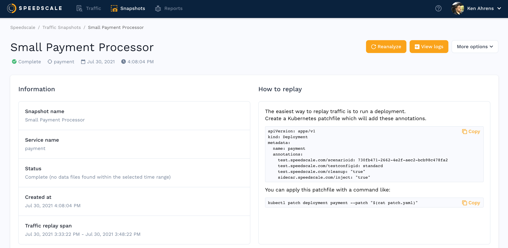

import Tabs from '@theme/Tabs';
import TabItem from '@theme/TabItem';

In this guide we will walk through importing traffic from an
[HTTP Archive format](https://en.wikipedia.org/wiki/HAR_(file_format)) (HAR)
file.  HAR files are supported by many tools, including browser plugins which
allow traffic capture from a web browser.

We'll take the following steps:

1. Create a HAR file from browser traffic
2. Import the traffic to Speedscale
3. Replay

## Create HAR from Browser

<Tabs>

<TabItem value="chrome" label="Chrome">

Open [dev tools](https://developer.chrome.com/docs/devtools/open/) and select the `Network` tab.

Navigate to, and use, your service in the browser to generate traffic.

Click
[Export HAR](https://developer.chrome.com/docs/devtools/network/reference/#save-as-har)
to export the traffic to a HAR file.

</TabItem>

<TabItem value="firefox" label="Firefox">

Open [dev tools](https://firefox-source-docs.mozilla.org/devtools-user/) and select the `Network` tab.

Navigate to, and use, your service in the browser to generate traffic.

Click the cog and choose [Save All as HAR](https://firefox-source-docs.mozilla.org/devtools-user/network_monitor/request_list/index.html#managing-har-data)
to export the traffic to a HAR file.

</TabItem>

</Tabs>

## Import to Speedscale

Navigate to the [services](https://app.speedscale.com) in the speedscale UI.
Click on `Add service` and selction the `Build from HAR` option.

A pop up will appear asking you for a snapshot name, traffic director (tests vs mocks) a HAR file and a unique Service Name. Note that the Service Name can be whatever you like but to prevent confusion it's better not to pick a real service that you are actually monitoring. Don't worry about picking the perfect service name, you'll put in the real URL of your service during replay. Most users will just leave it as the default.

If you select Inbound (create tests)  then Speedscale will generate a set of tests to exercise your API exaactly as your browser did in the original HAR recording.
If you select Outbound (create service mocks) then Speedscale will generate a service mock that you can use to test your browser code while Speedscale simulates the backend API.

## View Snapshot

A traffic snapshot is created from your HAR file. Snapshots are collections of requests that can be replayed in your cluster or from your local desktop. After import, you will be taken to the Snapshot summary screen for your postman requests.

If you click `View Traffic` you'll see your recorded requests ready to replay.

## Replay

HAR-generated snapshots can be replayed like any other snapshot using the instructions on the Snapshot Summary page.  Remember that you will need to put in a `Custom URL` to point at the correct service during replay. This is different than replaying a recorded snapshot because Speedscale typically has an automatically discovered default that is reasonable.

For more information on initiating replays, check out the full [replay guide](./replay/README.md)
