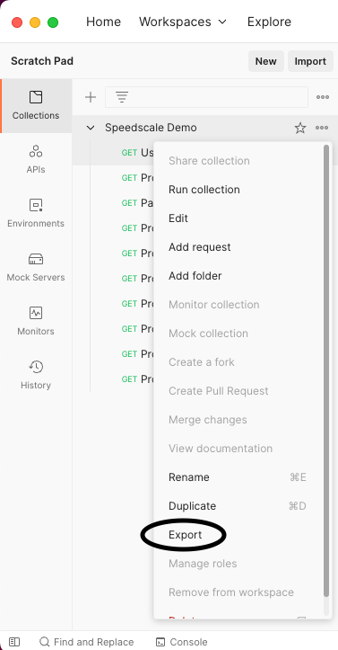
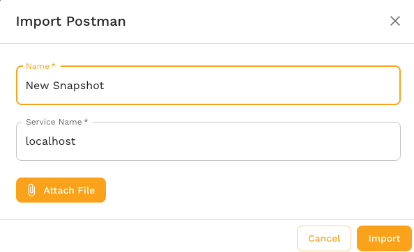
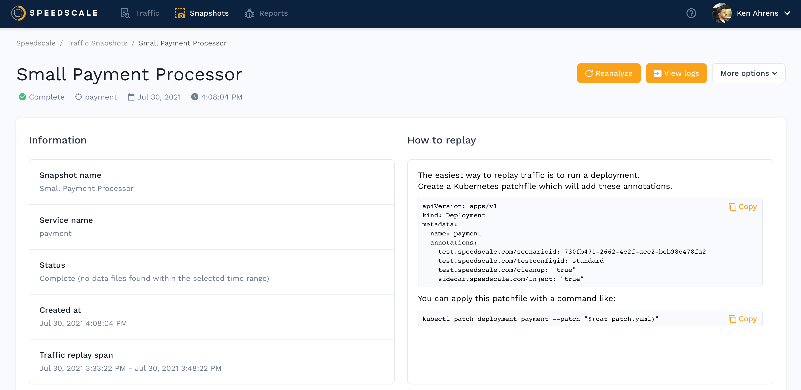

In this guide we will walk through importing an existing Postman collection and replaying it in a Kubernetes cluster. This guide is most helpful when you are unable to install the Speedscale sidecar for some reason, such as the service being brand new with no traffic.

We'll take the following steps:

1. Export your collection from Postman
2. Import your collection to Speedscale
3. Replay

## Export Postman collection

Open your Postman collection and export it to a file on your local desktop. Note that only collections v2.1 are supported.

## Import to Speedscale

Navigate to the [services](https://app.speedscale.com) in the speedscale UI. Click on the `Import Postman` button.

A pop up will appear asking you for a snapshot name, a Postman file and a unique Service Name. Note that the Service Name can be whatever you like but to prevent confusion it's better not to pick a real service that you are actually monitoring. Don't worry about picking the perfect service name, you'll put in the real URL of your service during replay. Most users will just leave it as the default.

## View Snapshot

A traffic snapshot is created from your Postman collection. Snapshots are collections of requests that can be replayed in your cluster or from your local desktop. After import, you will be taken to the Snapshot summary screen for your postman requests.

If you click `View Traffic` you'll see your Postman requests ready to replay.

## Replay

Postman-generated snapshots can be replayed like any other snapshot using the instructions on the Snapshot Summary page.  Remember that you will need to put in a `Custom URL` or `Replay Host` to point at the correct service during replay. This is different than replaying a recorded snapshot because Speedscale typically has an automatically discovered default that is reasonable.

For more information on initiating replays, check out the full [replay guide](./replay/README.md)