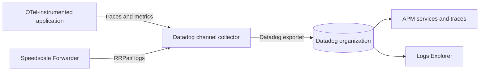

# Datadog

The Datadog integration sends two related data streams to one Datadog organization:

- Application OpenTelemetry traces and metrics populate APM services, traces, latency, throughput, and error views.
- Speedscale RRPairs arrive as structured logs containing the captured API request and response.

Both streams carry W3C trace context. From an APM trace, you can find the exact captured transaction, inspect what crossed the wire, and turn that traffic into a regression test or dependency mock.

## How it works



The collector uses the Datadog exporter for all three signals and the Datadog connector to derive the RED metrics used by APM service views. It also:

- marks spans with HTTP 5xx responses or exception events as errors;
- copies the captured workload to `service.name`;
- extracts `trace_id` and `span_id` from the captured `traceparent` header;
- adds `speedscale.workload` and `speedscale.direction` to RRPair logs.

## Why use it

Datadog shows where a request failed and how the failure affected latency and throughput. Speedscale adds the complete request and response needed to reproduce that failure. The same capture can be pulled from Datadog, saved as RRPairs, and run with proxymock in a local or CI environment.

Each Datadog destination is independent. Use credentials for the intended organization and keep partner workloads separate from the account used to monitor your production infrastructure.

## Install the channel

Create a Kubernetes Secret containing an API key for the destination organization:

```bash
kubectl create namespace byoc-datadog
kubectl -n byoc-datadog create secret generic datadog-api-key \
  --from-literal=api-key='<DATADOG_API_KEY>'

helm upgrade --install byoc-datadog speedscale-byoc/datadog \
  --namespace byoc-datadog \
  --set datadog.site='<DATADOG_SITE>' \
  --set datadog.credentialsSecret=datadog-api-key
```

Add one Forwarder exporter for this channel:

```yaml
forwarder:
  exporters:
    byoc_datadog:
      otel_endpoint: http://byoc-datadog-datadog.byoc-datadog.svc.cluster.local:4317
      filter_rule: standard
      dlp_config_id: standard
```

Send application OTLP data to the same collector service on port `4317` for gRPC or `4318` for HTTP.

## Verify in Datadog

1. Open **APM > Services** and find the application's `service.name`.
2. Open **APM > Traces** and filter on `service:<SERVICE_NAME>`.
3. Open **Logs > Explorer** and query `@msgType:rrpair service:<SERVICE_NAME>`.
4. Open a trace and confirm the correlated log has the same trace ID.
5. Trigger an HTTP 5xx response and confirm the span appears as an error in the trace and service views.

The API key permits ingest. Querying Datadog to retrieve captures also requires an application key from the same organization. The BYOC recipe requires explicit partner-account variables and does not fall back to production credentials:

```bash
export DATADOG_PARTNER_API_KEY='<API_KEY>'
export DATADOG_PARTNER_APP_KEY='<APPLICATION_KEY>'
export DATADOG_PARTNER_SITE='<DATADOG_SITE>'

python3 recipes/datadog-to-replay/gather.py \
  --trace-id '<TRACE_ID>' \
  --service '<SERVICE_NAME>' \
  --out ./datadog-capture

proxymock mock --in ./datadog-capture
```

## Evidence

The staging-decoy validation produced APM traces for the microsvc application and structured `rrpair` logs in the dedicated partner organization. The chart is also rendered and validated with its pinned OpenTelemetry Collector image in CI. The validation rejects any collector that includes a second destination exporter.

## One-time report export

The live OTLP channel is separate from `speedctl export datadog report`, which sends a completed Speedscale report to the Datadog event stream:

```bash
speedctl export datadog report '<REPORT_ID>' --apiKey '<DATADOG_API_KEY>'
```

Use the live channel for APM and trace correlation. Use the report export when you only need a completed replay result as a Datadog event.

## References

- [Speedscale BYOC Datadog chart](https://github.com/speedscale/speedscale-byoc/tree/main/charts/datadog)
- [Datadog OpenTelemetry Collector setup](https://docs.datadoghq.com/opentelemetry/setup/collector_exporter/)
