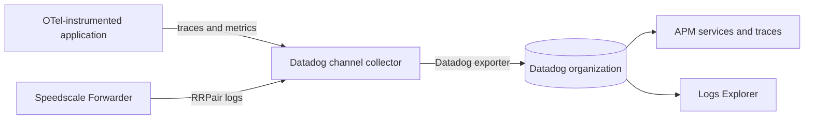
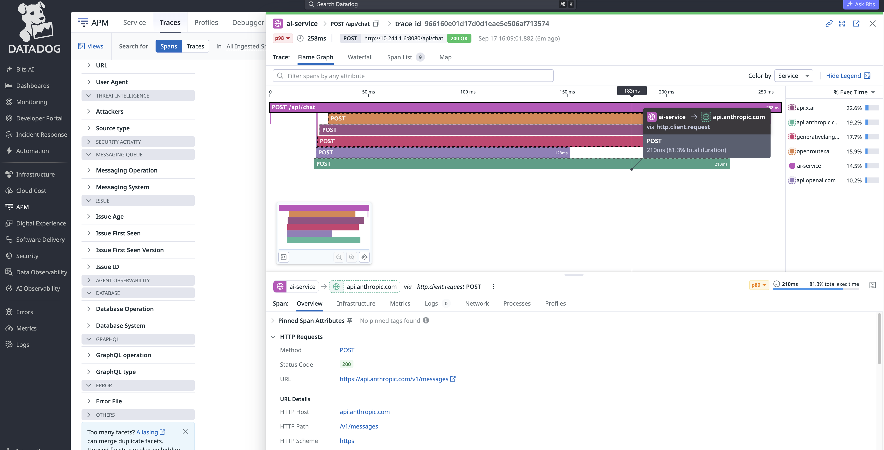
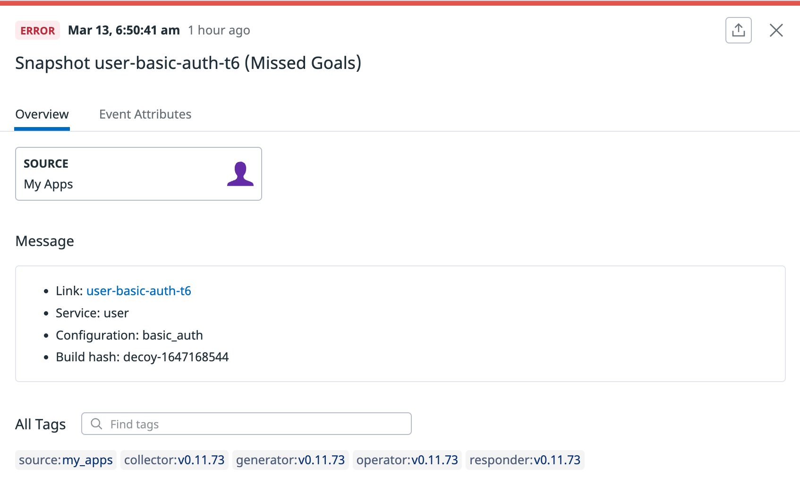

# Datadog

The Datadog integration sends two related data streams to one Datadog organization:

- Application OpenTelemetry traces and metrics populate APM services, traces, latency, throughput, and error views.
- Speedscale RRPairs arrive as structured logs containing the captured API request and response.

When an application request contains a valid W3C `traceparent` header, the collector copies its trace and span IDs onto the matching RRPair log. From an APM trace, you can find the captured transaction, inspect what crossed the wire, and turn that traffic into a regression test or dependency mock. Requests without a valid `traceparent` header still appear as logs, but they are not linked to an APM trace.

## How it works



The collector uses the Datadog exporter for all three signals and the Datadog connector to derive the RED metrics used by APM service views. It also:

- marks spans with HTTP 5xx responses or exception events as errors;
- identifies the source workload with `service.name` and `speedscale.workload`;
- identifies the remote destination with `hostname`, `server.address`, and `network.peer.address`;
- adds `speedscale.protocol`, `speedscale.command`, and `speedscale.status` for HTTP and non-HTTP traffic;
- extracts `trace_id` and `span_id` from the captured `traceparent` header;
- preserves the complete RRPair log body so it remains importable by the Datadog-to-proxymock recipe.

## Why use it

Datadog shows where a request failed and how the failure affected latency and throughput. Speedscale adds the complete request and response needed to reproduce that failure. The same capture can be pulled from Datadog, saved as RRPairs, and run with proxymock in a local or CI environment.

Each Datadog destination is independent. Use credentials for the intended organization and keep partner workloads separate from the account used to monitor your production infrastructure.

## Install the channel

Create a Kubernetes Secret containing an API key for the destination organization:

```bash
kubectl create namespace byoc-datadog
kubectl -n byoc-datadog create secret generic datadog-api-key \
  --from-literal=api-key='<DATADOG_API_KEY>'

helm upgrade --install byoc-datadog speedscale-byoc/datadog \
  --namespace byoc-datadog \
  --set datadog.site='<DATADOG_SITE>' \
  --set datadog.credentialsSecret=datadog-api-key
```

Add one Forwarder exporter for this channel:

```yaml
forwarder:
  exporters:
    byoc_datadog:
      otel_endpoint: http://byoc-datadog-datadog.byoc-datadog.svc.cluster.local:4317
      filter_rule: standard
      dlp_config_id: standard
```

Send application OTLP data to the same collector service on port `4317` for gRPC or `4318` for HTTP.

## Verify in Datadog

1. Open **APM > Services** and find the application's `service.name`.
2. Open **APM > Traces** and filter on `service:<SERVICE_NAME>`.
3. Open **Logs > Explorer** and query `@msgType:rrpair @speedscale.direction:OUT`. Add `service:<SERVICE_NAME>` only when you want to narrow the results to one source workload.
4. Add `service`, `@hostname`, `@speedscale.workload`, `@speedscale.protocol`, `@speedscale.command`, `@speedscale.status`, and `trace_id` as table columns.
5. Confirm the source and destination are distinct. For example, an LLM call can show `banking-ai` as the workload and `api.anthropic.com` as `@hostname`. PostgreSQL and Kafka records should show their cluster hostnames and protocols even when they have no trace ID.
6. Open an HTTP trace and confirm the correlated log has the same trace ID.
7. Trigger an HTTP 5xx response and confirm the span appears as an error in the trace and service views.



## Use the capture with proxymock

The [Datadog-to-proxymock recipe](https://github.com/speedscale/speedscale-byoc/tree/main/recipes/datadog-to-replay) queries the RRPair logs and APM spans for one trace. The Datadog application key needs `logs_read_data` and `apm_read`. Clone the `speedscale-byoc` repository and set credentials for the same Datadog organization used by the collector:

```bash
export DATADOG_PARTNER_API_KEY='<API_KEY>'
export DATADOG_PARTNER_APP_KEY='<APPLICATION_KEY>'
export DATADOG_PARTNER_SITE='<DATADOG_SITE>'

python3 recipes/datadog-to-replay/gather.py \
  --trace-id '<32_CHARACTER_LOWERCASE_TRACE_ID>' \
  --service '<SERVICE_NAME>' \
  --out ./datadog-capture

proxymock mock --in ./datadog-capture
proxymock replay --in ./datadog-capture \
  --test-against http://localhost:8080
```

The recipe requires the trace to contain at least one incoming HTTP RRPair, one outgoing HTTP RRPair, and a same-service APM span from the previous 24 hours. Its `provenance.json` records the Datadog log and span IDs used to build the local capture.

If the same traffic is retained in Speedscale Cloud or a BYOC bucket, you can pull it without querying Datadog:

```bash
proxymock cloud pull snapshot '<SNAPSHOT_ID>' --out ./datadog-capture
# Or retrieve the trace from an S3 BYOC channel:
proxymock import s3 --bucket '<BUCKET>' --prefix byoc/ \
  --trace-id '<TRACE_ID>' --out ./datadog-capture
```

## Evidence

The chart is rendered and validated with its pinned OpenTelemetry Collector image in CI. A runtime test sends HTTPS, PostgreSQL, and Kafka RRPairs through the rendered collector in one mixed batch and verifies source-service isolation, upstream hostnames, protocol metadata, trace correlation, and preservation of the complete Datadog RRPair body.

## One-time report export

The live OTLP channel is separate from `speedctl export datadog`, which sends a completed Speedscale report to the Datadog event stream:

```bash
speedctl export datadog '<REPORT_ID>' --apiKey '<DATADOG_API_KEY>'
```

Use the live channel for APM and trace correlation. Use the report export when you only need a completed replay result as a Datadog event.



## References

- [Speedscale BYOC Datadog chart](https://github.com/speedscale/speedscale-byoc/tree/main/charts/datadog)
- [Datadog OpenTelemetry Collector setup](https://docs.datadoghq.com/opentelemetry/setup/collector_exporter/)
