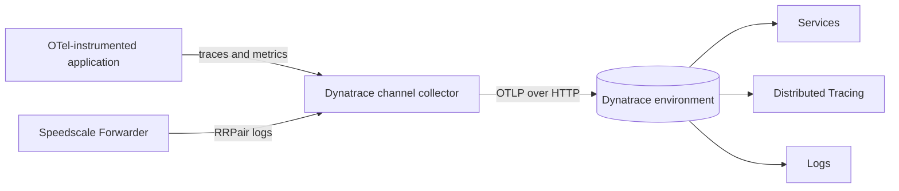
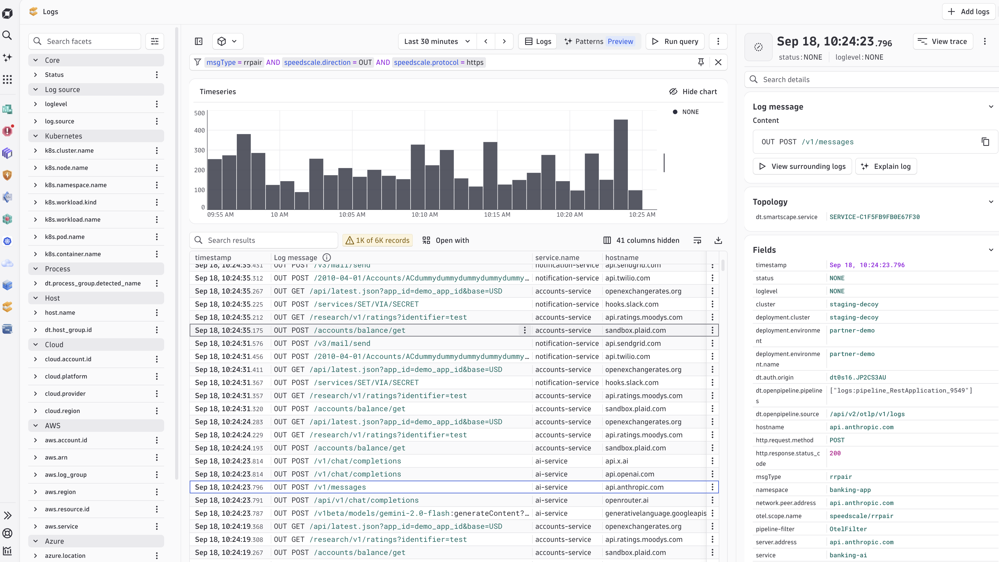
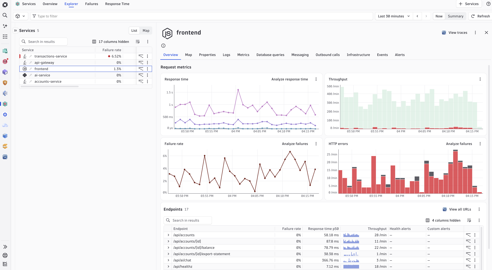

# Dynatrace

The Dynatrace integration sends application OpenTelemetry traces and metrics alongside normalized Speedscale capture logs. Application spans populate Services and Distributed Tracing. Capture logs identify the source workload, remote destination, protocol, command, and status; retain the full RRPair in Speedscale Cloud or a BYOC object-storage channel when it must be replayed.

Trace correlation requires a valid W3C `traceparent` header on the captured application request. Requests without one still appear in Logs, but Dynatrace cannot link them to an application trace.

## How it works



Dynatrace's ingest API accepts OTLP over HTTP. The collector receives gRPC or HTTP inside the cluster, then sends each signal to the correct Dynatrace path. It also:

- marks spans with HTTP 5xx responses or exception events as errors;
- identifies the source workload with `service.name` and `speedscale.workload`;
- identifies the remote destination with `hostname`, `server.address`, and `network.peer.address`;
- emits a readable message and `speedscale.protocol`, `speedscale.command`, and `speedscale.status` for HTTP, PostgreSQL, Kafka, and other captured protocols;
- extracts W3C trace context from captured request headers;
- converts cumulative metrics to delta temporality before export.

## Why use it

Dynatrace Services shows service health, request rate, response time, endpoints, and failures from the application spans. Distributed Tracing shows individual request paths. Speedscale capture logs add the protocol and remote-destination context needed to identify the corresponding full traffic in Speedscale Cloud or a BYOC object-storage channel.

## Install the channel

Create a Dynatrace access token with `openTelemetryTrace.ingest`, `metrics.ingest`, and `logs.ingest`. Store the token in a Kubernetes Secret:

```bash
kubectl create namespace byoc-dynatrace
kubectl -n byoc-dynatrace create secret generic dynatrace-api-token \
  --from-literal=api-token='<DYNATRACE_TOKEN>'

helm upgrade --install byoc-dynatrace speedscale-byoc/dynatrace \
  --namespace byoc-dynatrace \
  --set dynatrace.endpoint='https://<ENVIRONMENT>.live.dynatrace.com/api/v2/otlp' \
  --set dynatrace.credentialsSecret=dynatrace-api-token
```

The endpoint is the OTLP base URL. Do not add `/v1/traces`, `/v1/metrics`, or `/v1/logs`.

Add one Forwarder exporter for this channel:

```yaml
forwarder:
  exporters:
    byoc_dynatrace:
      otel_endpoint: http://byoc-dynatrace-dynatrace.byoc-dynatrace.svc.cluster.local:4317
      filter_rule: standard
      dlp_config_id: standard
```

Send application OTLP data to the same collector service on port `4317` for gRPC or `4318` for HTTP.

The chart's NetworkPolicy only admits traffic from the `speedscale` namespace by default. Add each application namespace that sends OTLP data:

```bash
helm upgrade byoc-dynatrace speedscale-byoc/dynatrace \
  --namespace byoc-dynatrace --reuse-values \
  --set 'networkPolicy.allowedNamespaces={speedscale,<APP_NAMESPACE>}'
```

## Verify in Dynatrace

Open **Logs**, paste this expression into the **Filter field**, and select **Run query**:

```text
msgType = rrpair AND speedscale.direction = OUT
```

This is filter-field syntax, not DQL. The table only needs four columns: `timestamp`, `Log message`, `service.name`, and `hostname`. `service.name` is the source service and `hostname` is the remote destination. For example, PostgreSQL traffic can show `accounts-service` and `banking-postgres.banking-app.svc.cluster.local`.

Append `AND speedscale.protocol = https` to show only HTTPS traffic.



Open **Services** separately to confirm that application throughput, response-time, and failure charts contain current data.



## Use the capture with proxymock

Dynatrace is the observability view, not the portable RRPair archive. There is no direct `proxymock import dynatrace` command. Retain the same traffic in Speedscale Cloud, Amazon S3, or Google Cloud Storage if developers need to turn a trace into local tests and mocks.

Pull a Speedscale snapshot by ID:

```bash
proxymock cloud pull snapshot '<SNAPSHOT_ID>' --out ./dynatrace-capture
proxymock mock --in ./dynatrace-capture
proxymock replay --in ./dynatrace-capture \
  --test-against http://localhost:8080
```

For an S3 or GCS BYOC channel, retrieve recent RRPairs by service and time range:

```bash
proxymock import s3 --bucket '<BUCKET>' --prefix byoc/ \
  --service '<SERVICE_NAME>' --from now-1h --out ./dynatrace-capture

# Native GCS uses Google Application Default Credentials.
proxymock import gcs --bucket '<GCS_BUCKET>' --prefix byoc/ \
  --service '<SERVICE_NAME>' --from now-1h --out ./dynatrace-capture
```

See [Use BYOC traffic with proxymock](/byoc/use-traffic.md) for authentication, filtering, and cluster discovery.

## Evidence

The chart's collector configuration is rendered and validated with its pinned OpenTelemetry Collector image in CI. A runtime test sends HTTPS, PostgreSQL, and Kafka RRPairs through the rendered collector in one mixed batch and verifies readable messages, source-service isolation, real upstream hostnames, protocol metadata, and trace behavior. Dynatrace also exposes ingest health metrics such as accepted and rejected OTLP metric data points and received spans for troubleshooting.

## References

- [Speedscale BYOC Dynatrace chart](https://github.com/speedscale/speedscale-byoc/tree/main/charts/dynatrace)
- [Dynatrace OTLP API endpoints](https://docs.dynatrace.com/docs/ingest-from/opentelemetry/otlp-api)
- [Configure the OpenTelemetry Collector for Dynatrace](https://docs.dynatrace.com/docs/ingest-from/opentelemetry/collector/configuration)
