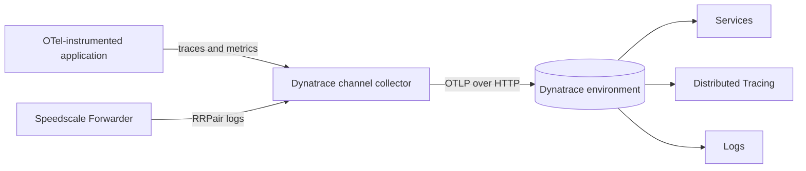

# Dynatrace

The Dynatrace integration sends application OpenTelemetry traces and metrics alongside Speedscale RRPair logs. Application spans populate Services and Distributed Tracing. RRPairs preserve the API request and response that can be used to reproduce the same behavior outside the monitored environment.

Trace correlation requires a valid W3C `traceparent` header on the captured application request. Requests without one still appear in Logs, but Dynatrace cannot link them to an application trace.

## How it works



Dynatrace's ingest API accepts OTLP over HTTP. The collector receives gRPC or HTTP inside the cluster, then sends each signal to the correct Dynatrace path. It also:

- marks spans with HTTP 5xx responses or exception events as errors;
- copies the captured workload to `service.name`;
- extracts W3C trace context from captured request headers;
- adds `speedscale.workload` and `speedscale.direction` to RRPair logs;
- converts cumulative metrics to delta temporality before export.

## Why use it

Dynatrace Services shows service health, request rate, response time, endpoints, and failures from the application spans. Distributed Tracing shows individual request paths. Speedscale captures add the request and response payload needed to build tests and dependency mocks from the traffic behind those service views.

## Install the channel

Create a Dynatrace access token with `openTelemetryTrace.ingest`, `metrics.ingest`, and `logs.ingest`. Store the token in a Kubernetes Secret:

```bash
kubectl create namespace byoc-dynatrace
kubectl -n byoc-dynatrace create secret generic dynatrace-api-token \
  --from-literal=api-token='<DYNATRACE_TOKEN>'

helm upgrade --install byoc-dynatrace speedscale-byoc/dynatrace \
  --namespace byoc-dynatrace \
  --set dynatrace.endpoint='https://<ENVIRONMENT>.live.dynatrace.com/api/v2/otlp' \
  --set dynatrace.credentialsSecret=dynatrace-api-token
```

The endpoint is the OTLP base URL. Do not add `/v1/traces`, `/v1/metrics`, or `/v1/logs`.

Add one Forwarder exporter for this channel:

```yaml
forwarder:
  exporters:
    byoc_dynatrace:
      otel_endpoint: http://byoc-dynatrace-dynatrace.byoc-dynatrace.svc.cluster.local:4317
      filter_rule: standard
      dlp_config_id: standard
```

Send application OTLP data to the same collector service on port `4317` for gRPC or `4318` for HTTP.

## Verify in Dynatrace

1. Open **Services > Explorer** and confirm each application `service.name` appears.
2. Confirm throughput and response-time charts contain recent data.
3. Open **Distributed Tracing** from a service and inspect a trace.
4. Open **Logs** and query `content.$.msgType = rrpair`.
5. Open the column picker and show `trace_id`, `service.name`, `speedscale.workload`, and `speedscale.direction`. Dynatrace stores these OTLP attributes separately from the JSON log body.
6. Compare the RRPair log's `trace_id` with the application trace.
7. Trigger an HTTP 5xx response and confirm the service failure rate and HTTP error charts change.


## Use the capture with proxymock

Dynatrace is the observability view, not the portable RRPair archive. There is no direct `proxymock import dynatrace` command. Retain the same traffic in Speedscale Cloud, Amazon S3, or Google Cloud Storage if developers need to turn a trace into local tests and mocks.

Pull a Speedscale snapshot by ID:

```bash
proxymock cloud pull snapshot '<SNAPSHOT_ID>' --out ./dynatrace-capture
proxymock mock --in ./dynatrace-capture
proxymock replay --in ./dynatrace-capture \
  --test-against http://localhost:8080
```

For an S3 or GCS BYOC channel, retrieve recent RRPairs by service and time range:

```bash
proxymock import s3 --bucket '<BUCKET>' --prefix byoc/ \
  --service '<SERVICE_NAME>' --from now-1h --out ./dynatrace-capture

# Native GCS uses Google Application Default Credentials.
proxymock import gcs --bucket '<GCS_BUCKET>' --prefix byoc/ \
  --service '<SERVICE_NAME>' --from now-1h --out ./dynatrace-capture
```

See [Pull traffic from a BYOC bucket](/proxymock/guides/byoc-bucket.md) for authentication, filtering, and cluster discovery.

## Evidence

In the staging-decoy validation, Dynatrace showed five microsvc services, including `ai-service`, with live throughput. The frontend service view also showed a nonzero failure rate and HTTP error volume. Logs contained RRPairs with populated `trace_id`, `service.name`, `speedscale.workload`, and `speedscale.direction` attributes.

The chart's collector configuration is rendered and validated with its pinned OpenTelemetry Collector image in CI. Dynatrace also exposes ingest health metrics such as accepted and rejected OTLP metric data points and received spans for troubleshooting.

## References

- [Speedscale BYOC Dynatrace chart](https://github.com/speedscale/speedscale-byoc/tree/main/charts/dynatrace)
- [Dynatrace OTLP API endpoints](https://docs.dynatrace.com/docs/ingest-from/opentelemetry/otlp-api)
- [Configure the OpenTelemetry Collector for Dynatrace](https://docs.dynatrace.com/docs/ingest-from/opentelemetry/collector/configuration)
