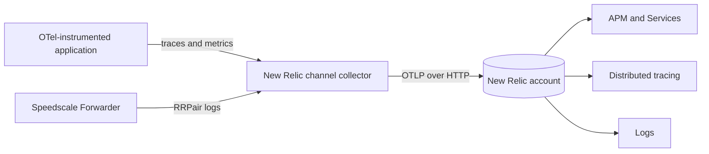
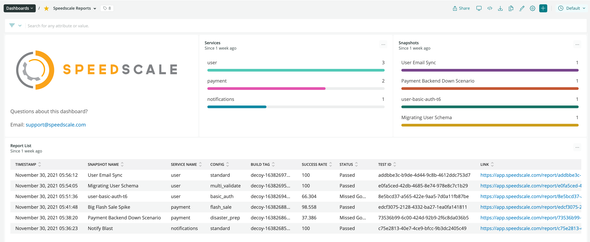

# New Relic

The New Relic integration sends application OpenTelemetry traces and metrics alongside Speedscale RRPair logs. New Relic APM shows the application topology, latency, throughput, and errors. When the captured request contains a valid W3C `traceparent` header, the matching RRPair log carries the trace ID needed for correlation. Requests without that header still appear in Logs but are not linked to an APM trace.

## How it works



The collector sends all signals to New Relic's native OTLP endpoint with an ingest license key. It also:

- marks spans with HTTP 5xx responses or exception events as errors;
- copies the captured workload to `service.name`;
- extracts W3C trace context from captured request headers;
- adds `speedscale.workload` and `speedscale.direction` to RRPair logs.

No New Relic account ID is needed for OTLP ingest. Keep account IDs, license keys, and partner tenant details out of values files and source control.

## Why use it

New Relic APM identifies the service and span involved in an error. The matching RRPair shows the API input and output at that point in the trace. That traffic can become a regression test or a dependency mock, giving developers a repeatable way to investigate the behavior seen in APM.

## Install the channel

Create an ingest license key in the destination account and store it in a Kubernetes Secret:

```bash
kubectl create namespace byoc-newrelic
kubectl -n byoc-newrelic create secret generic newrelic-license-key \
  --from-literal=license-key='<NEW_RELIC_LICENSE_KEY>'

helm upgrade --install byoc-newrelic speedscale-byoc/newrelic \
  --namespace byoc-newrelic \
  --set newrelic.credentialsSecret=newrelic-license-key
```

The default endpoint is New Relic's US OTLP endpoint. Set `newrelic.endpoint` to the documented EU, Japan, or FedRAMP base URL when required. Do not add a signal path.

Add one Forwarder exporter for this channel:

```yaml
forwarder:
  exporters:
    byoc_newrelic:
      otel_endpoint: http://byoc-newrelic-newrelic.byoc-newrelic.svc.cluster.local:4317
      filter_rule: standard
      dlp_config_id: standard
```

Send application OTLP data to the same collector service on port `4317` for gRPC or `4318` for HTTP.

## Verify in New Relic

1. Open **APM & Services > Services** and find the application's `service.name`.
2. Open **Distributed tracing** and filter for that service.
3. Open **Logs** and query `msgType = 'rrpair'`.
4. Add `trace.id`, `service.name`, `speedscale.workload`, and `speedscale.direction` as table columns.
5. Open a trace and confirm a matching RRPair log has the same `trace.id`.
6. Trigger an HTTP 5xx response and confirm the transaction and span appear as errors.
7. Use **Metrics and events** to confirm application metrics are arriving.

## Use the capture with proxymock

New Relic is the observability view, not the portable RRPair archive. There is no direct `proxymock import newrelic` command. Retain the same traffic in Speedscale Cloud, Amazon S3, or Google Cloud Storage if developers need to turn a trace into local tests and mocks.

Pull a Speedscale snapshot by ID:

```bash
proxymock cloud pull snapshot '<SNAPSHOT_ID>' --out ./newrelic-capture
proxymock mock --in ./newrelic-capture
proxymock replay --in ./newrelic-capture \
  --test-against http://localhost:8080
```

For an S3 or GCS BYOC channel, retrieve recent RRPairs by service and time range:

```bash
proxymock import s3 --bucket '<BUCKET>' --prefix byoc/ \
  --service '<SERVICE_NAME>' --from now-1h --out ./newrelic-capture

# Native GCS uses Google Application Default Credentials.
proxymock import gcs --bucket '<GCS_BUCKET>' --prefix byoc/ \
  --service '<SERVICE_NAME>' --from now-1h --out ./newrelic-capture
```

See [Pull traffic from a BYOC bucket](/proxymock/guides/byoc-bucket.md) for authentication, filtering, and cluster discovery.

## Evidence

The BYOC chart is rendered and validated with the pinned OpenTelemetry Collector image in CI, including the logs, traces, and metrics pipelines and Secret-backed `api-key` header.

## One-time report export

The live OTLP channel is separate from `speedctl export newrelic`, which sends a completed Speedscale report to New Relic as custom events:

```bash
speedctl export newrelic '<REPORT_ID>' \
  --accountId '<ACCOUNT_ID>' \
  --insightsKey '<INSERT_KEY>'
```

Use the live channel for APM and trace correlation. Use the report export when you only need completed replay results in a New Relic dashboard.



## References

- [Speedscale BYOC New Relic chart](https://github.com/speedscale/speedscale-byoc/tree/main/charts/newrelic)
- [New Relic OTLP endpoint](https://docs.newrelic.com/docs/opentelemetry/best-practices/opentelemetry-otlp/)
