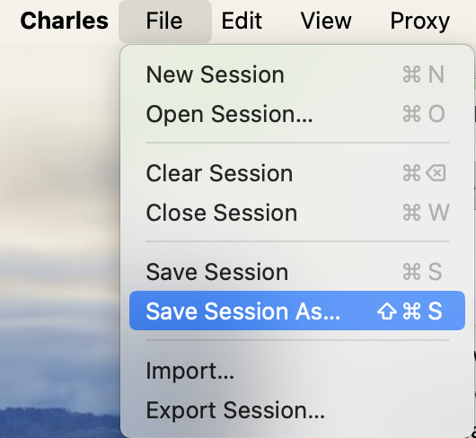

In this guide we will walk through importing traffic from a [Charles Proxy Session](https://www.charlesproxy.com/). These files generally have the `.chlz` file extension and represent request/response pairs recorded by the proxy.

We'll take the following steps:

1. Export a Charles Proxy session file (.chlz)
2. Convert the `.chlz` file to `.har`
3. Import into Speedscale

## Export a Charles Proxy Session

Charles Proxy makes it very easy to save proxy results. Open your desired set of traffic and find the `Save Session As` option or equivalent:



Note the location of the newly created `.chlz` file.

## Convert to HAR Format

Charles Proxy conveniently provides the ability to convert from its proprietary format into the standard HAR file format used to store browser requests. From the Charles Proxy [documentation](https://www.charlesproxy.com/documentation/tools/command-line-tools/) we want to run a command like the following:

```
Charles session.chlz ready_for_speedscale.har
```

Note the location of the newly created `.har` file.

## Import and replay

Import the HAR file into Speedscale Cloud or local proxymock files. Select inbound traffic for tests or outbound traffic for dependency mocks. This lets you record browser-to-backend traffic with Charles Proxy and then test the browser code against recorded backend responses.

Continue with the [HAR import guide](./import-har.md). Its cloud and local commands work with the HAR file produced by Charles.
