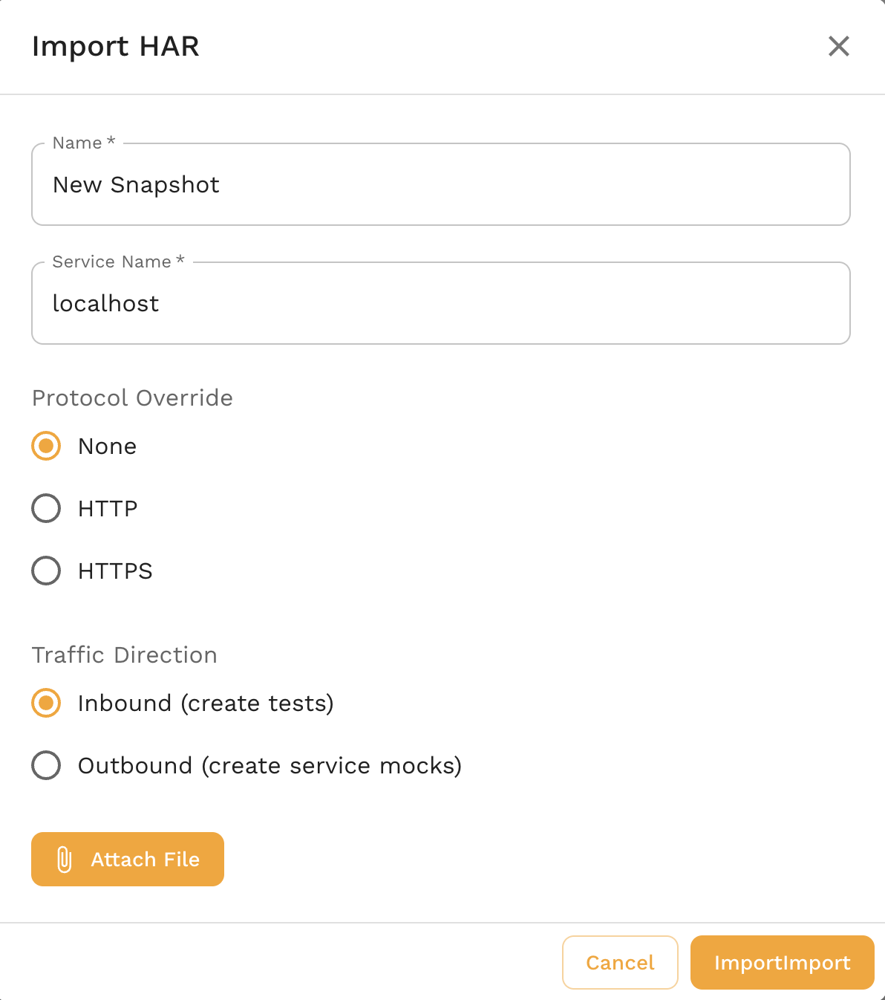

import Tabs from '@theme/Tabs';
import TabItem from '@theme/TabItem';


This guide imports traffic from an [HTTP Archive](https://en.wikipedia.org/wiki/HAR_(file_format)) (HAR) file. Browsers and HTTP debugging tools can export this format with both requests and recorded responses.

We'll take the following steps:

1. Create a HAR file from browser traffic.
2. Import the traffic to Speedscale Cloud or proxymock.
3. Replay the requests or serve the responses as mocks.

## Create a HAR file from a browser

<Tabs>

<TabItem value="chrome" label="Chrome">

Open [DevTools](https://developer.chrome.com/docs/devtools/open/) and select the **Network** tab.

Use your service in the browser to generate traffic.

Click
[Export HAR](https://developer.chrome.com/docs/devtools/network/reference/#save-as-har)
to export the traffic to a HAR file.

</TabItem>

<TabItem value="firefox" label="Firefox">

Open [Developer Tools](https://firefox-source-docs.mozilla.org/devtools-user/) and select the **Network** tab.

Use your service in the browser to generate traffic.

Click the cog and choose [Save All as HAR](https://firefox-source-docs.mozilla.org/devtools-user/network_monitor/request_list/index.html#managing-har-data)
to export the traffic to a HAR file.

</TabItem>

</Tabs>

## Import to Speedscale Cloud

Open [Services](https://app.speedscale.com) in the Speedscale UI. Click **Add service**, then select **Build from HAR**.



The dialog asks for a snapshot name, traffic direction, HAR file, and service name. Use inbound direction to create tests and outbound direction to create dependency mocks. The service name identifies the imported traffic; the replay wizard asks for the real target URL later.

The equivalent CLI command is:

```bash
speedctl import har --name {SNAPSHOT_NAME} \
  --service-name {SERVICE_NAME} --from recording.har
```

## Import to local proxymock files

The local importer does not require a Speedscale account. Each HAR entry becomes an inbound test, and its recorded response can also be served as an outbound mock:

```bash
proxymock import har recording.har --out ./har-rrpairs

# Replay requests against an application.
proxymock replay --in ./har-rrpairs --test-against http://localhost:8080

# Or serve the recorded responses as dependency mocks.
proxymock mock --in ./har-rrpairs
```

## View Snapshot

A cloud import creates a traffic snapshot that can be replayed in a cluster or from a local desktop. After import, the UI opens the snapshot summary.


Click **View Traffic** to inspect the requests before replay.

## Replay

HAR-generated cloud snapshots can be replayed from the snapshot summary. Set **Custom URL** to the service under test because an imported HAR does not have a discovered cluster destination.

For the cloud workflow, see the full [replay guide](../../replay/README.md). For local commands, run `proxymock import har --help` and `proxymock replay --help`.
