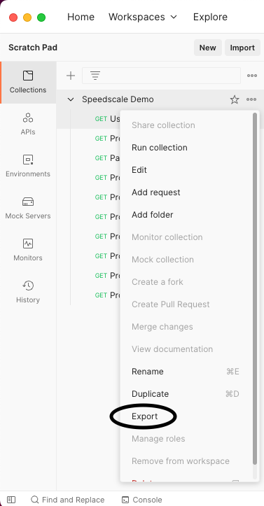
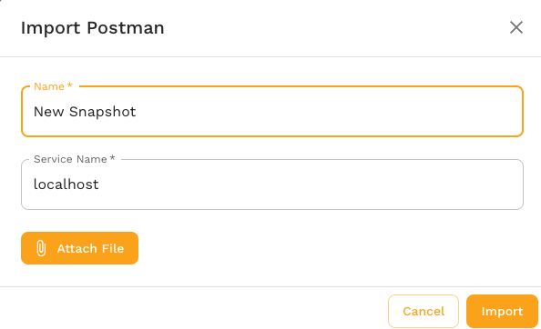

<iframe src="https://www.youtube.com/embed/jS01DK7R70E?rel=0&modestbranding=1" width="640" height="360" frameborder="0" allow="autoplay; fullscreen; picture-in-picture" allowfullscreen></iframe>

This guide imports an existing Postman collection into Speedscale Cloud or local proxymock files. It is useful when a service is new and has no recorded traffic.

We'll take the following steps:

1. Export your collection from Postman
2. Import your collection to Speedscale Cloud or proxymock.
3. Replay the requests or serve saved example responses as mocks.

## Export Postman collection

Open your Postman collection and export it to a local file. Only collection format v2.1 is supported.



## Import to Speedscale Cloud

Open [Services](https://app.speedscale.com) in the Speedscale UI. Click **Add service**, then select **Build from Postman Collection**.



The dialog asks for a snapshot name, collection file, and service name. The service name identifies the imported traffic; the replay wizard asks for the real target URL later.

The equivalent CLI command is:

```bash
speedctl import postman --name {SNAPSHOT_NAME} \
  --service-name {SERVICE_NAME} --from collection.json
```

## Import to local proxymock files

The local importer does not require a Speedscale account. Collection variables with values are substituted. Variables exported without values, which commonly include secrets, remain as `{{placeholders}}`.

```bash
proxymock import postman collection.json --out ./postman-rrpairs
proxymock replay --in ./postman-rrpairs \
  --test-against http://localhost:8080
```

Requests with saved example responses can also be served as dependency mocks:

```bash
proxymock mock --in ./postman-rrpairs
```

## View Snapshot

A cloud import creates a traffic snapshot that can be replayed in a cluster or from a local desktop. After import, the UI opens the snapshot summary.


Click **View Traffic** to inspect the Postman requests before replay.

## Replay

Postman-generated cloud snapshots can be replayed from the snapshot summary. Set **Custom URL** to the service under test because an imported collection does not have a discovered cluster destination.

For the cloud workflow, see the full [replay guide](/guides/replay/README.md). For local commands, run `proxymock import postman --help` and `proxymock replay --help`.
