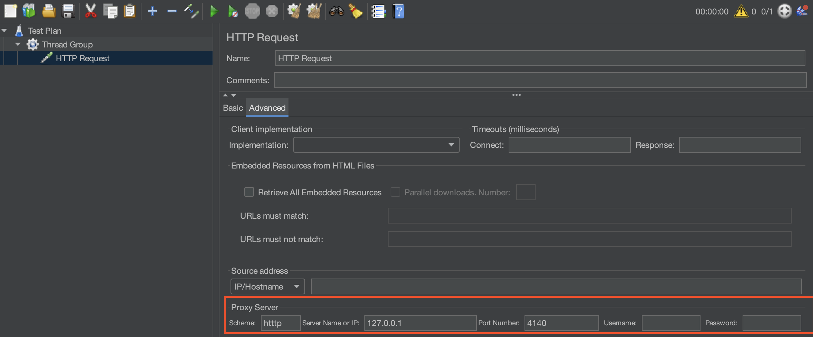

# Migrating from JMeter

Performance testing is a crucial aspect of the software development lifecycle, ensuring applications can handle expected load and stress. Apache JMeter and Speedscale are two popular tools used for this purpose. Speedscale users commonly seek to migrate JMeter scripts onto the Speedscale platform to modernize their API testing.

This guide describes how to easily re-direct JMeter to the Speedscale recorder and scale up for various test types of tests. Keep in mind that Speedscale replicates your JMeter script by recording the requests it makes. Once imported into Speedscale it's easy to recombine and otherwise modify the output. The focus within JMeter is to run the simplest and cleanest version of each test suite.

:::tip
Turn your vUser settings down to one and record each test script as a separate snapshot. Speedscale already knows how to scale up traffic, merge test suites, etc. It's best to start with the cleanest run possible and use Speedscale's built-in functionality.
:::

#### Pre-Migration Checklist

1. **Inventory of JMeter Scripts:** List all the JMeter scripts you intend to migrate.
2. **Understand the Test Scenarios:** Ensure you understand the logic, parameters, and datasets used in your JMeter scripts.
3. **Speedscale Setup:** Ensure you have [speedctl](../../../getting-started/quick-start.md#install-cli-optional) installed.

#### Step-by-Step Migration Process

1. **Analyze JMeter Test Plan:**
   - Open your JMeter test plan (.jmx file) and review the test components, such as Thread Groups, HTTP Requests, Samplers, Controllers, and Listeners.
   - Note any custom scripts, plugins, or configurations used. Ensure that any additional plug in protocols are supported in Speedscale's support [page](/reference/technology-support.md).


2. **Recreate Test Structure in Speedscale:**
   - Many JMeter test plans are already logically oriented and it is usually wise to create a new snapshot for each section. For example, you may want to record the authorization section once and use it over and over before each test plan. Record that as its own snapshot and then merge it into each replay.
   - More recordings is better than larger recordings. You can always recombine sections after recording but it's harder to split sections up.
   - Make sure you use consistent service names for each snapshot you record (remember this for the `speedctl capture <service name>` below)

3. **Replicate Load Patterns:**
:::tip
Review Speedscale's default load [patterns](/guides/load-patterns.md) to see if one already fits your needs. You can skip over this section entirely if so.
:::
   - Create a new test config using the Speedscale UI. Look for the "Create Test Config" button or you can clone from an existing one like [100replicas](https://app.speedscale.com/config/performance_100replicas).
   - Modify the `Load Patterrn` section to match the vUser volume and timing of the original JMeter script.

4. **Migrate CSV Data Sets:**
:::tip
Manual CSV import is usually not necessary in this type of migration. If JMeter iterates a CSV then the CSV data is by definition stored within the requests that are recorded. Speedscale will see every request/response and determine that there is a field with changing data within.
:::
   - If CSV data must be manually migrated (see tip above) then upload the CSV to Speedscale using the `speedctl push userdata my_data_1 <file.csv>` command or using the Speedscale UI.
   - Find the data field that needs replacing in your traffic and replace it using either the [smart_replace_csv](../../transformation/transforms/smart_replace_csv.md) or csv_iterator transforms.
   - It is possible to run your JMeter script and then retroactively extract data into CSVs. This is not necessary for this workflow but it comes in handy if you're working with CSVs (see the `speedctl extract` man page for more info)

5. **Assertions:**
:::tip
In most cases, Speedscale's default assertions will be more than adequate and this section can be skipped. Speedscale already knows what to assert on because it can see the application's response while JMeter is running.
:::
   - To manually edit assertions to cover a special use case, open the test config you created in step 3 (or make a new one).
   - Click on the "Assertions" tab and modify as desired.
   - Remember to save changes.

6. **Think Time and Pacing:**
:::tip
Speedscale automatically records the think time and pacing of transactions. No special action is required if you simply want to replicate JMeter timings.
:::
   - Keep in mind that pacing can be altered for each load pattern step. See step 3 for information on load patterns. If you need to alter *individual* request timings beyond what is recorded from JMeter you can alter them using the [latency](/guides/transformation/extractors/latency) extractor.

7. **Start Speedscale Recorder:**
   - Open a terminal on your local desktop (or the machine running JMeter).
   - Start the Speedscale recorder by running the following command. Replace `<service_name>` and `<listener_port>` to match the service JMeter will be talking to
   - For testing purposes the command might look like this: `speedctl capture localhost 8080`
   - Ensure the service that JMeter is talking to is running.

```bash
speedctl capture <service_name> <listener_port>
```

8. **Run JMeter Script:**
   - Remember to dial back your vUsers.
   - Change the proxy settings in JMeter to point at the Speedscale recorder (the settings you need were outputted by the `speedctl capture` command)
   - Press the Play button for each section you would like to record.
   - Don't worry about breaking up the traffic into snapshots yet. Just record everything and you can break it up in the next section. It is helpful to put some time between each traffic set (or filter it by endpoint, etc) to make it easier to visually delineate.

Here is an example of adding these proxy settings for one request:



9. **Create Snapshot(s):**
   - Open the Speedscale traffic viewer.
   - Select your `service_name` from the dropdown or service filter.
   - Review the traffic you recorded.
   - Select a time range and filter set that isolate a test suite.
   - Click the "Save" button.
   - Repeat this process for each snapshot you would like to create.
:::tip
Traffic is immutable and many snapshots can be created from the same recording. In other words, don't be afraid of making mistakes because you can start over easily.
:::

10. **Run replay:**
   - View one of the snapshots you created.
   - Click "Replay" to start the replay wizard.
   - In the replay wizard, make sure you select the test config you created in the previous steps (if necessary) to run the correct load pattern and assertions. JMeter combines all aspects of a test into the test suite. Speedscale breaks up the traffic (what) with the load pattern (how) for more seamless automation.
   - View report and results.

#### Conclusion

Migrating from JMeter to Speedscale can significantly reduce the labor required to support your performance testing practice. Speedscale's ability to record actual behavior should make migration fairly painless in most cases.

Let us know on the [community Slack](https://slack.speedscale.com) if you need additional help or advice.
