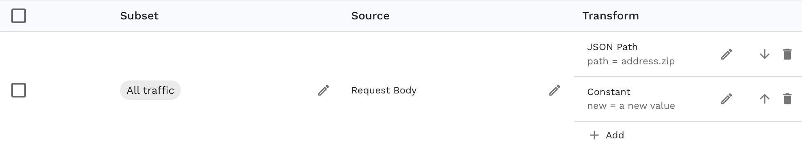

# How to Modify JSON Payloads

Working with JSON payloads is a common task, whether you're parsing data or modifying it dynamically. Speedscale makes it easy to modify JSON strings without scripting or other complex data manipulation techniques. In this guide we will walk through using [transforms](../concepts/transforms.md) to quickly modify the request or response payload within an RRPair.

This guide works for either request payloads or response payloads but examples are only shown for request payloads. To modify response payloads, change every reference to `req_body` to `res_body`. The formatting or whitespace of the incoming JSON does not affect functionality.

Here’s a quick guide on how to use Speedscale to modify JSON data.

## Basic Usage

### 1. Adding or Modifying a Key-Value Pair

The [json_path](/guides/transformation/transforms/json_path) transform provides a simple API for modifying a JSON string. By default, if the path does not exist then a new key will be created. If you would prefer that the transform error instead you can set `create=false` in the configuration.

Take the following example JSON as an HTTP request body:

```json
{
    "foo": "bar"
}
```

Here’s an example of how to add or modify the above JSON string in pseudo-code, as a Speedscale-compatible JSON configuration and as shown in the UI. Note that to provide a complete example the `constant` transform is added but any transform can be used downstream of the `json_path`. The `constant` transform simply inserts a new value into the key selected by the previous `json_path` transform.

```
req_body() | json_path(path=foo) | constant(value="a new value")
```

```json
{
    "extractor": {
    "type": "req_body"
    },
    "transforms": [
        {
            "type": "json_path",
            "config": {
                "path": "foo"
            }
        },
        {
            "type": "constant",
            "config": {
                "new": "a new value"
            }
        }
    ],
}
```


### 2. Nested Key Modification

If you need to modify a nested key, you follow the same pattern as in example 1. Note that to provide a complete example the `constant` transform is added but any transform can be used downstream of the `json_path`. The `constant` transform simply inserts a new value into the key selected by the previous `json_path` transform.

```json
{
    "name": "Alice",
    "address": {
        "city": "New York",
        "zip": "10001"
    }
}
```

Here are examples as pseudo-code, Speedscale-compatible JSON and as shown in the UI:

```
req_body() | json_path(path=address.zip) | constant(value="a new value")
```

```json
{
    "extractor": {
    "type": "req_body"
    },
    "transforms": [
        {
            "type": "json_path",
            "config": {
                "path": "address.zip"
            }
        },
        {
            "type": "constant",
            "config": {
                "new": "a new value"
            }
        }
    ],
}
```



### 3. Deleting a Key

To delete a key from the JSON string, use the `json_delete` transform:

If you need to modify a nested key, you follow the same pattern as in example 2. Assume there is an HTTP Request with the following payload:

```json
{
    "name": "Alice",
    "address": {
        "city": "New York",
        "zip": "10001"
    }
}
```

Here are examples as pseudo-code, Speedscale-compatible JSON and as shown in the UI. Note that there are no transforms after the `json_delete` because the key has been deleted and no data will be provided to any downstream transforms.

```
req_body() | json_delete(path="address.zip")
```

```json
{
    "extractor": {
    "type": "req_body"
    },
    "transforms": [
        {
            "type": "json_delete",
            "config": {
                "path": "address.zip"
            }
        }
    ],
}
```


## Performance Considerations

Speedscale's JSON transforms are highly optimized for both performance and memory usage. However, be aware that JSON parsing can be expensive when run as part of a very large scale load test. If you are experiencing slowdowns in the load generator you may need to allocate more CPU to its container.

## Conclusion

Speedscale simplifies modifying JSON strings and provides a clean and efficient way to set, update, or delete fields without excessive performance impact. The `json_path` and `json_delete` transforms can be used to modify outgoing requests in the load generator or signatures in the responder. Please reach out via the Speedscale [community](https://slack.speedscale.com) if you have questions!
