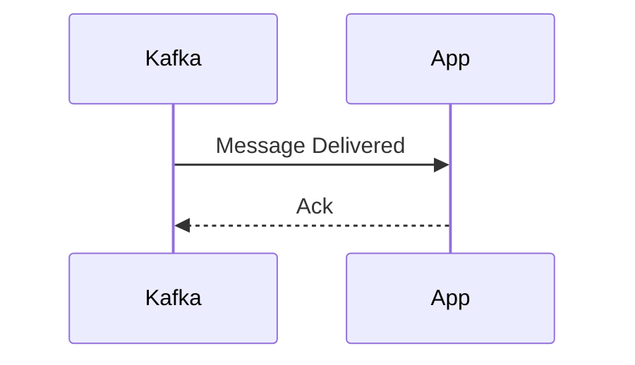
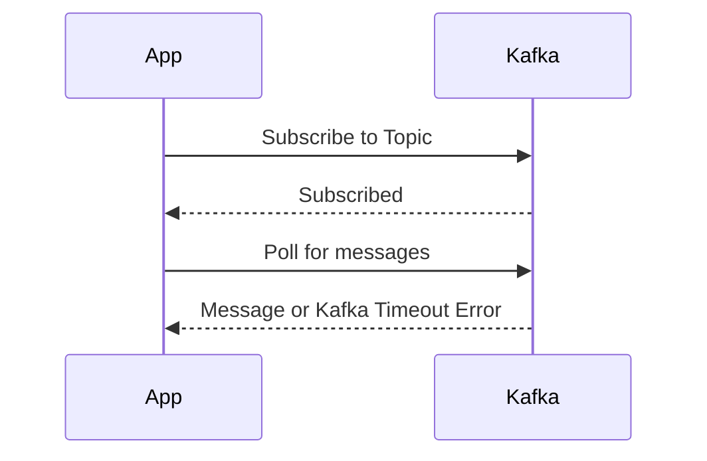
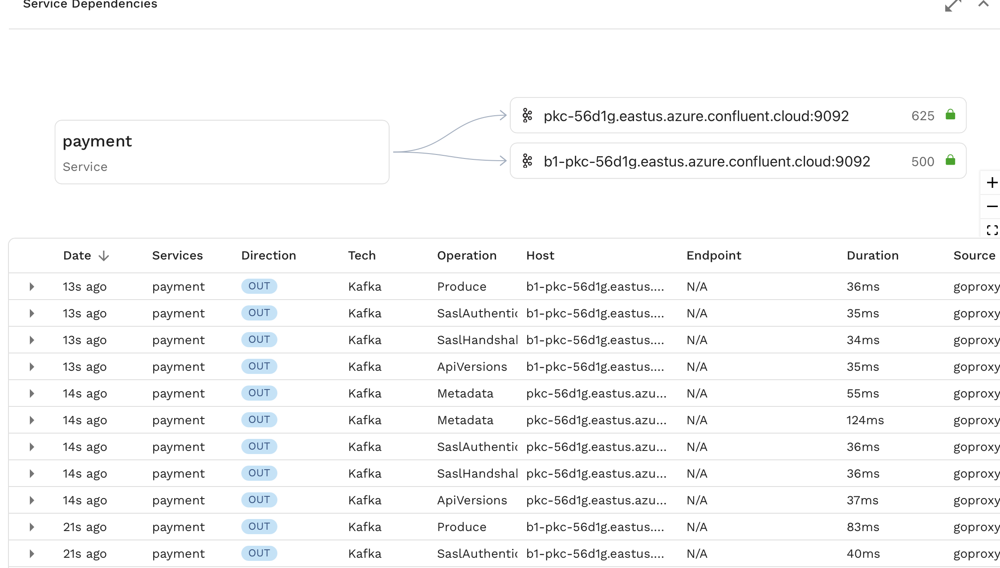

## Background

In this guide we will show you how to replay Kafka traffic using data captured by Speedscale. The network level modelling of Kafka does not match most people's mental model which leads to confusion and an undesirable replay scenario. Most people view their app interacting with Kafka like this.



when the reality looks more like this



This is why when observed in Speedscale, you see something like this that has a lot of internal Kafka calls along with the most important `Produce` and `Fetch` calls.



This sort of outbound traffic would typically be part of a mock when running a replay. In the case of Kafka however, we can simplify the replay process by simply turning `Fetch` calls made by our app into `Produce` calls controlled by our homemade load driver.

## Prerequistites

1. [speedctl](/reference/glossary.md#speedctl) is installed
1. [Create a snapshot](/guides/creating-a-snapshot.md) containing the traffic you need.

## Extract the data

Grab your snapshot id and run this command. This will extract the useful data related field which is deeply nested in Speedscale's RRPair format.

```bash
speedctl extract data <snapshot-id> --path kafka.response.FetchResponse.topics.0.partitions.0.records.records.0.valueString --filter='(command IS  "Fetch")'
```

This will generate a csv that looks something like this, a CSV of the data we extracted from all the Kafka fetch commands and the corresponding RRPair UUID (not needed in this case)

```csv
kafka.response.FetchResponse.topics.0.partitions.0.records.records.0.valueString,RRPair UUID
"message1",44f7a2cc-2045-4fb6-9635-3da8aa7fa909
"message2",58f7a2cc-1135-4fa6-3433-ada5aa2fa161
```

:::tip

This example uses a basic case where single topic and a single record per Fetch call is assumed. For more advanced use cases see `speedctl extract data --help`

:::

## Create your producer

Next up, using the language and LLM of your choice, create a small load producer to send these messages to your Kafka broker. The steps here are

1. Read the CSV from our previous step.
1. Create a Kafka producer/client.
1. Iterate over the CSV.
1. For each row in the CSV, extract the first column and send it as a message to Kafka.
1. Wait for the producer flush to complete.

An example script in Go is provided below.

```go
func main() {
    if err := do(); err != nil {
		panic(err)
	}
}

func do() {
	// Open CSV file
	file, err := os.Open("out.csv")
	if err != nil {
		return fmt.Errorf("failed to open CSV file: %w", err)
	}
	defer file.Close()

	// Create CSV reader
	reader := csv.NewReader(file)

	// Create Kafka producer
	producer, err := kafka.NewProducer(&kafka.ConfigMap{
        // Your settings here
	})
	if err != nil {
		return fmt.Errorf("failed to create Kafka producer: %w", err)
	}
	defer producer.Close()

	// Iterate over CSV rows
	for {
		row, err := reader.Read()
		if err == io.EOF {
			break
		}
		if err != nil {
			return fmt.Errorf("failed to read CSV row: %w", err)
		}

        // Using the first column only
		messageBody := row[0]

		// Create Kafka message
		msg := &kafka.Message{
			TopicPartition: kafka.TopicPartition{
				Topic:     kafkaTopic,
				Partition: kafka.PartitionAny,
			},
			Value: []byte(messageBody),
		}

		// Produce message to Kafka
		if err := producer.Produce(msg, nil); err != nil {
			return fmt.Errorf("failed to produce message to Kafka: %w", err)
		}
	}
	// Wait for all messages to be delivered
	producer.Flush(15000) // 15 second timeout
	return nil
}
```
