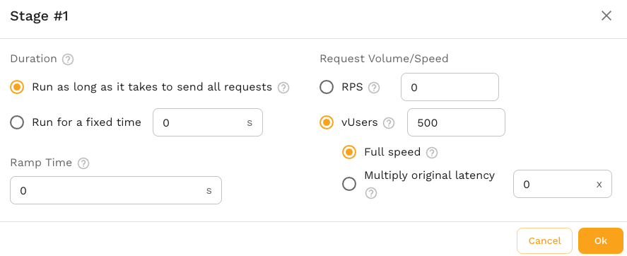
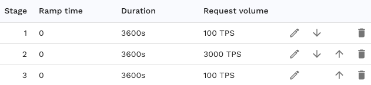
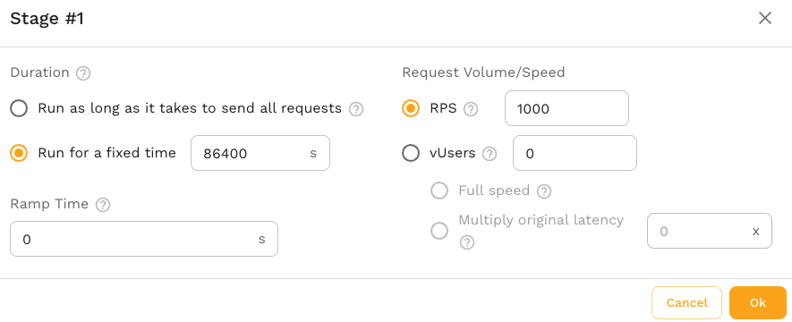
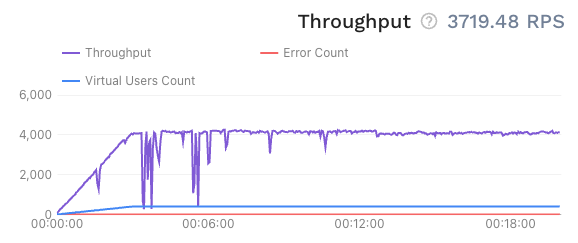
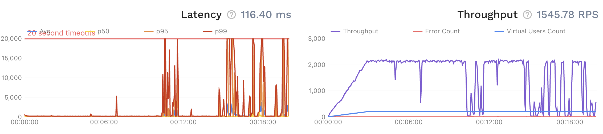

# Load Patterns

## Overview

In performance testing, understanding how your system behaves under various conditions is crucial. Different load patterns simulate various real-world scenarios to help you identify potential bottlenecks, optimize performance, and ensure reliability. Here are a few reasons why you need different load patterns:

1. **Identify Performance Bottlenecks**: Different load patterns can reveal how your system handles varying user loads, helping you pinpoint specific issues that arise under certain conditions.
2. **Understand System Capacity**: By testing with different loads, you can determine the maximum number of users your system can handle before performance degrades.
3. **Ensure Stability and Reliability**: Simulating real-world usage patterns helps ensure your system remains stable and reliable under various conditions.
4. **Optimize Resource Utilization**: Knowing how your system responds to different loads allows you to optimize resource allocation and avoid over-provisioning or under-provisioning.

## Types of Load Patterns

In Speedscale, you can configure various load patterns to simulate different user behaviors. The most common load patterns include:

1. **Constant Load**:
    - Simulates a fixed number of users accessing the system over a period of time.
    - Useful for understanding system behavior under a steady-state load.

2. **Ramp-Up Load**:
    - Gradually increases the number of users over a specified period.
    - Helps identify the point at which the system begins to struggle with increased load.

3. **Peak Load**:
    - Simulates sudden spikes in user activity, followed by a return to normal load levels.
    - Useful for testing how the system handles sudden increases in traffic, such as during marketing campaigns or major events.

4. **Soak (Endurance) Load**:
    - Applies a constant load over an extended period.
    - Helps identify potential memory leaks or degradation in performance over time.

5. **Stress Load**:
    - Involves increasing the load until the system breaks.
    - Helps determine the system’s breaking point and understand its limits.

6. **Spike Load**:
    - Introduces a sudden, large increase in load for a short period.
    - Tests the system's ability to handle sudden bursts of high traffic.

:::note
Testers may be used to thinking in terms of [vUsers](/reference/glossary.md#vuser) as representing user flows or sessions. In this document, the term vUser is used interchangeably with "concurrent thread." Sessions are handled elsewhere and setting vUsers in Speedscale will not directly map to what you are familiar with in other traditional testing tools. If you are unfamiliar, it may be easier to think in terms of requests per second or RPS instead of vUsers. This document uses both as examples but feel free to change RPS to vUsers and vice versa. RPS may be a better measurement for stress and performance testing because it better maps to what is expected in production monitoring tools.
:::

:::note
Make sure your desired scenario is not already covered by the default test configs. For instance, `performance_500replicas` already exists by default but is shown here as an example.
:::

## Example Use Cases

### Constant Load Pattern

All examples in this section are created by modifying or creating a new test [config](../reference/configuration/README.md). You can enter these workflows by navigating to an existing config like [performance_100replicas](https://dev.speedscale.com/config/performance_100replicas) and clicking `Create Test Config`.

**Scenario**: A company wants to ensure their e-commerce website can handle a steady stream of 500 concurrent vUsers during normal business hours.

**Implementation in Speedscale**:
1. Create a new Test [config](../reference/configuration/README.md).
2. Select the Load Pattern editor.
3. Create one stage.
3. Select 500 vUsers.
4. Run a replay and select this test config.

Your single stage should look something like this:

### Ramp-Up Load Pattern

**Scenario**: A new mobile app is launching, and the company expects to send notifications to users throughout the day, causing load to ramp over time.

**Implementation in Speedscale**:
1. Create a new Test [config](../reference/configuration/README.md).
2. Select the Load Pattern editor.
3. Create a stage with vUsers set to 3000 and duration of 10,800 seconds (3 hours)
4. Select Ramp Time of 3600 seconds (1 hour)
5. Run a replay and select this test config.

### Peak Load Pattern

**Scenario**: A ticketing website expects a surge in traffic when concert tickets go on sale.

**Implementation in Speedscale**:
1. Create a new Test [config](../reference/configuration/README.md).
2. Select the Load Pattern editor.
3. Create a new stage. Set the RPS to the expected steady-state or normal load (e.g., 100).
4. Create a new stage. Set the RPS to the expected peak load (e.g., 3000)
5. Create a new stage. Set the RPS to the expected steady-state or normal load k (e.g., 100).
6. Run a replay and select this test config.

You will end up with a set of three total stages looking like the following screenshot:

### Soak Load Pattern

**Scenario**: A financial services application needs to be tested for reliability over a 24-hour period.

**Implementation in Speedscale**:
1. Create a new Test [config](../reference/configuration/README.md).
2. Select the Load Pattern editor.
3. Create a new stage. Set the RPS to the expected average load (e.g., 1000).
4. Configure the Duration to 86400 seconds (24 hours).
5. Run a replay and select this test config.

### Stress Load Pattern

**Scenario**: A social media platform wants to determine the maximum number of concurrent requests it can handle before failure.

**Implementation in Speedscale**:
1. Create a new Test [config](../reference/configuration/README.md).
2. Select the Load Pattern editor.
3. Create a new stage. Set the RPS to an unreasonable amount of load (e.g., 5000).
4. Run a replay and select this test config.
5. Open the replay you just ran and let it run for a while.
6. If the app can handle the load, you'll see a steadily increasing throughput chart.

Note that some app "jitter" during the start of the test for a variety of reasons including cache population. If this type of jitter happens later in the test it may be a sign of the app breaking down:

### Spike Load Pattern

**Scenario**: An online news portal wants to test its response to sudden traffic spikes when breaking news is published.

**Implementation in Speedscale**:
Follow the same procedure as Peak Load Pattern, except with a shorter spike duration.

By understanding and implementing these load patterns in Speedscale, you can ensure your system is robust, scalable, and capable of handling a variety of real-world scenarios.

## FAQ

### How fast does the Speedscale Load Generator send requests? Can it be sped up?

After selecting vUsers in the test config stage editor you can select from two different modes:

**Full Speed:** -  The generator will send requests sequentially as fast as the application can respond. Each concurrent thread (or vUser) will wait for a response from the previous request before initiating a new request. If you were to chart out the time between requests it will be variable based on how fast the app responds. Each thread runs concurrently and slowdowns in use thread should not affect other threads.

**Multiply original latency:** - The generator will send requests at the same speed they were sent by the actual user in the original recording. Requests are still run sequentially but there is effectively a "think time" sleep to mimic what happened in the original recording. If the app is responds more slowly than the original recording then requests are sent as fast as they can be handled.

### Is there a limit on how long an overall test can run (i.e. soak for)?

There is no absolute limit but at some point the amount of data in the reports become unwieldy. If you are hitting a report timeout please notify Speedscale [support](https://slack.speedscale.com) and timeouts can be increased.

### Can I run a replay using only mocks and no load at all?

Yes. Select the "mocks-only" option in the test config editor. The Speedscale responder can container will run for an extended period of time without a load test. This is used frequently in pure "environment replication" and passthrough modes.
