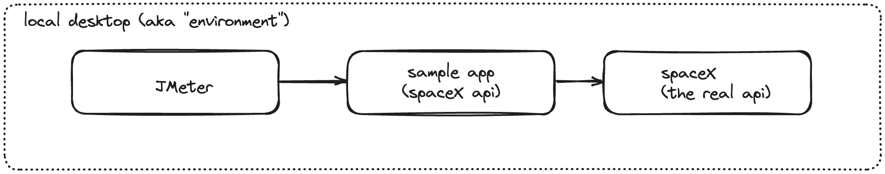
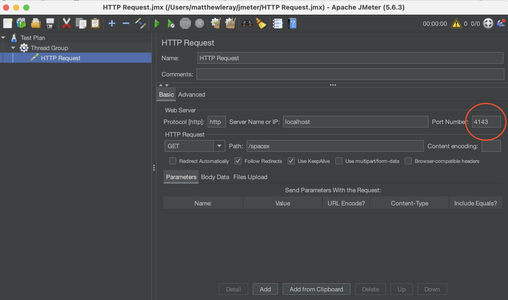

## Introduction

Speedscale is a powerful tool that creates a replica of an environment by observing network traffic. That's great if you have access to some sort of running environment, but what if all you have is your local desktop?

This guide will walk you through recording an environment from your local desktop using Speedscale. This allows Platform Engineers to quickly create "Preview" environments for CI validation or testers to create service mocks instantly.

### Prerequisites

- **speedctl CLI**: Ensure that speedctl CLI is installed. You can find it in your Speedscale tenant if you haven't installed it yet.

## Step-by-Step Guide

### Step 1: Set Up Your Application

   - For this guide, we'll use a basic [application](https://github.com/speedscale/demo/tree/master/go) written in Golang. However, the instructions apply to any application. Just make sure you use the appropriate environment variables or flags for your language.

   We use JMeter to drive requests to our sample app. Requests sent to the sample app will trigger an outbound call to the spaceX API.



### Step 2: Start Speedscale Recording

1. **Initialize the Speedscale Recorder**:
   - Use the `speedctl capture` command to start recording.
   - Provide two key pieces of information:
     - **service**: the name that will show up in the Speedscale UI
     - **port**: port that the demo application is listening on locally (e.g., `8080`).

   ```bash
   speedctl capture localhost 8080
   ```

   This will cause `speedctl` to intercept inbound traffic routed to port 8080 on the local desktop.
   
   Notice that this command prints out some helpful instructions. Take note of the environment variables that are necessary for capturing outbound traffic. Capturing inbound traffic simply requires pointing at a different endpoint. These environment variables will let us capture outbound traffic from the demo app as well.

### Step 3: Capture Inbound and Outbound Traffic

1. **Record Inbound**:
   - If you're used to tools like Postman or UI recorders then the process for recording inbound traffic will be familiar. However, note that capturing outbound requires an extra step.
   - Redirect your inbound API requests to the speedctl capture port instead of your normal application port. For instance, our demo app is listening on port 8080 but we will instead point to port 4143 so that `speedctl` can intercept the traffic before forwarding it along to 8080.

2. **Record Outbound (Optional but Recommended)**:
   - To create service mocks, capture outbound traffic by setting environment variables in the *same terminal environment as your app*. In other words, copy/paste into the terminal window where you are about to run your sample app.
   - Copy the provided set of environment variables and export them in a new terminal window where you will run your demo application. Copy what is provided by speedctl but the variables should look something like this:

   ```bash
   export http_proxy=http://127.0.0.1:4140
   export https_proxy=http://127.0.0.1:4140
   export SSL_CERT_FILE=~/.speedscale/certs/tls.crt
   export REQUESTS_CA_BUNDLE=~/.speedscale/certs/tls.crt
   export GRPC_DEFAULT_SSL_ROOTS_FILE_PATH=~/.speedscale/certs/tls.crt
   export NODE_EXTRA_CA_CERTS=~/.speedscale/certs/tls.crt
   ```

:::tip
MacOS users should add this certificate to the System keychain [settings](https://support.apple.com/guide/keychain-access/add-certificates-to-a-keychain-kyca2431/mac). You only need to do this once or it can be undone after recording is completed.
:::

3. **Run Your Application**:
   - Start your application with the exported environment variables.
   - Remember to use the same terminal that you pasted the environment variables into. This is only required to capture outbound traffic.

### Step 4: Simulate Load

1. **Select a script**:
   - a simple `curl localhost:4143/spacex` will trigger the example application
   - Alternatively, you can prepare a JMeter script to simulate load. This guide uses a simple JMeter script for demonstration purposes. You can find it [here](https://github.com/speedscale/demo/blob/master/go/HTTP%20Request.jmx)

2. **Configure JMeter**:
   - Change your endpoint port to 4143. Here is an example screenshot showing where to change the port in a simple JMeter script 

3. **Execute the JMeter Script**:
   - Run the script multiple times to generate a variety of transactions.

### Step 5: Save as Snapshot

1. **View Speedscale Dashboard**:
   - Access the Speedscale dashboard to view graphs and traffic data. It can take a few minutes for new traffic to show in the dashboard. If you recorded with the name localhost, this [link](https://app.speedscale.com/analyze?service=localhost&startTime=now-15minutes&endTime=now) will take you to the sample traffic.

2. **Observe Environment Modeling**:
   - Speedscale builds a model of the environment that mirrors your architectural diagram. 
   - Each inbound call made with JMeter and the corresponding outbound transaction (e.g., to SpaceX) is recorded.

### Step 6: Utilize the Preview Environment

1. **Replay Transactions**:
   - Use the replay button in Speedscale to turn the recorded data into a preview environment for testing and debugging purposes. This is most useful if you are replaying the environment on a shared resource like a test Kubernetes cluster.
   - Use `speedctl replay <snapshot id>` to start the recorded environment on your local desktop.

:::tip
Recorded environments, or Snapshots, contain the data necessary to clone an environment for a span of time. If you are doing general development and just need to mimic production services, consider a `mocks-only` replay setting. This will leave the mock server running so you can run different builds of your app against realistic services. If you want to run incoming client traffic over and over to reproduce an issue or for other development it's best to use a regular replay. This is more of a regression or load testing use case. Either can be done from the same recording.
:::

## Conclusion

This guide demonstrates how to set up a Speedscale recording from your local desktop, enabling you to replicate an environment effortlessly and gain valuable insights into your application's behavior. Whether for testing or debugging, Speedscale provides a robust solution for managing and analyzing network traffic.

Thank you for using Speedscale, and we hope this guide was helpful.
