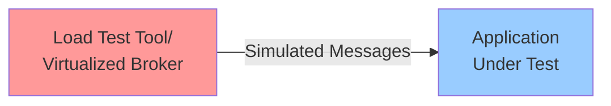
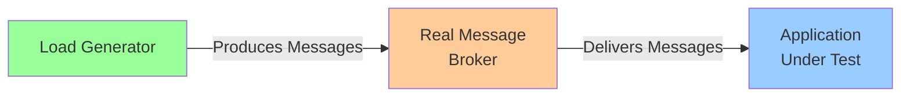

## Overview

Message brokers are a critical component of modern distributed systems, facilitating asynchronous communication between services. Load testing message broker integrations requires special considerations since the interaction patterns differ from traditional HTTP-based APIs.

Speedscale provides specialized tooling to help you load test applications that integrate with message brokers by:

- Capturing message broker traffic at the network level
- Extracting message payloads from captured traffic
- Converting consumer-side traffic into producer-side load drivers
- Replaying realistic message patterns with proper timing and ordering

## Load Testing Approaches

:::note Protocol Support

For HTTP or gRPC-based protocols (such as AWS SQS, Google Pub/Sub, Azure Service Bus), both Approach 1 (virtualized) and Approach 2 (real broker) are fully supported through Speedscale's standard replay capabilities. However, for Kafka and RabbitMQ (AMQP protocol), only Approach 2 is available, requiring custom load driver scripts.

:::

There are two fundamental approaches to load testing applications that utilize message brokers:

### Approach 1: Virtualized Message Broker

In this approach, the application connects to a simulated or virtualized message broker. The virtualization layer provides incoming messages directly to the service under test without involving a real broker.

**Pros:**
- The message broker does not impact the performance of the application under test
- Simpler test environment setup
- Lower resource requirements

**Cons:**
- Not realistic because message brokers and services interact in unpredictable ways that only a real load test can expose
- No virtualized broker can completely simulate the real behavior of production brokers like Kafka or RabbitMQ (AMQP)
- Gives testers a false sense of security by narrowing the problem scope too much
- Misses real-world issues like network latency, broker backpressure, connection pooling, and rebalancing

:::note

This approach is only available for HTTP or gRPC-based brokers. Kafka and RabbitMQ (AMQP) do not support virtualization and require Approach 2 with custom scripts.

:::

### Approach 2: Real Message Broker with Load Generator

In this approach, a load generator sends messages through a real message broker to the client application, simulating production conditions as closely as possible.

**Pros:**
- Results are as realistic as possible
- Exposes real interactions between the broker and application
- Tests actual broker behavior including [partitioning, rebalancing, backpressure, and connection handling](./performance-issues.md)
- Identifies performance bottlenecks that only occur with real broker infrastructure

**Cons:**
- Requires running a message broker in the test environment or CI pipeline
- More complex test environment setup
- Higher resource requirements

### Speedscale's Approach

**Speedscale supports Approach 2** because it provides more realistic results. For HTTP/gRPC-based brokers, Speedscale also supports Approach 1 through standard replay capabilities. However, for Kafka and RabbitMQ (AMQP protocol), only Approach 2 is available, requiring custom load driver scripts. By using real message brokers during load testing, you can:

- Uncover real-world [performance issues](./performance-issues.md) before they reach production
- Test how your application handles broker-specific behaviors like consumer group rebalancing or partition reassignment
- Validate that your application can handle the actual network latency and overhead of broker communication
- Ensure your monitoring and observability work correctly with real broker metrics

## Supported Message Brokers

Speedscale currently supports the following message brokers:

### Kafka

Support for replaying Kafka traffic through open source load generation. Speedscale can capture both Produce and Fetch operations, allowing you to extract messages and create custom load drivers.

[Learn how to replay Kafka traffic](./kafka.md)

### RabbitMQ (AMQP)

Support for replaying RabbitMQ traffic using AMQP protocol through open source load generation. Speedscale can capture message deliveries and help you create custom load drivers to replay traffic. Note: RabbitMQ uses AMQP protocol, so custom load driver scripts are required (standard Speedscale replay is not available for AMQP).

[Learn how to replay RabbitMQ traffic](./rabbitmq.md)

### AWS Simple Queue Service (SQS)

Full support for AWS SQS. Since SQS uses HTTP-based APIs, you can capture and replay SQS traffic using standard Speedscale replay capabilities. Message extraction and custom load driver approaches similar to Kafka and RabbitMQ can also be applied.

[Learn how to replay AWS SQS traffic](./aws-sqs.md)

### Google Pub/Sub

Full support for Google Pub/Sub including record and replay. Speedscale can capture Pub/Sub traffic and replay it using standard Speedscale replay capabilities. Message extraction and custom load driver approaches similar to Kafka and RabbitMQ can also be applied.

[Learn how to replay Google Pub/Sub traffic](./google-pubsub.md)

### AWS Kinesis

Full support for AWS Kinesis Data Streams. Since Kinesis uses HTTP-based APIs and provides a Kafka-compatible interface, you can capture and replay Kinesis traffic using standard Speedscale replay capabilities or Kafka client libraries. Message extraction and custom load driver approaches similar to Kafka can also be applied.

[Learn how to replay AWS Kinesis traffic](./aws-kinesis.md)

### AWS Kinesis Data Firehose

Full support for AWS Kinesis Data Firehose. Since Firehose uses HTTP-based APIs, you can capture and replay Firehose traffic using standard Speedscale replay capabilities. Message extraction and custom load driver approaches similar to SQS can also be applied.

[Learn how to replay AWS Kinesis Data Firehose traffic](./aws-kinesis-data-firehose.md)

### AWS Simple Notification Service (SNS)

Full support for AWS SNS. Since SNS uses HTTP-based APIs, you can capture and replay SNS traffic using standard Speedscale replay capabilities. Message extraction and custom load driver approaches similar to SQS can also be applied.

[Learn how to replay AWS SNS traffic](./aws-sns.md)

### Microsoft Azure Service Bus

Full support for Azure Service Bus. Since Service Bus uses HTTP REST APIs and supports AMQP 1.0, you can capture and replay Service Bus traffic using standard Speedscale replay capabilities or AMQP client libraries. Message extraction and custom load driver approaches can also be applied.

[Learn how to replay Azure Service Bus traffic](./azure-service-bus.md)

### Azure Event Hubs

Full support for Azure Event Hubs. Event Hubs provides a Kafka-compatible API, allowing you to use standard Kafka client libraries. Speedscale can capture and replay Event Hubs traffic using Kafka-compatible approaches.

[Learn how to replay Azure Event Hubs traffic](./azure-event-hubs.md)

### Apache Pulsar

Full support for Apache Pulsar. Pulsar supports multiple protocols including Kafka-compatible API, HTTP REST, and gRPC. You can use Kafka client libraries with Pulsar's Kafka-compatible API, or use standard Speedscale replay for HTTP/gRPC traffic.

[Learn how to replay Apache Pulsar traffic](./apache-pulsar.md)

### Apache ActiveMQ

Full support for Apache ActiveMQ. ActiveMQ supports AMQP 1.0 protocol, allowing you to use AMQP client libraries to extract and replay traffic. Speedscale can capture ActiveMQ AMQP traffic and help you create custom load drivers.

[Learn how to replay Apache ActiveMQ traffic](./apache-activemq.md)

### Amazon MQ

Full support for Amazon MQ. Amazon MQ provides managed ActiveMQ or RabbitMQ brokers, so you can use the same approaches as those brokers. Speedscale can capture and replay Amazon MQ traffic using AMQP protocols.

[Learn how to replay Amazon MQ traffic](./amazon-mq.md)

## Key Concepts

### Network-Level Observation

Message brokers typically use long-lived connections and polling patterns rather than simple request-response cycles. Understanding these patterns is essential for effective load testing:

- **Polling vs Push**: Most broker clients poll for messages rather than receiving pushed notifications
- **Protocol Complexity**: Broker protocols include heartbeats, metadata requests, and other internal operations
- **Message Ordering**: Maintaining proper message ordering during replay may require special handling

### Load Testing Strategy

When load testing message broker integrations:

1. **Use Standard Speedscale Replay** (for HTTP/gRPC-based brokers): For brokers using HTTP or gRPC protocols (AWS SQS, Google Pub/Sub, Azure Service Bus, etc.), use Speedscale's standard replay capabilities. Simply capture traffic, create a snapshot, and run a replay - no custom scripts needed.

2. **Use Custom Load Driver Scripts** (for Kafka and RabbitMQ/AMQP): For Kafka and RabbitMQ (AMQP protocol), you must use custom load driver scripts because these protocols require specialized handling:
   - **Capture Production Traffic**: Use Speedscale to capture real message patterns and timing
   - **Extract Payloads**: Use `speedctl extract data` to pull message contents from captures
   - **Build Load Drivers**: Create simple producer clients that replay extracted messages
   - **Scale and Iterate**: Adjust message rates and patterns to test different load scenarios

## Getting Started

To begin load testing your message broker integrations:

1. Install [speedctl](/reference/glossary.md#speedctl)
2. [Create a snapshot](/guides/creating-a-snapshot.md) of your application traffic
3. Follow the broker-specific guide for your message broker:
   - **Kafka Protocol**: [Kafka](./kafka.md), [AWS Kinesis](./aws-kinesis.md), [Azure Event Hubs](./azure-event-hubs.md), [Apache Pulsar](./apache-pulsar.md)
   - **AMQP Protocol**: [RabbitMQ](./rabbitmq.md) (AMQP 0.9.1, requires custom scripts), [Azure Service Bus](./azure-service-bus.md), [Apache ActiveMQ](./apache-activemq.md), [Amazon MQ](./amazon-mq.md)
   - **HTTP-based**: [AWS SQS](./aws-sqs.md), [AWS SNS](./aws-sns.md), [Google Pub/Sub](./google-pubsub.md), [Azure Service Bus](./azure-service-bus.md)
4. Build and run your load driver (if using custom approach) or start a standard replay

## Need Help?

If you're working with a message broker not listed here or need assistance with your load testing strategy, please contact Speedscale support.
