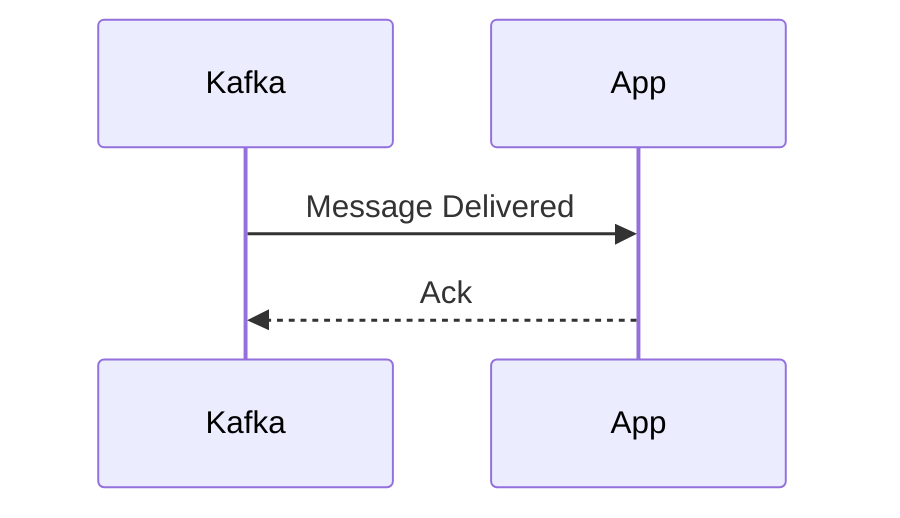
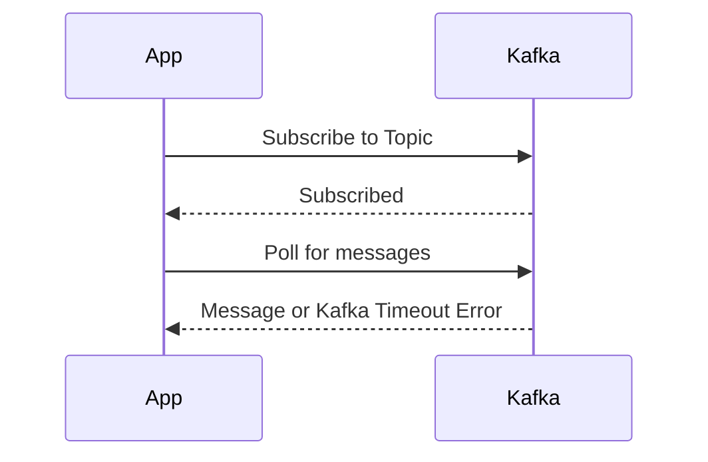

## Background

In this guide we will show you how to replay Kafka traffic using data captured by Speedscale. The network level modelling of Kafka does not match most people's mental model which leads to confusion and an undesirable replay scenario. Most people view their app interacting with Kafka like this.

For more information about Apache Kafka, see the [official Kafka documentation](https://kafka.apache.org/).



when the reality looks more like this



This is why when observed in Speedscale, you see something like this that has a lot of internal Kafka calls along with the most important `Produce` and `Fetch` calls.


This sort of outbound traffic would typically be part of a mock when running a replay. In the case of Kafka however, we can simplify the replay process by simply turning `Fetch` calls made by our app into `Produce` calls.

## Prerequisites

1. [speedctl](/reference/glossary.md#speedctl) is installed
1. [Create a snapshot](/guides/creating-a-snapshot.md) containing the traffic you need.

## Replay with proxymock (Recommended)

The simplest way to replay Kafka traffic is using `proxymock`. When a snapshot contains Kafka traffic, `proxymock replay` will automatically produce messages to the specified Kafka broker.

### Pull a Snapshot

First, download the snapshot from Speedscale cloud:

```bash
proxymock cloud pull snapshot <snapshot-id>
```

This will download the snapshot traffic to individual local files.

### Replay Traffic

```bash
proxymock replay --in <directory> --test-against <kafka-broker>
```

For example:

```bash
proxymock replay --in ./proxymock/snapshot-abc123 --test-against localhost:9092
```

### Output

When replaying Kafka traffic, proxymock displays a Kafka-specific latency table:

```
LATENCY / THROUGHPUT
+-----------------+---------+-------+-------------+-------+-------+-------+-------+--------+-----------------+------------+
|      TOPIC      |   API   | COUNT | AVG LATENCY |  P50  |  P90  |  P95  |  P99  | FAILED | RESULT MISMATCH | PER-SECOND |
+-----------------+---------+-------+-------------+-------+-------+-------+-------+--------+-----------------+------------+
| dev-fulfillment | Produce |     3 |    94.33 ms | 12 ms | 12 ms | 12 ms | 12 ms |     0% |              0% |      10.28 |
+-----------------+---------+-------+-------------+-------+-------+-------+-------+--------+-----------------+------------+
| TOTAL           |         |     3 |    94.33 ms | 12 ms | 12 ms | 12 ms | 12 ms |     0% |              0% |      10.28 |
+-----------------+---------+-------+-------------+-------+-------+-------+-------+--------+-----------------+------------+
```

The output shows:
- **Topic**: The Kafka topic messages were produced to
- **API**: The Kafka API operation (e.g., Produce)
- **COUNT**: Number of messages sent
- **Latency metrics**: Average, P50, P90, P95, and P99 latencies for producing messages
- **FAILED**: Percentage of failed produce operations
- **RESULT MISMATCH**: Percentage of unexpected results
- **PER-SECOND**: Throughput in messages per second

:::note
The latency reported is the time to produce messages to the broker, not the full latency for downstream applications to consume them.
:::

---

## Manual Replay (Alternative)

If you need more control over the replay process, you can extract the data from Speedscale and create a custom producer script.

### Extract the data

Grab your snapshot id and run this command. This will extract the message data and timestamps from Kafka fetch commands, which are deeply nested in Speedscale's RRPair format.

```bash
speedctl extract data <snapshot-id> --path kafka.response.FetchResponse.topics.0.partitions.0.records.records.0.valueString --path .ts --filter='(command IS  "Fetch")'
```

This will generate a csv that looks something like this, with the message data, timestamp, and the corresponding RRPair UUID (not needed in this case)

```csv
kafka.response.FetchResponse.topics.0.partitions.0.records.records.0.valueString,.ts,RRPair UUID
"message1",2024-01-15T10:30:45.123Z,44f7a2cc-2045-4fb6-9635-3da8aa7fa909
"message2",2024-01-15T10:30:46.456Z,58f7a2cc-1135-4fa6-3433-ada5aa2fa161
```

:::tip

This example uses a basic case where single topic and a single record per Fetch call is assumed. For more advanced use cases see `speedctl extract data --help`

:::

### Create your producer

Next up, using the language and LLM of your choice, create a small load producer to send these messages to your Kafka broker. The steps here are

1. Read the CSV from our previous step.
1. Create a Kafka producer/client.
1. Iterate over the CSV.
1. For each row in the CSV, extract the message body and optionally the timestamp.
1. If timing mode is enabled, wait between messages to match the original recording timing.
1. Send the message to Kafka.
1. Wait for the producer flush to complete.

Example scripts in multiple languages are provided below.

import Tabs from '@theme/Tabs';
import TabItem from '@theme/TabItem';

<Tabs>
<TabItem value="go" label="Go">

```go
package main

import (
	"encoding/csv"
	"flag"
	"fmt"
	"io"
	"os"
	"time"

	"github.com/confluentinc/confluent-kafka-go/kafka"
)

var (
	respectTiming = flag.Bool("respect-timing", false, "Respect original message timing from recording")
	csvFile       = flag.String("csv", "out.csv", "Path to CSV file")
	kafkaTopic    = flag.String("topic", "demo-topic", "Kafka topic name")
	brokers       = flag.String("brokers", "localhost:9092", "Kafka broker addresses")
)

func main() {
	flag.Parse()
	if err := do(); err != nil {
		panic(err)
	}
}

func do() error {
	// Open CSV file
	file, err := os.Open(*csvFile)
	if err != nil {
		return fmt.Errorf("failed to open CSV file: %w", err)
	}
	defer file.Close()

	// Create CSV reader
	reader := csv.NewReader(file)

	// Skip header row
	if _, err := reader.Read(); err != nil {
		return fmt.Errorf("failed to read CSV header: %w", err)
	}

	// Create Kafka producer
	producer, err := kafka.NewProducer(&kafka.ConfigMap{
		"bootstrap.servers": *brokers,
	})
	if err != nil {
		return fmt.Errorf("failed to create Kafka producer: %w", err)
	}
	defer producer.Close()

	var lastTimestamp time.Time
	startTime := time.Now()

	// Iterate over CSV rows
	for {
		row, err := reader.Read()
		if err == io.EOF {
			break
		}
		if err != nil {
			return fmt.Errorf("failed to read CSV row: %w", err)
		}

		// Extract message body from first column
		messageBody := row[0]

		// Handle timing if enabled
		if *respectTiming && len(row) > 1 {
			// Parse timestamp from second column
			timestamp, err := time.Parse(time.RFC3339Nano, row[1])
			if err != nil {
				return fmt.Errorf("failed to parse timestamp %s: %w", row[1], err)
			}

			// Calculate delay relative to previous message
			if !lastTimestamp.IsZero() {
				delay := timestamp.Sub(lastTimestamp)
				if delay > 0 {
					time.Sleep(delay)
				}
			} else {
				// First message - record start time
				startTime = time.Now()
			}
			lastTimestamp = timestamp
		}

		// Create Kafka message
		msg := &kafka.Message{
			TopicPartition: kafka.TopicPartition{
				Topic:     *kafkaTopic,
				Partition: kafka.PartitionAny,
			},
			Value: []byte(messageBody),
		}

		// Produce message to Kafka
		if err := producer.Produce(msg, nil); err != nil {
			return fmt.Errorf("failed to produce message to Kafka: %w", err)
		}
	}

	// Wait for all messages to be delivered
	producer.Flush(15000) // 15 second timeout

	if *respectTiming {
		elapsed := time.Since(startTime)
		fmt.Printf("Replay completed in %s with original timing\n", elapsed)
	} else {
		fmt.Println("Replay completed at maximum speed")
	}

	return nil
}
```

</TabItem>
<TabItem value="java" label="Java">

```java
import org.apache.kafka.clients.producer.*;
import org.apache.kafka.common.serialization.StringSerializer;
import java.io.*;
import java.time.Duration;
import java.time.Instant;
import java.util.Properties;

public class KafkaReplay {
    private final String csvFile;
    private final String topic;
    private final String brokers;
    private final boolean respectTiming;

    public KafkaReplay(String csvFile, String topic, String brokers, boolean respectTiming) {
        this.csvFile = csvFile;
        this.topic = topic;
        this.brokers = brokers;
        this.respectTiming = respectTiming;
    }

    public void replay() throws Exception {
        // Configure Kafka producer
        Properties props = new Properties();
        props.put(ProducerConfig.BOOTSTRAP_SERVERS_CONFIG, brokers);
        props.put(ProducerConfig.KEY_SERIALIZER_CLASS_CONFIG, StringSerializer.class.getName());
        props.put(ProducerConfig.VALUE_SERIALIZER_CLASS_CONFIG, StringSerializer.class.getName());

        try (KafkaProducer<String, String> producer = new KafkaProducer<>(props);
             BufferedReader reader = new BufferedReader(new FileReader(csvFile))) {

            // Skip header row
            reader.readLine();

            Instant lastTimestamp = null;
            Instant startTime = Instant.now();

            String line;
            while ((line = reader.readLine()) != null) {
                String[] columns = line.split(",", -1);
                String messageBody = columns[0].replaceAll("^\"|\"$", ""); // Remove quotes

                // Handle timing if enabled
                if (respectTiming && columns.length > 1) {
                    Instant timestamp = Instant.parse(columns[1]);

                    if (lastTimestamp != null) {
                        Duration delay = Duration.between(lastTimestamp, timestamp);
                        if (!delay.isNegative()) {
                            Thread.sleep(delay.toMillis());
                        }
                    } else {
                        startTime = Instant.now();
                    }
                    lastTimestamp = timestamp;
                }

                // Send message to Kafka
                ProducerRecord<String, String> record = new ProducerRecord<>(topic, messageBody);
                producer.send(record);
            }

            // Wait for all messages to be delivered
            producer.flush();

            if (respectTiming) {
                Duration elapsed = Duration.between(startTime, Instant.now());
                System.out.println("Replay completed in " + elapsed + " with original timing");
            } else {
                System.out.println("Replay completed at maximum speed");
            }
        }
    }

    public static void main(String[] args) throws Exception {
        String csvFile = System.getProperty("csv", "out.csv");
        String topic = System.getProperty("topic", "demo-topic");
        String brokers = System.getProperty("brokers", "localhost:9092");
        boolean respectTiming = Boolean.parseBoolean(System.getProperty("respect-timing", "false"));

        KafkaReplay replay = new KafkaReplay(csvFile, topic, brokers, respectTiming);
        replay.replay();
    }
}
```

</TabItem>
<TabItem value="typescript" label="TypeScript">

```typescript
import { Kafka, Producer } from 'kafkajs';
import * as fs from 'fs';
import * as csv from 'csv-parser';

interface Config {
  csvFile: string;
  topic: string;
  brokers: string[];
  respectTiming: boolean;
}

async function replay(config: Config): Promise<void> {
  // Create Kafka client
  const kafka = new Kafka({
    clientId: 'speedscale-replay',
    brokers: config.brokers,
  });

  const producer: Producer = kafka.producer();
  await producer.connect();

  let lastTimestamp: Date | null = null;
  const startTime = new Date();
  const rows: Array<{ message: string; timestamp?: string }> = [];

  // Read CSV file
  await new Promise<void>((resolve, reject) => {
    fs.createReadStream(config.csvFile)
      .pipe(csv())
      .on('data', (row) => {
        rows.push({
          message: Object.values(row)[0] as string,
          timestamp: Object.values(row)[1] as string | undefined,
        });
      })
      .on('end', resolve)
      .on('error', reject);
  });

  // Process rows
  for (const row of rows) {
    // Handle timing if enabled
    if (config.respectTiming && row.timestamp) {
      const timestamp = new Date(row.timestamp);

      if (lastTimestamp) {
        const delay = timestamp.getTime() - lastTimestamp.getTime();
        if (delay > 0) {
          await new Promise(resolve => setTimeout(resolve, delay));
        }
      }
      lastTimestamp = timestamp;
    }

    // Send message to Kafka
    await producer.send({
      topic: config.topic,
      messages: [{ value: row.message }],
    });
  }

  await producer.disconnect();

  if (config.respectTiming) {
    const elapsed = new Date().getTime() - startTime.getTime();
    console.log(`Replay completed in ${elapsed}ms with original timing`);
  } else {
    console.log('Replay completed at maximum speed');
  }
}

// Parse command line arguments
const config: Config = {
  csvFile: process.env.CSV || 'out.csv',
  topic: process.env.TOPIC || 'demo-topic',
  brokers: (process.env.BROKERS || 'localhost:9092').split(','),
  respectTiming: process.env.RESPECT_TIMING === 'true',
};

replay(config).catch(console.error);
```

</TabItem>
<TabItem value="python" label="Python">

```python
import csv
import time
from datetime import datetime
from argparse import ArgumentParser
from confluent_kafka import Producer

def replay(csv_file, topic, brokers, respect_timing):
    # Create Kafka producer
    conf = {
        'bootstrap.servers': brokers,
    }
    producer = Producer(conf)

    last_timestamp = None
    start_time = time.time()

    with open(csv_file, 'r') as file:
        reader = csv.reader(file)
        next(reader)  # Skip header row

        for row in reader:
            message_body = row[0]

            # Handle timing if enabled
            if respect_timing and len(row) > 1:
                timestamp = datetime.fromisoformat(row[1].replace('Z', '+00:00'))

                if last_timestamp is not None:
                    delay = (timestamp - last_timestamp).total_seconds()
                    if delay > 0:
                        time.sleep(delay)
                else:
                    start_time = time.time()

                last_timestamp = timestamp

            # Send message to Kafka
            producer.produce(topic, value=message_body.encode('utf-8'))

    # Wait for all messages to be delivered
    producer.flush()

    if respect_timing:
        elapsed = time.time() - start_time
        print(f"Replay completed in {elapsed:.2f}s with original timing")
    else:
        print("Replay completed at maximum speed")

if __name__ == "__main__":
    parser = ArgumentParser(description='Replay Kafka messages from CSV')
    parser.add_argument('--csv', default='out.csv', help='Path to CSV file')
    parser.add_argument('--topic', default='demo-topic', help='Kafka topic name')
    parser.add_argument('--brokers', default='localhost:9092', help='Kafka broker addresses')
    parser.add_argument('--respect-timing', action='store_true', help='Respect original message timing')

    args = parser.parse_args()
    replay(args.csv, args.topic, args.brokers, args.respect_timing)
```

</TabItem>
</Tabs>

### Usage Examples

<Tabs>
<TabItem value="go" label="Go">

Send messages as fast as possible (default):
```bash
go run main.go --csv out.csv --topic my-topic --brokers localhost:9092
```

Respect original message timing from the recording:
```bash
go run main.go --csv out.csv --topic my-topic --brokers localhost:9092 --respect-timing
```

</TabItem>
<TabItem value="java" label="Java">

Send messages as fast as possible (default):
```bash
javac KafkaReplay.java
java -Dcsv=out.csv -Dtopic=my-topic -Dbrokers=localhost:9092 KafkaReplay
```

Respect original message timing from the recording:
```bash
java -Dcsv=out.csv -Dtopic=my-topic -Dbrokers=localhost:9092 -Drespect-timing=true KafkaReplay
```

</TabItem>
<TabItem value="typescript" label="TypeScript">

Send messages as fast as possible (default):
```bash
CSV=out.csv TOPIC=my-topic BROKERS=localhost:9092 npx ts-node main.ts
```

Respect original message timing from the recording:
```bash
CSV=out.csv TOPIC=my-topic BROKERS=localhost:9092 RESPECT_TIMING=true npx ts-node main.ts
```

</TabItem>
<TabItem value="python" label="Python">

Send messages as fast as possible (default):
```bash
python main.py --csv out.csv --topic my-topic --brokers localhost:9092
```

Respect original message timing from the recording:
```bash
python main.py --csv out.csv --topic my-topic --brokers localhost:9092 --respect-timing
```

</TabItem>
</Tabs>
