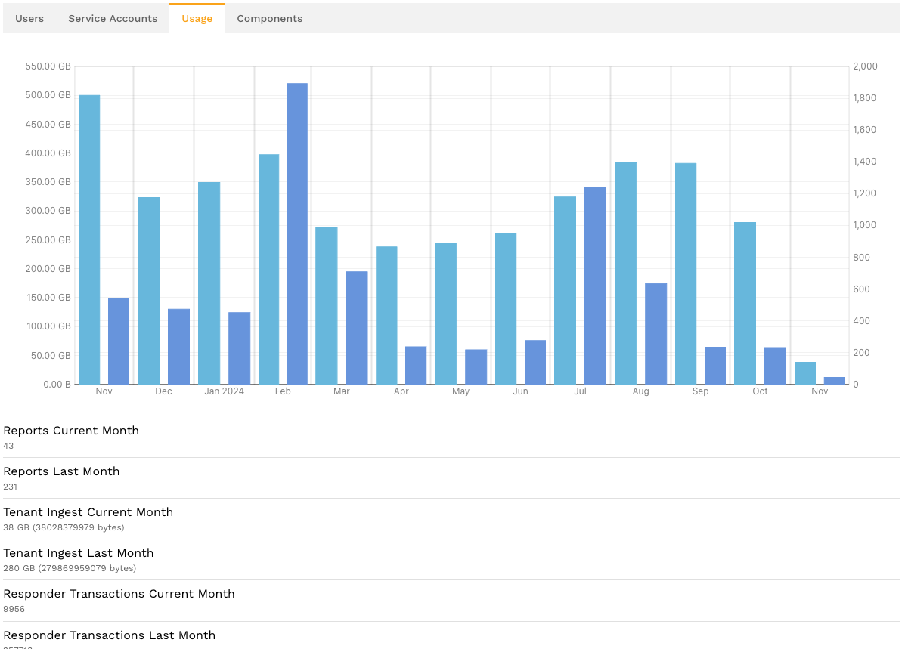

# Optimizing ingest

As a powerful replication and observability tool, Speedscale provides extensive insights into your infrastructure, applications, and logs. However, as usage scales, so can cost. To manage these expenses and create transparency around costs, this guide will outline how to optimize your Speedscale usage and establish departmental chargebacks.

## Strategies to limit visibility ingest

For most customers, the vast majority of data ingest takes place while recording and observing environments. Generally this is the best place to start any analysis of usage. Speedscale provides visibility into overall tenant usage from within the [UI](https://app.speedscale.com/tenant#tenant-tab-usage).

### Filter noisy events

Much of the traffic recorded in your environment probably falls into the category of heartbeats and telemetry. The Speedscale forwarder includes a built in filter capability that can help you dramatically reduce ingest volume. Generally, you should look for things like monitoring tools and keep alive heartbeats. Configure your filters using this [guide](../reference/filters/README.md).

### Ignore IPs and Ports

Sometimes you may have a backend like a memory cache is is very noisy but does not need to be replicated. In this case it may be better to simply filter the entire backend from the proxy. You can find instructions [here](../setup/sidecar/annotations.md#sidecarspeedscalecomignore-src-ips)

### Schedule data collection

Speedscale provides the ability to only apply sidecars and record data during specific time windows. You may want to only record data during the heaviest usage times for your application, for instance. You can learn more about scheduling sidecars [here](../concepts/schedules.md).

### Split deployments

If your app utilizes many replicas you may also be able to split your deployment and apply the Speedscale sidecar selectively. In this model, you would create a duplicate of your existing deployment also containing the Speedscale sidecar. That way, the original deployment will run as normal but a smaller Speedscale-enabled duplicate deployment can be run to receive only a portion of the traffic. This approach typically requires manually applying the Speedscale sidecar [annotations](../setup/sidecar/annotations.md#sidecarspeedscalecominject).

### Reduce the number of sidecars

Lastly, you can simply remove sidecars to reduce visibility and data ingest.

## Strategies to limit replay ingest

Typically, replay-related ingest is insignificant compared to visibility-related ingest. Speedscale ingest is already optimized during replay. However, here are a few tips and tricks to limit ingest during replay.

### Turn on low data mode

By default, Speedscale performance test configs enable low data mode. This mode turns off assertion processing and focuses on performance and status codes only. This dramatically reduces the amount of data sent during each test run. Both the generator and responder have low data mode settings.
