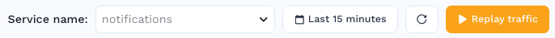
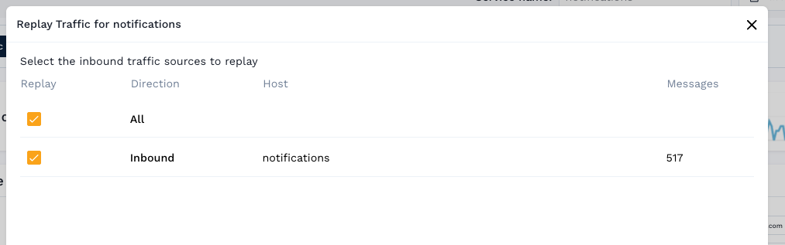
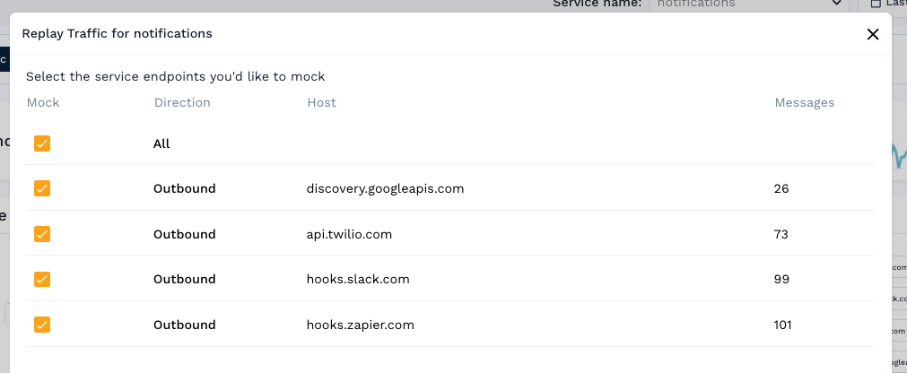
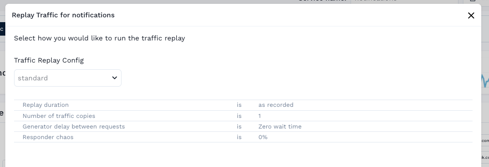
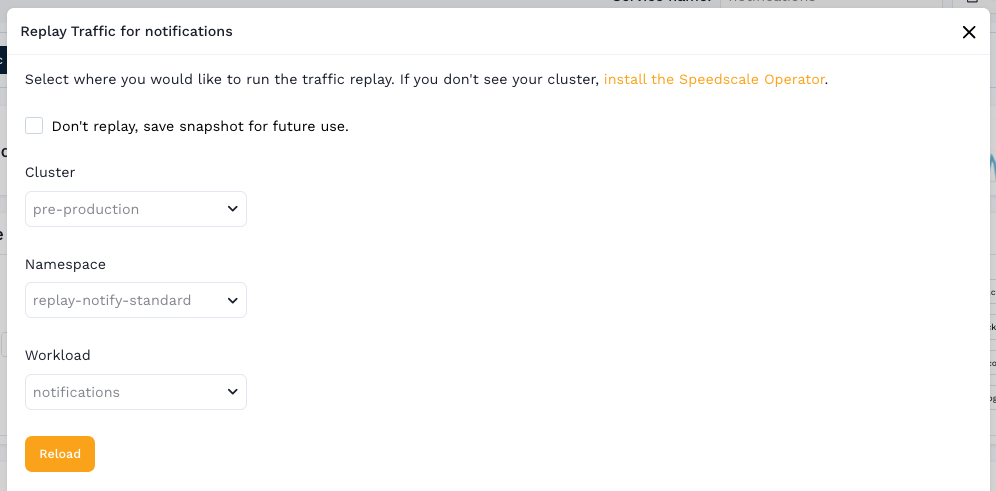
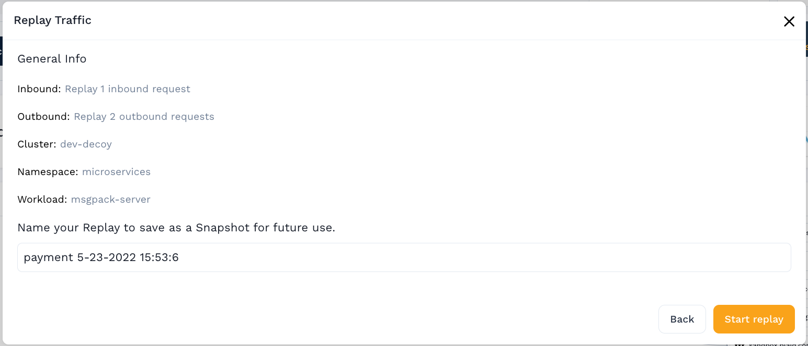
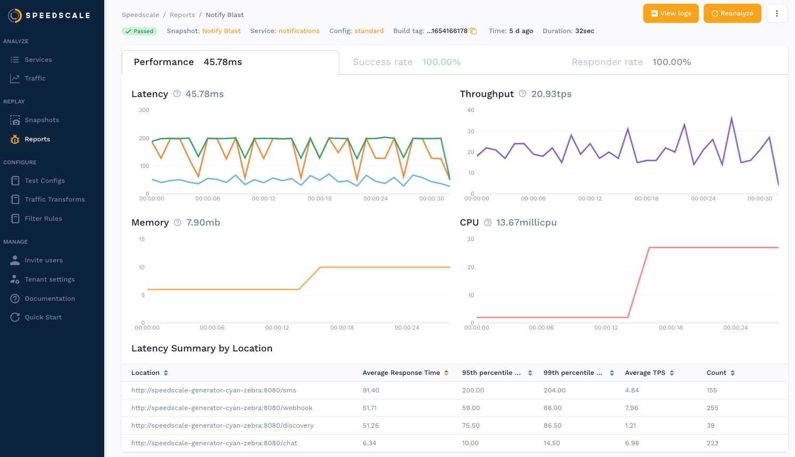

# Dashboard

Once your service has recorded traffic you can start a replay with the "Replay
traffic" button from the traffic viewer, which will start the replay wizard.

Follow the instructions in the wizard to select **inbound** traffic, the requests to be replayed against your service

and **outbound** traffic, the endpoints Speedscale will mock and respond to instead of making requests to your real dependencies.

The **replay config** controls how the replay will be run.  If you are unsure "standard" is a good default.

And finally select where the replay will run in your environment. Choose a
**cluster**, **namespace**, and **workload** where a copy of your service is running.  This
may be the workload where the traffic was recorded, or a newer version of the
same application you want to test against.

In the final step confirm your choices and optionally name the snapshot.  The snapshot
can be used to run the same replay later.

## View Report

Once the replay is started you will be redirected to the replay report.  The page will automatically update as the report is run, eventually showing a summary of the replay.

You can also access the report later from the reports page.

