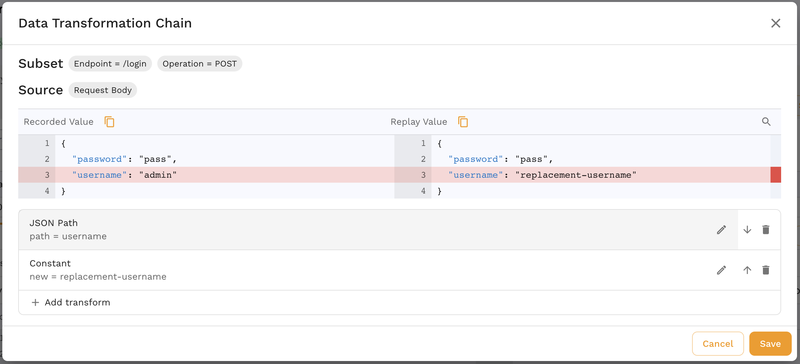
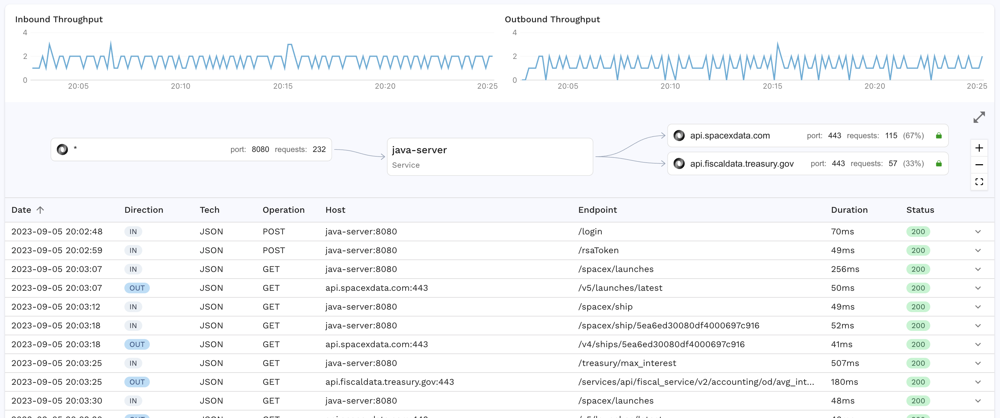
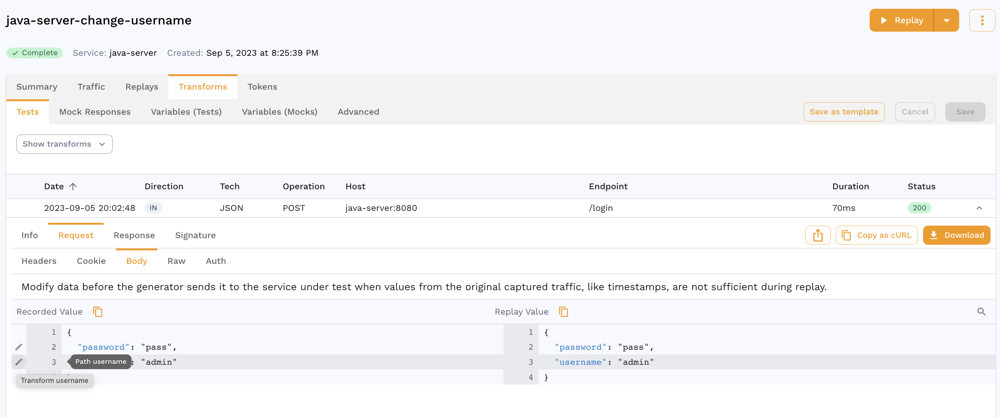
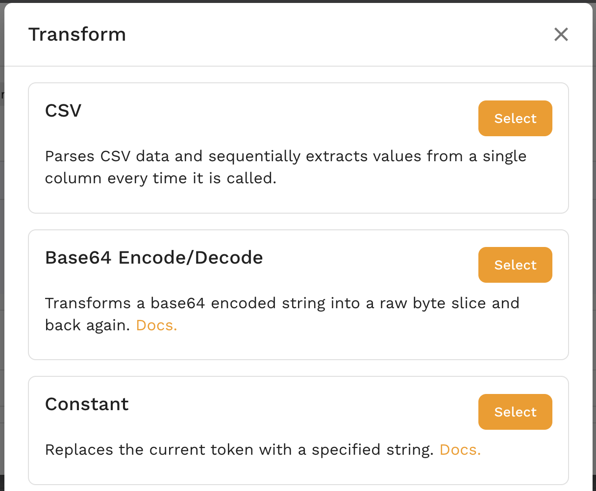
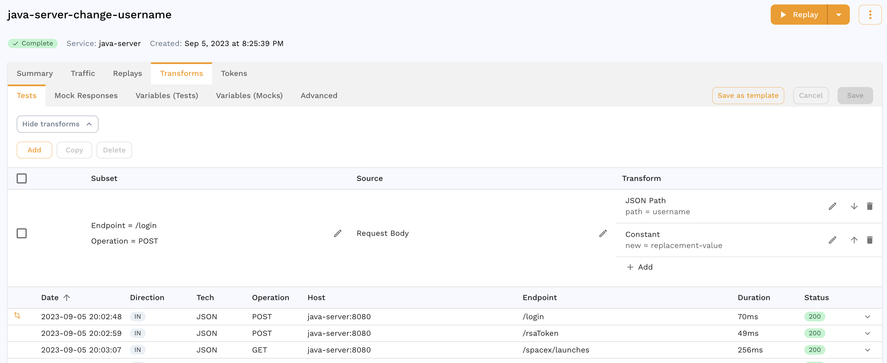

# Change Username

Generally speaking, login credentials in test environments may not match production logins. This example shows you how to change a production credential (such as a `client_id` or username) into a test environment value.

Keep in mind that this is typically not necessary if you are using the Speedscale Responders. If the Responder is mocking the connection between the Service Under Test (SUT) and the authentication service, it will provide the same list of valid users as the production system because that's what it recorded in production. However, this example is provided in case you are unable to record the interactions between the SUT and  the authentication service.

## Objective

Change a credential recorded in production to a test value provided by us. When you have created your transform it should look something like this:



### Install Demo

The data necessary for this example can be found in the Speedscale github repository:

```
git clone https://github.com/speedscale/mock-lab
```

After you have downloaded the demo, follow the instructions in the `go` directory (`cd mock-lab/go` and `go run .`) to run the app and start capturing traffic. The mock-lab app authenticates through the `POST /oauth/token` endpoint, which returns an `access_token` used as a bearer token on subsequent calls. Send a credentialed token request whose body carries the login values you want to transform, for example:

```
{
    "grant_type": "client_credentials",
    "client_id": "admin",
    "client_secret": "pass"
}
```

> **Note:** The mock-lab `/oauth/token` handler does not require these fields to issue a token, so you can supply whatever credential body fits your own auth flow. The point of this example is to show transforming a credential field (here `client_id`) in the login request body; pick whichever field carries the identity value in your environment.

Find this traffic in the traffic viewer, and then use the `Save` button to create a snapshot with this traffic.



### Configuration

From the snapshot viewer, select the `Transforms` tab and you can see your set of `Test` requests that will be sent to the server, and `Mock` transactions to mock out downstream calls. This is how to create this transform:
* Select the `/oauth/token` transaction
* Click on the `Request` tab to see the request body
* Click on the pencil next to `client_id`



This will open the `Data Transformation Chain` viewer and you can see it has already selected the JSON Path for your `client_id` key. Now click the `+ Add transform` button and you will see a list of options:



You can see there are many different options available, but for this example select the `Constant` transform which lets you supply your own value, then click `Save`. You can visually see exactly how this value will change by looking at it on the right. Now click `Save` one more time to save the entire chain, and the snapshot will update.



You can visually see an icon next to the `/oauth/token` transaction which shows that there are transforms applied to that specific request. Now you can run this snapshot to see what the results look like. Try it out on your own snapshot!

:::info
Join slack.speedscale.com to ask real time questions. Our expert engineers are always happy to help with configuration issues.
:::
