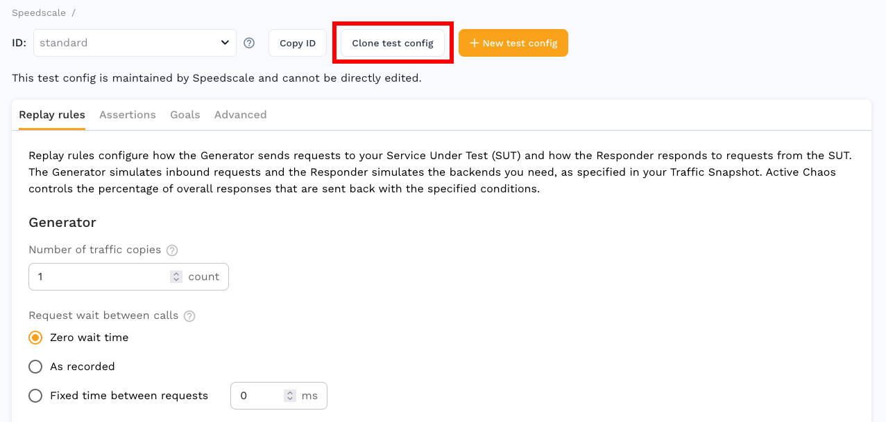

Replay configuration is set via test config from https://app.speedscale.com/config.

Get started by making a copy of the standard config.

**Generator** settings control load generation characteristics during replay.

**Responder** settings control mocked responses for outbound dependencies like an internal database or third party API during replay.

**Cluster** settings control Kubernetes cluster configuration during replay.

**Sidecar** settings control how your service is wrapped and resources provided during replay.

## Secret configuration

If your application uses short lived JWTs, you need to provide a JWT secret
that Speedscale can use to resign tokens. For example, if your service receives
HTTP calls that contain a JWT authorization with 10 minute expiration (exp)
setting, that JWT will be invalid by the time it is used for replay. These may
be provided by adding secret names to **Replay secrets** under **Cluster**.

