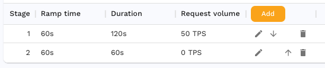
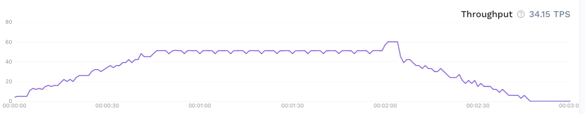

Replay configuration is set via test config from https://app.speedscale.com/config.

Get started by making a copy of the standard config.

The test configuration is broken down into tabs and sections to help you
configure replays. Modify the cloned config to create a template for
[replaying traffic](/concepts/replay).

## Load Pattern

The Load Pattern tab allows you to shape the load over the course of a traffic
replay.

Let's say we want to create a load pattern that ramps up to 50 transactions per
second (TPS) over the course of a minute, holds at 50 TPS for another minute,
and ramps down to 0 over a third minute.

We can actually implement this with only two stages.

The first stage will ramp from 0 to the target TPS over 60 seconds then hold
for the remainder of the stage duration. The second stage has the same total
duration as the ramp time so the full stage will be used to ramp from the
current TPS of 50 down to the target of 0.

This load pattern will result in a throughput graph like this:

## Secret configuration

If your application uses short lived JWTs, you need to provide a JWT secret
that Speedscale can use to resign tokens. For example, if your service receives
HTTP calls that contain a JWT authorization with 10 minute expiration (exp)
setting, that JWT will be invalid by the time it is used for replay. These may
be provided by adding secret names to **Replay secrets** under **Cluster**.

