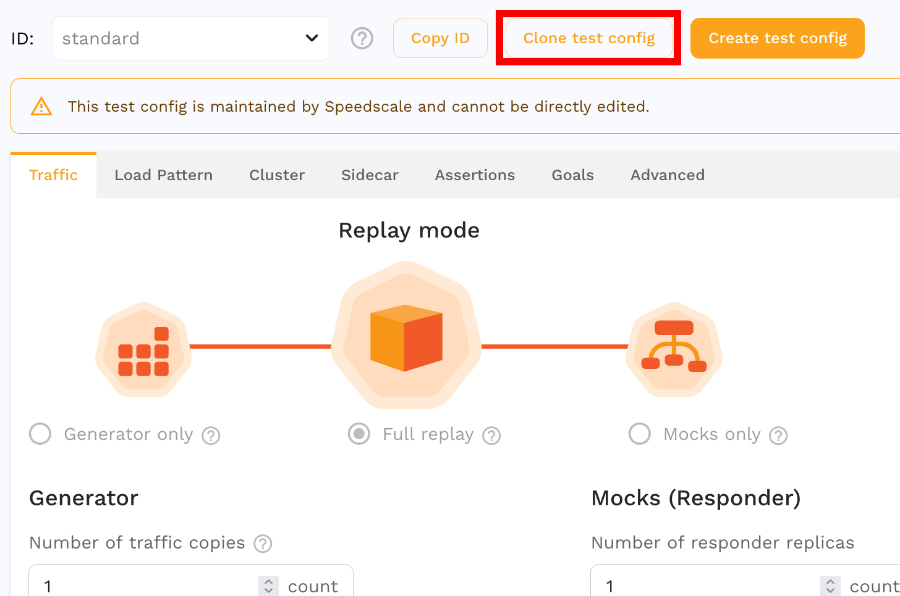

Replay configuration is set via test config from https://app.speedscale.com/config.

Get started by making a copy of the standard config.

The test configuration is broken down into tabs and sections to help you
configure replays. Modify the cloned config to create a template for
[replaying traffic](/concepts/replay).

## Secret configuration

If your application uses short lived JWTs, you need to provide a JWT secret
that Speedscale can use to resign tokens. For example, if your service receives
HTTP calls that contain a JWT authorization with 10 minute expiration (exp)
setting, that JWT will be invalid by the time it is used for replay. These may
be provided by adding secret names to **Replay secrets** under **Cluster**.

