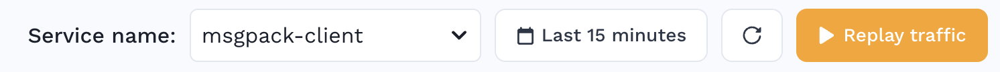
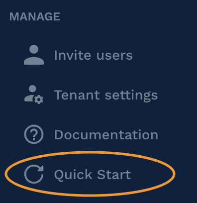
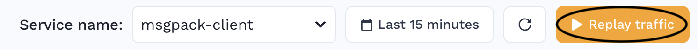
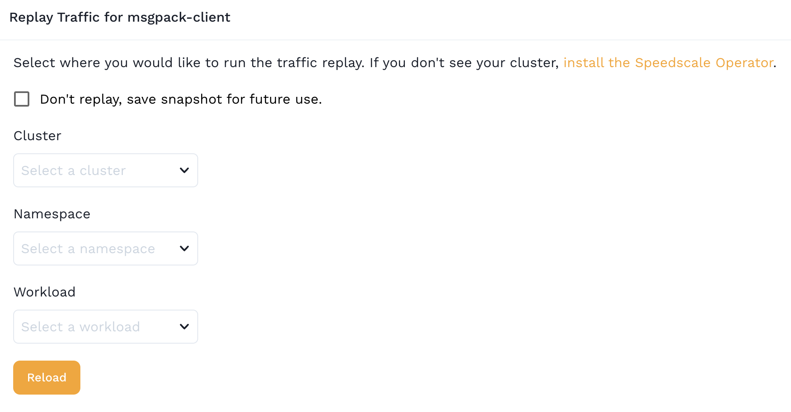

# Replay Traffic in a Different Cluster

One great use of Speedscale is to record traffic in one cluster and replay it another cluster. For example, record real user requests in production and then replay that traffic in a test cluster. Or, record traffic in production and use it to create realistic mocks running in [minikube](https://minikube.sigs.k8s.io/docs/start/) for local development.

#### Before you begin

* Ensure that you hve a working version of your service under test (SUT) already running in your 2nd cluster. It is not necessary to have working versions of downstream APIs that you intend to mock with Speedscale (since it will be doing the mocking), you just need to make sure your SUT starts successfully and isn't erroring out.

#### Select traffic for replay

1. Open the traffic viewer and isolate the traffic you want to replay. Make sure to find your service in the dropdown in the upper right and set a reasonable time range.

2. Create filters to narrow down the traffic to only the incoming requests and outgoing mocks you want to include. The Speedscale cloud engine can handle very large snapshots but it may cause you to wait unnecessarily. Common traffic that slows things down includes monitoring heartbeats and liveness probes. For more information on filtering check out the [docs](../../../reference/filters/).

### Replay traffic in a 2nd cluster

1. Make sure you have installed the operator/inspector combo in the cluster you would like to replay in. This usually takes about 30 seconds when following the Quick Start instructions in the UI. 

2. Now, click the Replay Traffic button on the traffic viewer.

3. Follow the instructions in the Replay Wizard. It will ask you to select which requests you want to replay and which downstream APIs you want to simulate. A few steps into the process you will be asked to select where you would like the traffic to be replayed.

4. Select your new cluster and workload and finish the wizard. You should see any workload type including deployments, statefulsets, replicasets, jobs and daemonsets. Jobs are not currently supported.

5. View your report!
