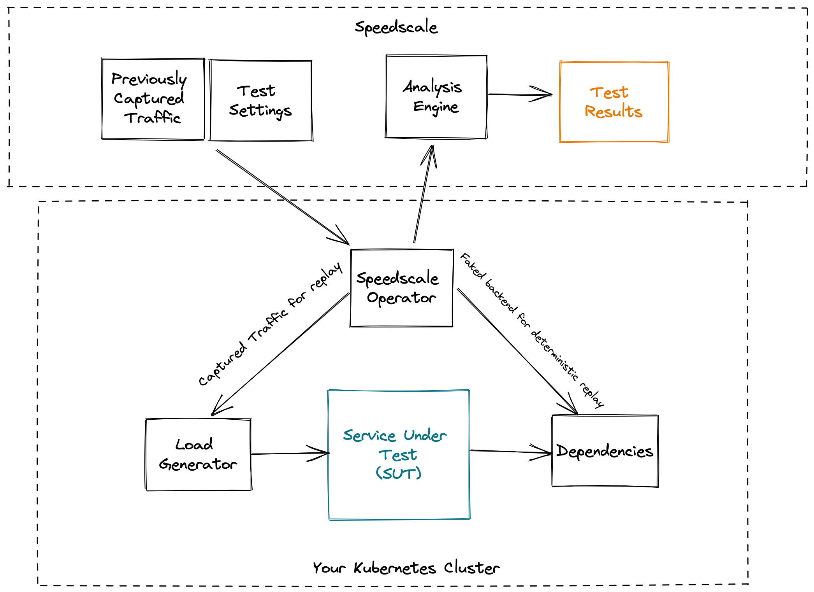

# Via Kubernetes

For those who cannot start a replay from the dashboard, Kubernetes resource
annotations may be modified directly to achieve the same result.

The Speedscale Kubernetes Operator **must** be installed.

### Key Ingredients

Once you have created a snapshot you can replay it at any time in your own environment.



When you replay these are the key ingredients that you will use:

| Ingredient               | Description                                                                                                                                                |
| ------------------------ | ---------------------------------------------------------------------------------------------------------------------------------------------------------- |
| Snapshot                 | A recording of inbound and outbound traffic. You should have created this in the Create Snapshot step.                                                     |
| Configuration            | Use this to customize how traffic will be replayed. There are some built-in configurations, the `standard` one should replay the same way it was captured. |
| Service Under Test (SUT) | This is your application that you want to test, it should be described in a manifest already, such as a deployment yaml.                                   |
| Generator                | This is a job that will be replay the traffic into the Service Under Test.                                                                                 |
| Forwarder                | This container forwards test results to the Speedscale datastore.                                                                                          |
| TrafficReplay            | A Kubernetes Custom Resource that tracks the state of a running replay.
| _(optional)_ Responder   | This is an optional container that can simulate the downstream dependencies behind the SUT.                                                                |
| _(optional)_ Collector   | This is an optional container that will collect logs and other telemetry from the SUT. This container only works in Kubernetes environments.               |
| _(optional)_ Operator    | This is an optional container that will orchestrate your replay in a Kubernetes environment. You can also manually deploy components without the Operator. |

For the rest of these instructions it is assumed that the operator and forwarder are deployed per the installation instructions.

:::info
Readiness Probe: Your deployment should have a
[readiness probe](https://kubernetes.io/docs/tasks/configure-pod-container/configure-liveness-readiness-startup-probes/)
configured in Kubernetes, this lets the operator know exactly when the pod is
ready to receive traffic.
:::

## Starting a Replay <a href="#running-an-isolation-test" id="running-an-isolation-test"></a>

Start a simple replay by applying a `TrafficReplay` in the cluster with
`kubectl`, or check out our [CI/CD docs](../integrations/cicd/cicd.md) for more detailed
instructions on scripting the replay process.

```bash
$ cat replay.yaml
apiVersion: speedscale.com/v1
kind: TrafficReplay
metadata:
  name: test-1
spec:
  snapshotID: abf5c088-48f2-43a6-bf59-8b12f04144b4 # from https://app.speedscale.com/snapshots
  testConfigID: standard                           # from https://app.speedscale.com/config
  workloadRef:
    kind: Deployment
    name: my-app
$ kubectl apply -n my-namespace -f replay.yaml
```

If this is the first time you are running a replay, you should start with the
`standard` test config ID. Running this test config usually works. If it
doesn't the report will give you an idea of how to configuration the data
transformation. For more information about test configs see the
[docs](../../reference/configuration/README.md).

