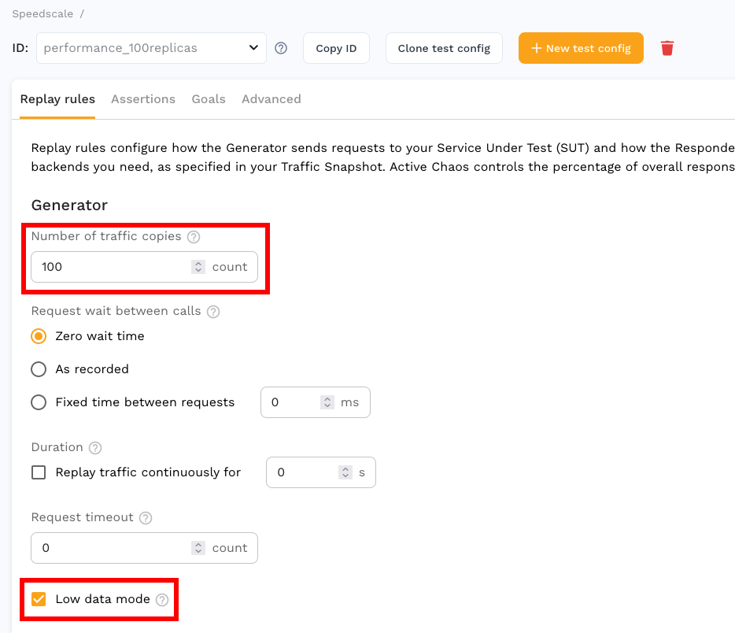

# Load Testing

The amount of load generated during a replay is controlled by the selected
[test config](https://app.speedscale.com/config).  To subject your service to
very high load set the **number of traffic copies** somewhere between 50 and
500 and enable **low data mode**.

There are several performance oriented test configs available by default to get you started.

Each traffic copy will make requests against the system under test
concurrently.  In low data mode response data will not be sent to Speedscale
for analysis.  This removes the ability to run assertions, defined on the
**Assertions** tab, but enables much higher throughput than can be achieved
otherwise.  Status codes will be compared in low data mode and will affect the
overall success rate of the replay report.

# Soak Test

A common use case is to use a small amount of traffic to create a high
throughput or long running replay.  Some issues are only exposed after
sustained load exhausts a resource, which can take time.  Extend your traffic
with the test config **Duration** setting.  This will run your traffic in a
loop for the entirety of the duration.

