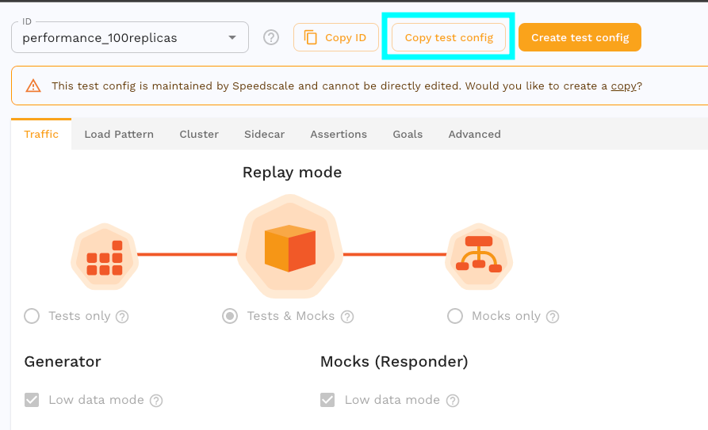
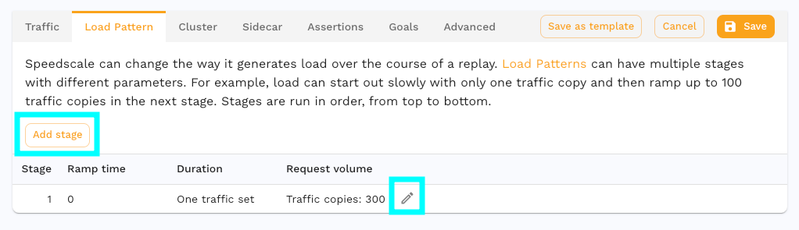
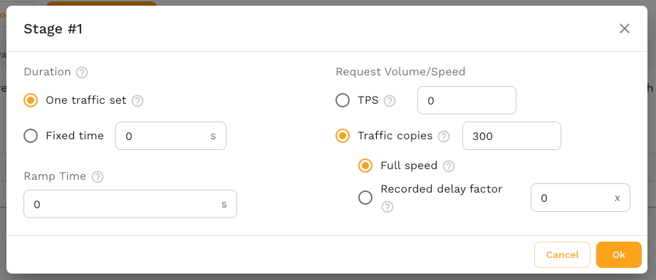
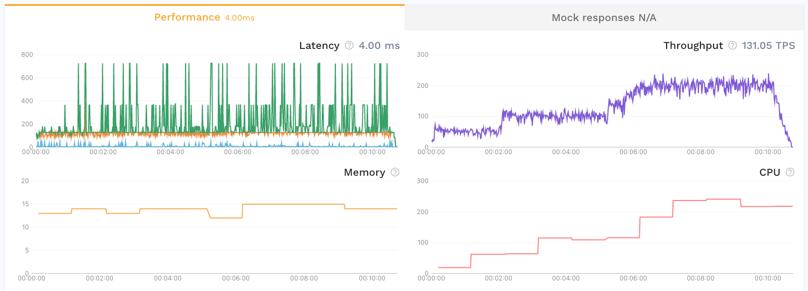

# Load Testing

Load testing your service, stressing it until it starts to fail, is one of the
best ways to prepare for a point in the future when your service has more load
than it does today.  This guide will help you configure and run a load test
against your service.

Use a [test config](/reference/glossary.md/#test-config) to define the load
pattern for your test.  Start by making a copy of the test config
[performance-100replicas](https://app.speedscale.com/config/performance_100replicas)
since the built in test configs cannot be modified.



Notice the existing settings on the test config like [**low data
mode**](/reference/glossary.md/#low-data-mode).

:::info
In low data mode only sampled response data of failures will not be sent to
Speedscale for analysis.  This limits the number of
[RRPairs](/reference/glossary.md/#rrpair) that will be collected and processed
with [assertions](/reference/glossary.md/#assertions), defined on the
**Assertions** tab, but enables much higher throughput than can be achieved
otherwise.  Status codes will be compared in low data mode which determines the
overall success rate of the replay report.
:::


Now click on the **Load Pattern** tab to configure load for the
[replay](/reference/glossary.md/#replay).  From this screen we can edit and add
replay stages.



A replay may have one or more stages and each stage may have a different
configuration.  Let's break down the settings in a stage.  Click the edit
button on stage 1.



The left side sets the **Duration** and determines how long the stage will last.
Select **One traffic set** to replay each request in the
[snapshot](/reference/glossary.md/#snapshot) only once, per traffic copy.
Alternatively, set a **Fixed time** to cycle traffic from the snapshot until
the time is reached.  The **Ramp time** will ramp traffic up to the **Request
Volume/Speed** over the duration given.

The right side sets the **Request Volume/Speed** and determines fast requests
will be made.  Selecting a **RPS** sets the number of [requests per
second](/reference/glossary.md/#requests-per-second) this stage will
target.  While the replay is running the
[generator](/reference/glossary.md/#generator) monitors the current RPS and
increases or decreases load accordingly, holding load once the target is
reached.

Let's look at an example with multiple stages using RPS to control load.

| Stage | Ramp time | Duration  | Request Volume |
|-------|-----------|-----------|----------------|
| 1     | 0s        | 120s      | 50 RPS         |
| 2     | 0s        | 180s      | 100 RPS        |
| 3     | 30s       | 300s      | 200 RPS        |
| 4     | 45s       | 45s       | 0 RPS          |

This load pattern would result in a replay that looks like this:

```
| stage 1  |   stage 2  |     stage 3        |stage 4|
|---120s---|----180s----|-30s-|-----270s-----|--45s--|
     ^           ^         ^         ^           ^
     |           |         |         |           |
 stage 1         |         |         |           |
targets 50 RPS   |         |         |           |
                 |         |         |           |
              stage 2      |         |           |
            immediately    |         |           |
          targets 100 RPS  |         |           |
                           |         |           |
                     stage 3 spends  |           |
                    30s ramping from |           |
                     100 to 200 RPS  |           |
                                     |           |
                               stage 3 spends    |
                                the reamining    |
                               270s at 200 RPS   |
                                                 |
                                   stage 4 spends all of its 45s
                                   ramping down from 200 RPS to 0
```

The graph for this load pattern might look something like this:



There are several performance oriented test configs available by default to get you started.

# Soak Test

A common use case is to use a small amount of traffic to create a high
throughput or long running replay.  Some issues are only exposed after
sustained load exhausts a resource, which can take time.  Extend your traffic
with the test config **Duration** setting.  This will run your traffic in a
loop for the entirety of the duration.

