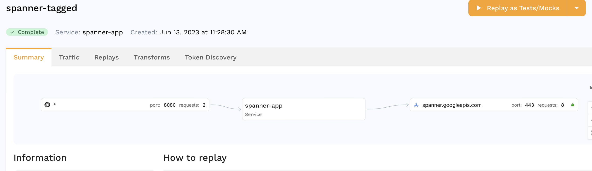
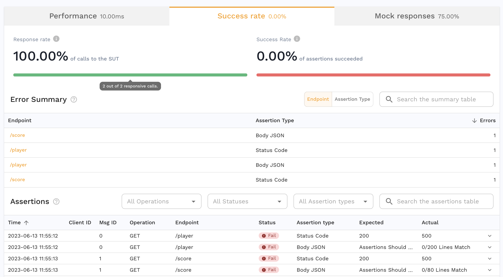
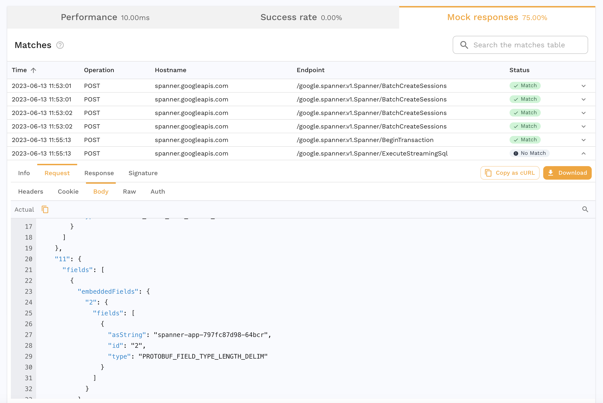
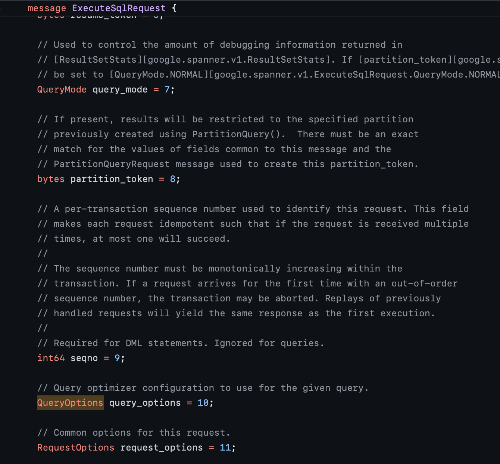
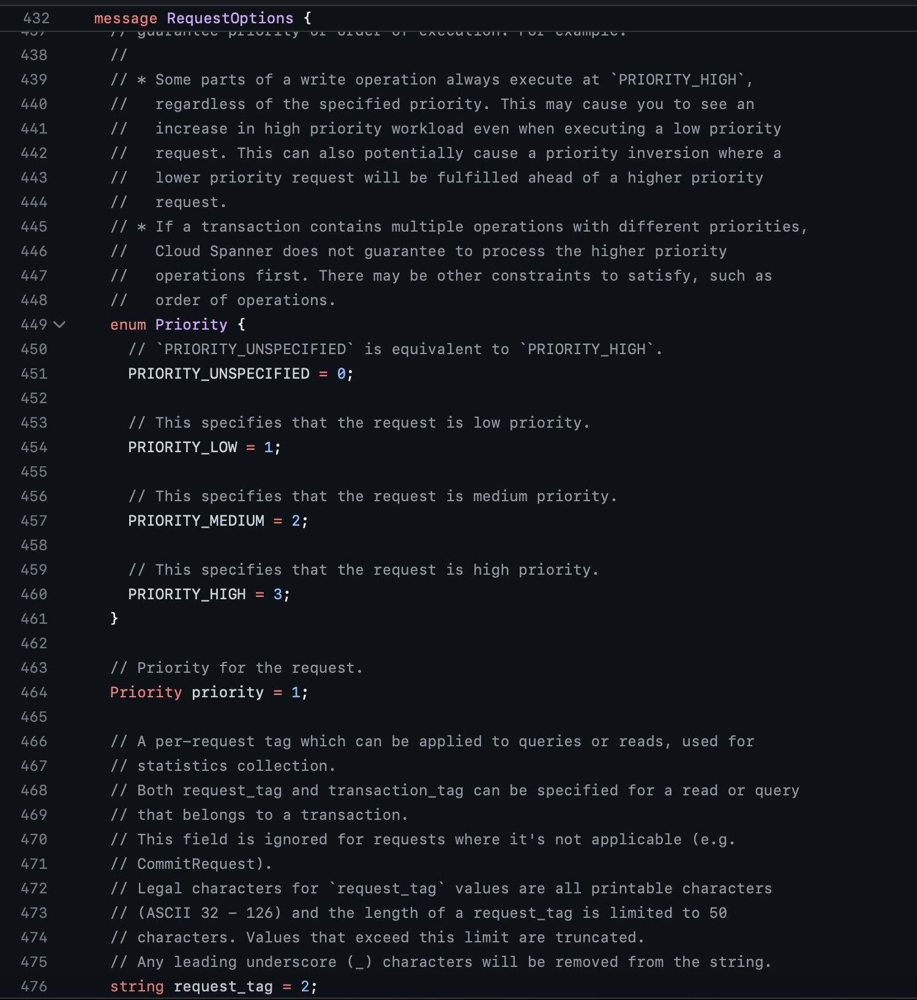
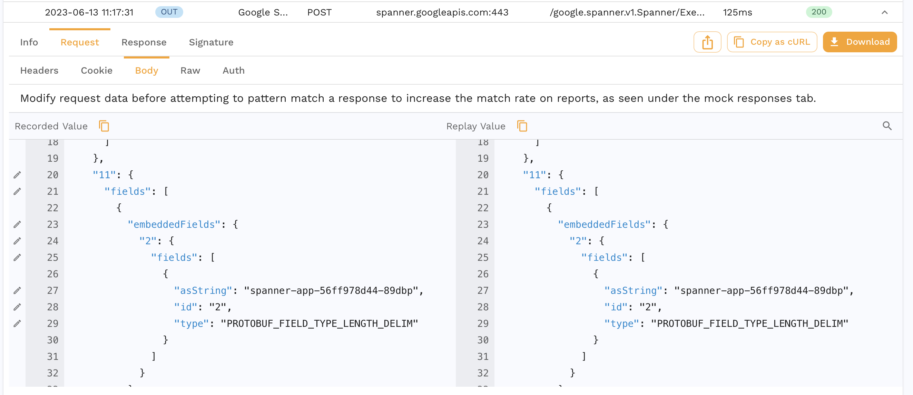
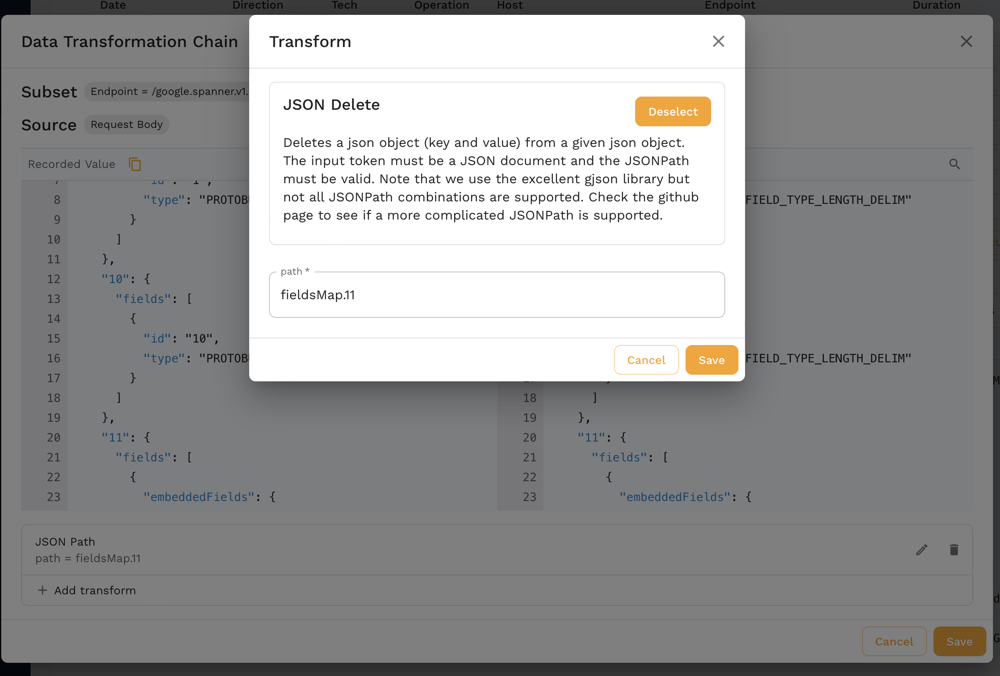
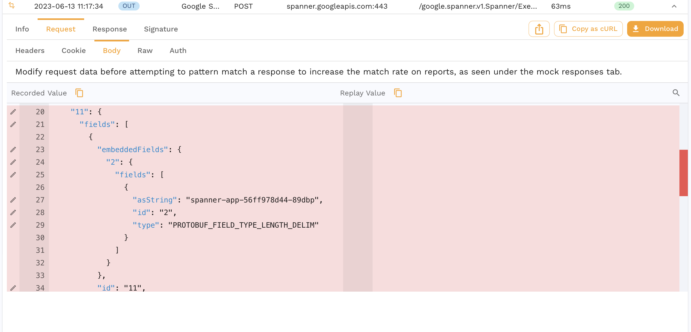
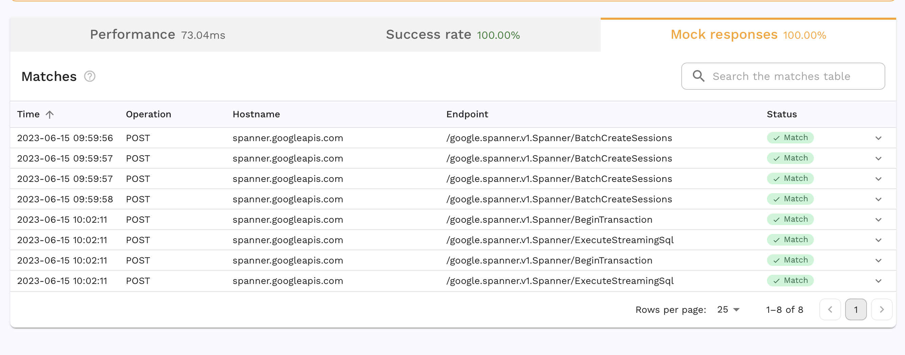

# Using Transforms for better Mocks

## Prerequisites
1. You have [created a snapshot](../../creating-a-snapshot.md)
2. You know how to [run a replay](../../)

## Replay without Transforms

For this guide, we're going to use this very simple snapshot for an app that uses Google Spanner as a database. This snapshot has two inbound calls to `/player` and `/score` that use Spanner and we are purposefully not including any other traffic to this app for this demo.

We run a replay with this snapshot and no special settings. This report has a 0% success rate.

We notice that besides the success rate being low, the Mock response rate is also not 100%. For some apps this may be normal but given how simple our test is, we want to know why.

Inspecting this `No Match` call to spanner, we see that field 11 in the body contains a value that looks like a constantly changing value, in this case the name of the pod that made the request. Upon further inspection of the protobuf for this request, we see that field 11 is `RequestOptions`.

And we see that the field itself contains a bunch of settings that are dynamic.

We could transform the snapshot to always set that pod name to a constant and that may be good enough for this case. But to future proof this, it would be safer to completely ignore a field with dynamic information like this.

## Transform

In our snapshot, under `Transforms/Responder (Mocks)` we can see a list of requests and responses that the mocks will use during our tests. We find a request to our RPC `/google.spanner.v1.Spanner/ExecuteStreamingSql` and open the request body section of the request.

We're going to use the `json_delete` transform which tells the mocks to ignore this field completely when trying to match mock responses.

Now you can see that this field is completely removed from the request body.

## Replay with Transforms

Now we run another replay with the transformed snapshot.

We have 100% Mock rate and also 100% success rate! Our replay behaved exactly like our app did when we did our initial recording and we didn't have to use an actual Google Spanner instance where the data might have changed since our recording.

Transforms are extremely powerful for parameterizing and modifying dynamic data. Lots of data that we use in our apps is static but there are always things like timestamps, session ids, environment tags, etc. that we need to control for in tests and Transforms help us do exactly that on the inbound and outbound side.
