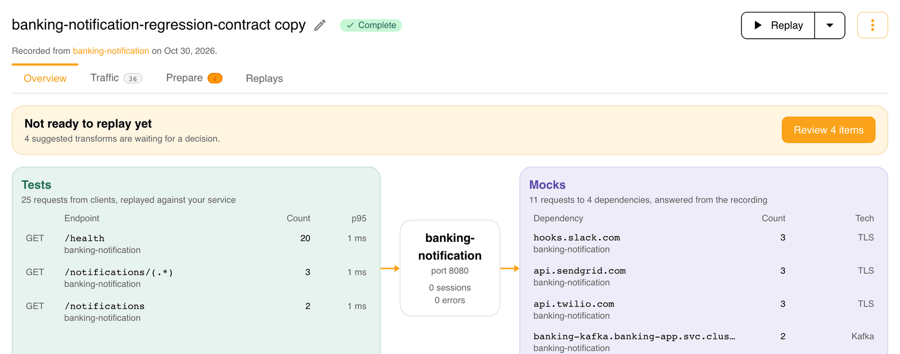
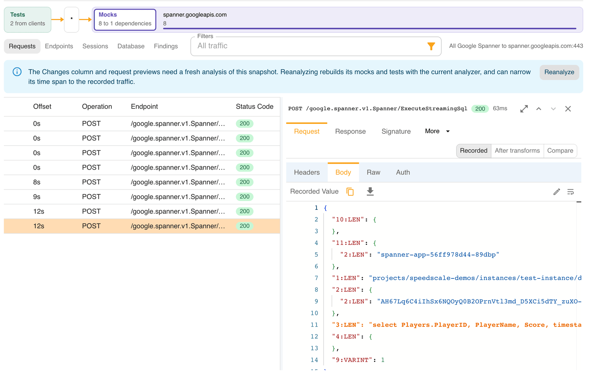
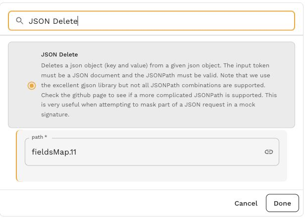
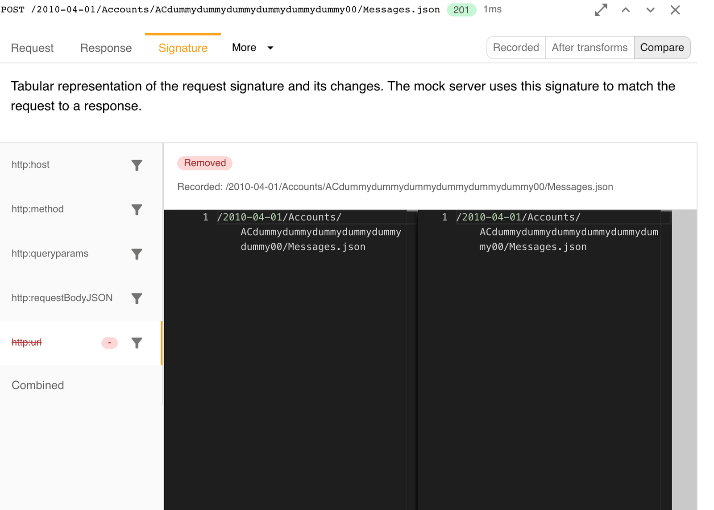
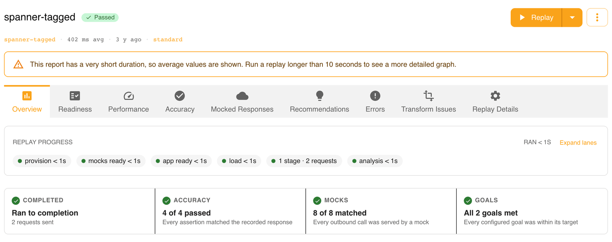

import JsonDeleteImage from './edit-sig/json-delete.jpg';

# Using Transforms for better Mocks

## Prerequisites
1. You have [created a snapshot](../../creating-a-snapshot.md)
2. You know how to [run a replay](../../)


## Replay without Transforms

For this guide, we're going to use this very simple snapshot for an app that uses Google Spanner as a database. This snapshot has two inbound calls to `/player` and `/score` that use Spanner and we are purposefully not including any other traffic to this app for this demo.



We run a replay with this snapshot and no special settings. The report misses its goals: 0 of 4 assertions passed.


We notice that besides the accuracy being low, the Mocks card shows only 6 of 8 calls matched, and the **Mocked Responses** tab shows a Mock Accuracy of 75%. For some apps this may be normal but given how simple our test is, we want to know why.


Inspecting the `No Match` call to Spanner, `ExecuteStreamingSql`, we see that field 11 in the request body contains a value that looks like a constantly changing value, in this case the name of the pod that made the request. Upon further inspection of the protobuf for this request, we see that field 11 is `RequestOptions`.

```protobuf
message ExecuteSqlRequest {
  // ...
  // Common options for this request.
  RequestOptions request_options = 11;
}
```

And we see that the field itself holds per-request settings. Field 2, `request_tag`, is where this app writes its pod name, which changes with every deployment.

```protobuf
message RequestOptions {
  // Priority for the request.
  Priority priority = 1;

  // A per-request tag which can be applied to queries or reads, used for statistics collection.
  string request_tag = 2;

  // A tag used for statistics collection about this transaction.
  string transaction_tag = 3;
}
```

We could transform the snapshot to always set that pod name to a constant and that may be good enough for this case. But to future proof this, it would be safer to completely ignore a field with dynamic information like this.

## Transform

Open the snapshot's **Traffic** tab and select **Mocks**. Find a request to `/google.spanner.v1.Spanner/ExecuteStreamingSql` and open its request body.



Use the field's transform action to open the chain in **Prepare**. For this example, extract the request body and add **JSON Delete** with `path` set to `fieldsMap.11`. This removes the dynamic RequestOptions field before the responder matches the request.

<div className="docs-diagram-scroll" style={{'--docs-diagram-width': '618px'}} tabIndex={0} role="region" aria-label="JSON Delete step configuration">



</div>

<a href={JsonDeleteImage}>Open screenshot full size</a>

Check the chain preview against the recorded request, then select **Done** and **Save and reanalyze**. Keep the path specific to this example; other protobuf messages can use a different field number.

Now you can see that this field is completely removed from the request body.



## Replay with Transforms

Now we run another replay with the transformed snapshot.



All 8 outbound calls matched a mock and all 4 assertions passed! Our replay behaved exactly like our app did when we did our initial recording and we didn't have to use an actual Google Spanner instance where the data might have changed since our recording.

Transforms are extremely powerful for parameterizing and modifying dynamic data. Lots of data that we use in our apps is static but there are always things like timestamps, session ids, environment tags, etc. that we need to control for in tests and Transforms help us do exactly that on the inbound and outbound side.
