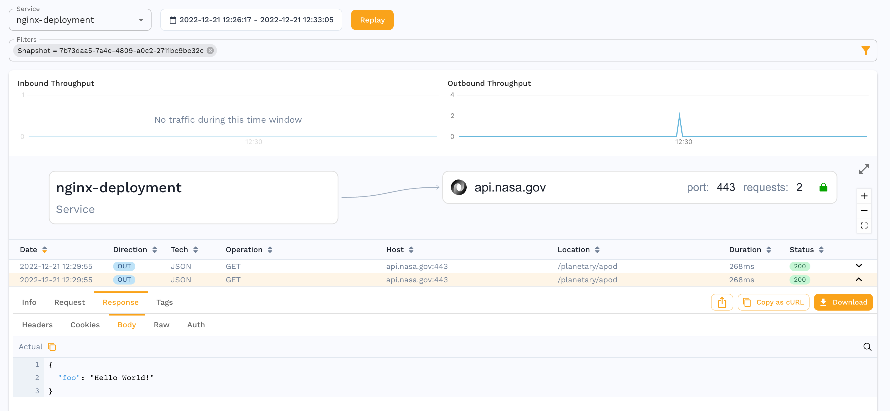

# Mock Services from Scratch

How to work with the data the responder uses:

1. Seed mock responses without using the UI
2. Delete mock responses without using the UI
3. Passthrough mode

## Prerequisite - create a snapshot

First you need a starter snapshot that you’ll work with, in my case I captured a single outbound request from an nginx container to NASA. Capture with these annotations:

```bash
apiVersion: apps/v1
kind: Deployment
metadata:
  annotations:
    sidecar.speedscale.com/inject: "true"
    sidecar.speedscale.com/tls-out: "true"
```

Run a curl against your pod against the `/nasa` endpoint with a valid call for the NASA API, and you should see a transaction. I decided to filter only for outbound calls and then saved the snapshot.


Download the snapshot with a command like this:

```bash
speedctl pull snapshot {SNAPSHOT_ID}
```

## Add Mock Responses

You’ll want to open the snapshot directory in your favorite editor like VSCode. You will see several files in the `{SNAPSHOT_ID}` directory. The `raw.jsonl` is the original raw traffic, you’ll want to add your responses here. Grab one of the lines that is already there and open in an editor and you’ll see the format, here are the first few lines.

```bash
{
  "msgType": "rrpair",
  "resource": "nginx-deployment",
  "ts": "2022-12-21T17:29:55.570976264Z",
```

Note that the body payloads are base64 encoded. For example if you want to add a new request with different query parameters, you would update the params to what you want, and then you need to put in a new body. For example:

```bash
echo '{"foo": "Hello World!"}' | base64
```

Take the output of that and put into the `http.res.bodyBase64` value.

<aside>
⚠️ You also need to delete the UUID parameter in the JSON because you want your new rrpair to get a new unique identifier.

</aside>

Save the rrpair file and then you can add it to your raw file like so (note that `-c` will take out all the whitespace):

```bash
cat rrpair-hello.json| jq -c . >> raw.jsonl
```

Now you can upload the snapshot like so:

```bash
speedctl push snapshot {SNAPSHOT_ID}
```

You should now see there are 2 responses:


You can view the traffic by going to the `Traffic` tab and selecting the `View traffic` button:


Once it loads the traffic you will see the 2 calls, and the 2nd call has the Hello World response:



## Delete Mock Responses

Now that you’ve added a response, you can see that deleting one just requires finding the correct value from the `raw.jsonl` file, deleting it, and then pushing the snapshot again with:

```bash
speedctl push snapshot {SNAPSHOT_ID}
```

## Configuring Passthrough

This is now a feature of the test config. Check the box, and if the responder does not match, instead of returning a 404, it will fetch from the live backend system.


## Running the snapshot

You need to run the responder by using a Custom Resource (or annotations), remember to use the updated test config that you created that has passthrough mode enabled.

```bash
apiVersion: speedscale.com/v1
kind: TrafficReplay
metadata:
  name: replay-abc123
spec:
  snapshotID: {SNAPSHOT_ID}
  testConfigID: responder-passthrough
  workloadRef:
    kind: Deployment
    name: nginx-deployment
  cleanup: inventory
```

Then deploy it with:

```bash
kubectl apply -f cr.yaml
```

You should see the responder resources are created and attached to your pod. You can check the status by running:

```bash
kubectl get trafficreplays.speedscale.com
```

## Appendix - minikube

To run this in minikube you’ll want a load balancer, I’m using `metallb`. When configuring the ip address for `metallb`, I use something with the same 3 values as my minikube ip, but a different value for the final octet.

```bash
minikube start ...
minikube addons enable metallb
minikube ip
minikube addons configure metallb
```

## Appendix - nginx

You can register for a NASA API key here:

[NASA Open APIs](https://api.nasa.gov/)

Full manifest of nginx:

```bash
apiVersion: v1
kind: ConfigMap
metadata:
  name: nginx-conf
data:
  nginx.conf: |
    user nginx;
    worker_processes  1;
    events {
      worker_connections  10240;
    }
    http {
      server {
        listen  8080;
        location /nasa/ {
          proxy_pass https://api.nasa.gov/;
        }
        location /hello {
          return 200 '{"hello":"there"}';
          add_header Content-Type application/json;
        }
        location /health/v1/lively {
          return 200 'this is a live check';
        }
        location /health/v1/ready {
          return 200 'this is a ready check';
        }
      }
    }
---
apiVersion: v1
kind: Service
metadata:
  name: nginx
spec:
  selector:
    app: nginx
  ports:
    - protocol: TCP
      port: 80
      targetPort: 8080
  type: LoadBalancer
---
apiVersion: apps/v1
kind: Deployment
metadata:
  name: nginx-deployment
spec:
  selector:
    matchLabels:
      app: nginx
  replicas: 1
  template:
    metadata:
      labels:
        app: nginx
    spec:
      containers:
      - name: nginx
        image: nginx:1.14.2
        ports:
        - containerPort: 80
        - containerPort: 8080
        volumeMounts:
            - name: nginx-conf
              mountPath: /etc/nginx/nginx.conf
              subPath: nginx.conf
              readOnly: true
      volumes:
      - name: nginx-conf
        configMap:
          name: nginx-conf
          items:
            - key: nginx.conf
              path: nginx.conf
```
