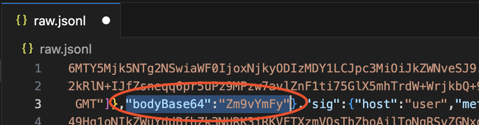

# Modifying Mock Responses

Speedscale mocks are built from observed traffic stored in a Snapshot. At the core, Snapshots are large `raw.jsonl` files that can be edited directly with a little bit of JSON knowledge. Let's walk through the process of modifying the expected response for an existing mock request. It's helpful to have a working understanding of how Speedscale builds service mocks. You can deepen your understanding by reading about the [service mock concept](../../../concepts/service_mocking.md).

## Download Your Snapshot

Take a snapshot of some outbound requests to use as a starting point. For more information on creating a snapshot take a look at our [Quick Start](../../../quick-start.md). Once you've created a snapshot take note of it's ID. You can find this in the URL of your browser or copy to your clipboard by clicking (three dot menu)->Copy Snapshot ID from the Snapshot Summary view.

First thing we want to do is download the snapshot with the command line CLI:

```bash
speedctl pull snapshot {SNAPSHOT_ID}
```

## Edit raw.jsonl

You’ll want to open the raw file for your snapshot in your favorite editor like VSCode. If you have an editor configured in your terminal you can do this by running:

```bash
speedctl edit {SNAPSHOT_ID}
```

If you don't have an editor configured then you can open the file directly with VSCode (or another text editor) by inserting SNAPSHOT_ID into the folowing command:

```bash
code ~/.speedscale/data/snapshots/{SNAPSHOT_ID}/raw.jsonl
```

Each line in the `raw.jsonl` file represents a single request. Outbound request are turned into service mocks while inbound requests are turned into tests.

Find the request you would like to modify, it will be a single line of JSON that you can edit with your text editor. To help clarify, here is an example raw file opened in Visual Studio Code:


You will want to find the request (or group of requests) you want to edit in this file. The simplest way to do this is to search for the `location` you want to edit (aka Endpoint URI). Once you find the right endpoint you'll want to stay on that line and make edits.

## Select a Request to Modify

Within the line you are editing, find this JSON location `.http.res.bodyBase64`. It's usually near the end. Take care not to edit the request body (`http.req.bodyBase64`) as they appear similar.


Note that the response body is base64 encoded.

## Base64 Encode New Payload

You want to modify the contents of `.http.res.bodyBase64` to match the new data you'd like to return. Because `bodyBase64` accepts binary input you'll need to base64 encode your new data and insert it into the existing location. Let's say you want to replace the existing response payload with `foobar`. To do this we encode the string `foobar` into its base64 representation of `Zm9vYmFy`. You can do this on the command line or using an online tool like [base64encode.org](https://www.base64encode.org/).

Now, insert the new string `Zm9vYmFy` into the `.http.res.bodyBase64` location:



## Upload Snapshot

You're almost there! Make sure to save your modified raw file and re-upload it to Speedscale:

`speedctl push snapshot {SNAPSHOT_ID}`

Speedscale will then re-analyze your outbound transactions, including your modified response payload, and update the service mocks for this snapshot.

