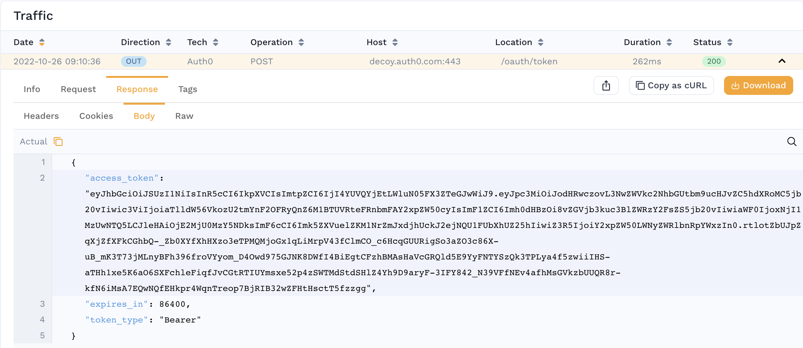

# Re-signing JWTs in Mocks

Most real-world APIs require authentication. The most common type of authentication we see is JWT/OAuth2. This guide shows you how to train Speedscale to automatically re-sign JWTs when simulating backend services for your Service Under Test (SUT). This guide is only for automatically generated service mocks (not incoming load)

:::note
This workflow is currently in queue for complete automation by Speedscale engineering. If you'd like to view the new design and weigh in let us know in the [community](https://slack.speedscale.com). For now, please follow these instructions. The new system will be backwards compatible.
:::

## How do I know my app needs to resign JWTs?

1. Your application complains of invalid JWTs from the mocked service
2. Your application complains of being unable to authenticate with the mocked service
3. You see an outbound login-style transaction with a response payload containing the JSON key `access token`. For example:



## Prerequisites

* Find secret used to sign JWTs. Your application and the Speedscale responder must share the same secret for JWT re-signing to work.
* For this example we will assume your [secret](https://kubernetes.io/docs/concepts/configuration/secret/) is mounted in Kubernetes. Technically, the Speedscale responder is just looking for a file so you can adapt these instructions easily to run outside of Kubernetes.
* [Create a snapshot](/guides/creating-a-snapshot.md) containing the traffic you need to re-sign

## Configure your transform

You must tell Speedscale which JWTs you want to re-sign. This is accomplished with a traffic transform.
1. Open the transform editor for your Snapshot
2. Select the Responder tab
3. Add a "JWT Resign" transform
4. Set the "path" to the correct file path so the responder can find it. If you are running in Kubernetes you can use this format to specify a secret in the cluster: `${{secret:secret_name/key_inside_the_secret}}`. You can find more information in the Kubernetes [docs](https://kubernetes.io/docs/concepts/configuration/secret/). Whether you specify a secret or a direct file location the secret must match the algorithm of the JWT. For example, if the JWT is signed using HS512 then the secret or file must contain 64 bytes as a key. If RS512 it must be a certificate and so on.
5. (optional) Select a subet of traffic to apply the transform to. Remember, if "access_token" is not found in an RRPair then the responder will just skip it. This means there should be little issue with not configuring fine grained filters unless you have many `access_token`s that need to be treated differently.

When you're done, you should be able to click on the "Advanced" tab and see JSON resembling the following:
```JSON
{
  "id": "jwt-test",
  "responder": [
    {
      "filters": {
        "filters": [
          {
            "include": true
          }
        ]
      },
      "extractor": {
        "type": "http_res_body"
      },
      "transforms": [
        {
          "type": "json_path",
          "config": {
            "path": "access_token"
          }
        },
        {
          "type": "jwt_resign",
          "config": {
            "secretPath": "${{secret:jwt-demo/tls.key}}"
          }
        }
      ]
    }
  ]
}
```

Now, run your replay and you're ready to go!

