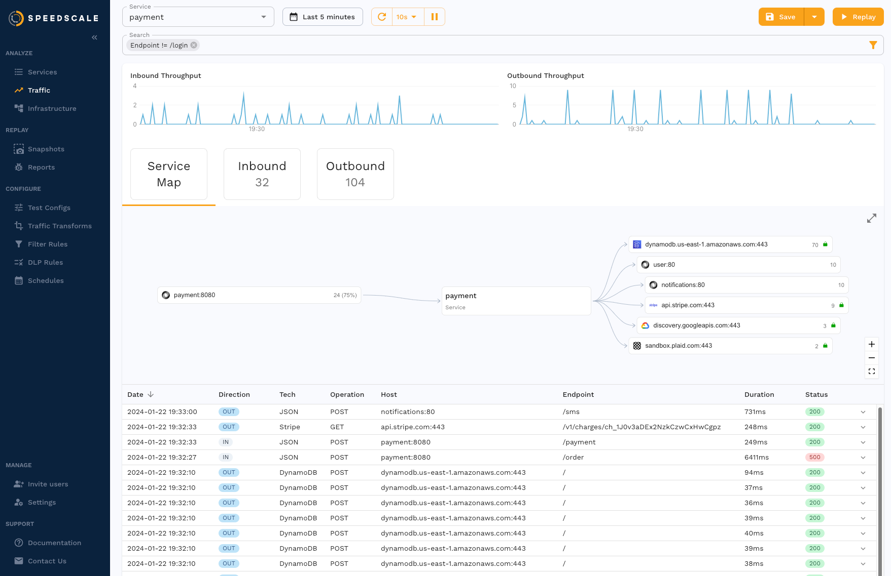
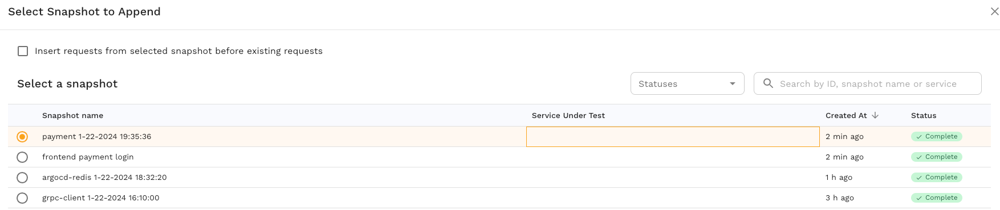

# Multi-Service Replay

Some applications require communication between multiple services to work correctly.  For example, imagine an API server which requires an authentication token.  In production a client might make a request to an auth service to get a token, then send that token to the API server.  In this guide we will configure Speedscale to run a [replay](/reference/glossary.md#replay) simulating this example.

## Create Snapshot

### Select Traffic

To start we will need to create two [snapshots](/reference/glossary.md#snapshot) and merge them together.

The first snapshot contains only the authentication request / response.  Here the `frontend` service provides the authentication token we need.


The second snapshot contains traffic to the API server we want to test, `payment` in this case.



### Merge Snapshots

From the first snapshot containing the authentication request select the menu and choose "Append snapshot".


Then select the second snapshot.



Now the first snapshot contains traffic from both services.

Just to be sure we can investigate the snapshot traffic to verify by pulling the snapshot files and looking at the `resource` fields in the [action file](/reference/glossary.md#action-file):

```shell
$ speedctl pull snapshot $SNAPSHOT_ID
$ cat ~/.speedscale/data/snapshots/$SNAPSHOT_ID/raw.jsonl | head -n 5 | jq '.resource'
"frontend"
"payment"
"payment"
"payment"
"payment"
```

The first request is from `frontend` and the rest are from `payment`.  The new snapshot shows the inbound and outbound [traffic](/reference/glossary.md#traffic) from both services.


### Transforms

The snapshot now contains the `/api/payment/login` request, which means that request will be made again during the replay to retrieve a new token, but this is not enough.  We need to configure Speedscale to pass the `access_token` from the auth response to the `X-Access-Token` header in subsequent requests.

We will create [Transforms](/reference/glossary.md#transform) to [store](/transform/transforms/variable_store) the `access_token` from the auth response body and [load](/transform/transforms/variable_load) it into the header field later. Transforms can be created for the snapshot under the `transforms` tab.

Store the access token by selecting the `/api/payment/login` [RRPair](/reference/glossary.md#rrpair) and clicking the pencil by the `access_token` field.


Select `Store Variable` to store and enter a variable name.


Now we can manually create a new transform by clicking `Add` at the top of the page.  The new transforms will:

- Match all requests EXCEPT those with endpoint `/api/payment/login`
- Target the HTTP Request Header `X-Access-Token`
- Load the variable `access_token` into the header field at index 1, since the full header string is `Bearer [token]`


Now during replay the `X-Access-Token` header for all requests, save the first one, will contain the `access_token` from the response of the `/api/payment/login` request which gives us the flexibility to test with our real service with real, valid authentication.

## Replay

The merged snapshot now has traffic from both services and transforms to route to different locations.  Let's replay it by clicking the `Replay` button.

### Cluster / Namespace

Use the replay wizard to select the cluster and namespace where the replay will run.


### Tests

The "Tests" page shows the service map at the top and recorded traffic at the bottom.  The traffic for each service is shown on the left side of the service map and may be configured separately.  We will click the pencil to edit and select the workload where recorded `frontend` app traffic will be sent.


Here we are selecting the `frontend` workload.


And similarly we can configure recorded `payment` app traffic to go to the `payment` workload.


The replay has been configured such that `frontend` app traffic will go to the `frontend` workload and `payment` app traffic will go to the `payment` workload.


### Test Config

The [test config](/reference/glossary.md#test-config) is used to configure additional details like load and duration.  Test configs can be modified under the `Test Configs` tab.  Select an existing config.


### Summary

Review the details of the replay and click `Start Replay` to begin.


