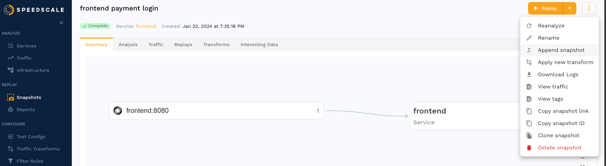

# Multi-Service Replay

Some applications require communication between multiple services to work correctly.  For example, imagine an API server which requires an authentication token.  In production a client might make a request to an auth service to get a token, then send that token to the API server.  In this guide we will configure Speedscale to run a [replay](/reference/glossary.md#replay) simulating this example.

## Select Traffic

To start we will need to create two [snapshots](/reference/glossary.md#snapshot) and merge them together.

The first snapshot contains only the authentication request / response.  Here the `frontend` service provides the authentication token we need.


The second snapshot contains traffic to the API server we want to test, `payment` in this case.


## Merge Snapshots

From the first snapshot containing the authentication request select the menu and choose "Append snapshot".



Then select the second snapshot.


Now the first snapshot contains traffic from both services.

Just to be sure we can investigate the snapshot traffic to verify by pulling the snapshot files and looking at the `resource` fields in the [action file](/reference/glossary.md#action-file):

```shell
$ speedctl pull snapshot $SNAPSHOT_ID
$ cat ~/.speedscale/data/snapshots/$SNAPSHOT_ID/raw.jsonl | head -n 5 | jq '.resource'
"frontend"
"payment"
"payment"
"payment"
"payment"
```

The first request is from `frontend` and the rest are from `payment`.

## Creating Transforms

[Transforms](/reference/glossary.md#transform) can be created to modify traffic under the `transforms` tab of a snapshot.  Transforms here are shown in their JSON format, which can be modified under the `Advanced` sub-tab but dealing with JSON directly is not necessary.  See [where to transform traffic](/concepts/transforms/#where-to-transform-traffic) for more information.

### Hostname Overrides

By default traffic during a replay inside a cluster is routed to a single location, `some-service:8080` for example.  If we were to replay this snapshot and select a `payment` server all requests would be routed to `payment`, but the authentication request needs to be routed to `frontend` or some other location. For this we need to create transforms which use the [target hostname extractor](/reference/transform-traffic/extractors/target_hostname/) to modify each request before it is sent.

This is what those transforms look like in JSON:

<details open><summary>JSON</summary>
<p>

```json
{
  "name": "my-transforms",
  "id": "my-transforms",
  "generator": [
    {
      "filters": {
        "filters": [
          {
            "include": true,
            "service": "frontend"
          },
          {
            "include": true,
            "detectedCommand": "POST"
          }
        ]
      },
      "extractor": {
        "type": "target_host"
      },
      "transforms": [
        {
          "type": "constant",
          "config": {
            "new": "frontend"
          }
        }
      ]
    },
    {
      "filters": {
        "filters": [
          {
            "include": true,
            "service": "payment"
          }
        ]
      },
      "extractor": {
        "type": "target_host"
      },
      "transforms": [
        {
          "type": "constant",
          "config": {
            "new": "payment"
          }
        }
      ]
    }
  ]
}
```

</p>
</details>


This will change the target hostname for a subset of the requests during replay.

### Port Overrides

It may also be necessary to change the target port, which can be done by adding [target port extractors](/reference/transform-traffic/extractors/target_port/).

Add transforms to modify the target port for the requests in each service:

<details open><summary>JSON</summary>
<p>

```json
...
    {
      "filters": {
        "filters": [
          {
            "include": true,
            "service": "frontend"
          },
          {
            "include": true,
            "detectedCommand": "POST"
          }
        ]
      },
      "extractor": {
        "type": "target_port"
      },
      "transforms": [
        {
          "type": "constant",
          "config": {
            "new": "3000"
          }
        }
      ]
    },
    {
      "filters": {
        "filters": [
          {
            "include": true,
            "service": "payment"
          }
        ]
      },
      "extractor": {
        "type": "target_port"
      },
      "transforms": [
        {
          "type": "constant",
          "config": {
            "new": "3001"
          }
        }
      ]
    }
...
```

</p>
</details>

### Store / Load Authentication Token

Requests will be directed to the correct location using the above transforms, however the Speedscale load generator doesn't have all of the logic of your real client.  We still need to store the value from the auth response and load it into subsequent requests so they can authenticate properly.  This can be done with [var_store](/reference/transform-traffic/transforms/variable_store/) and [var_load](/reference/transform-traffic/transforms/variable_load/) respectively.

Add an additional transform to store the `access_token` JSON value from the auth response body, and one to load that value into the `X-Access-Token` request header:

<details open><summary>JSON</summary>
<p>

```json
...
    {
      "filters": {
        "filters": [
          {
            "include": true,
            "service": "frontend"
          },
          {
            "include": true,
            "detectedCommand": "POST"
          }
        ]
      },
      "extractor": {
        "type": "res_body"
      },
      "transforms": [
        {
          "type": "json_path",
          "config": {
            "path": "access_token"
          }
        },
        {
          "type": "var_store",
          "config": {
            "name": "access_token"
          }
        }
      ]
    },
    {
      "filters": {
        "filters": [
          {
            "include": true,
            "service": "payment"
          }
        ]
      },
      "extractor": {
        "type": "http_req_header",
        "config": {
          "index": "0",
          "name": "X-Access-Token"
        }
      },
      "transforms": [
        {
          "type": "var_load",
          "config": {
            "name": "access_token"
          }
        }
      ]
    }
...
```

</p>
</details>

## Replay

The merged snapshot now has traffic from both services and transforms to route to different locations.  Run a replay with the snapshot and iterate as necessary.

## Reference

Here's the full transform from the sections above:

<details open><summary>JSON</summary>
<p>

```json
{
  "name": "my-transforms",
  "id": "my-transforms",
  "generator": [
    {
      "filters": {
        "filters": [
          {
            "include": true,
            "service": "frontend"
          },
          {
            "include": true,
            "detectedCommand": "POST"
          }
        ]
      },
      "extractor": {
        "type": "target_host"
      },
      "transforms": [
        {
          "type": "constant",
          "config": {
            "new": "frontend"
          }
        }
      ]
    },
    {
      "filters": {
        "filters": [
          {
            "include": true,
            "service": "payment"
          }
        ]
      },
      "extractor": {
        "type": "target_host"
      },
      "transforms": [
        {
          "type": "constant",
          "config": {
            "new": "payment"
          }
        }
      ]
    },
    {
      "filters": {
        "filters": [
          {
            "include": true,
            "service": "frontend"
          },
          {
            "include": true,
            "detectedCommand": "POST"
          }
        ]
      },
      "extractor": {
        "type": "target_port"
      },
      "transforms": [
        {
          "type": "constant",
          "config": {
            "new": "3000"
          }
        }
      ]
    },
    {
      "filters": {
        "filters": [
          {
            "include": true,
            "service": "payment"
          }
        ]
      },
      "extractor": {
        "type": "target_port"
      },
      "transforms": [
        {
          "type": "constant",
          "config": {
            "new": "3001"
          }
        }
      ]
    },
    {
      "filters": {
        "filters": [
          {
            "include": true,
            "service": "frontend"
          },
          {
            "include": true,
            "detectedCommand": "POST"
          }
        ]
      },
      "extractor": {
        "type": "res_body"
      },
      "transforms": [
        {
          "type": "json_path",
          "config": {
            "path": "access_token"
          }
        },
        {
          "type": "var_store",
          "config": {
            "name": "access_token"
          }
        }
      ]
    },
    {
      "filters": {
        "filters": [
          {
            "include": true,
            "service": "payment"
          }
        ]
      },
      "extractor": {
        "type": "http_req_header",
        "config": {
          "index": "0",
          "name": "X-Access-Token"
        }
      },
      "transforms": [
        {
          "type": "var_load",
          "config": {
            "name": "access_token"
          }
        }
      ]
    }
  ]
}
```

</p>
</details>

