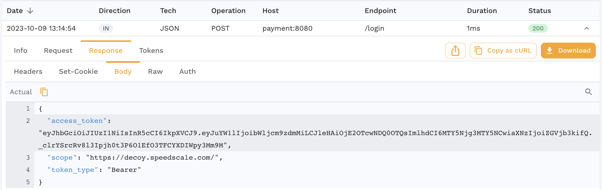
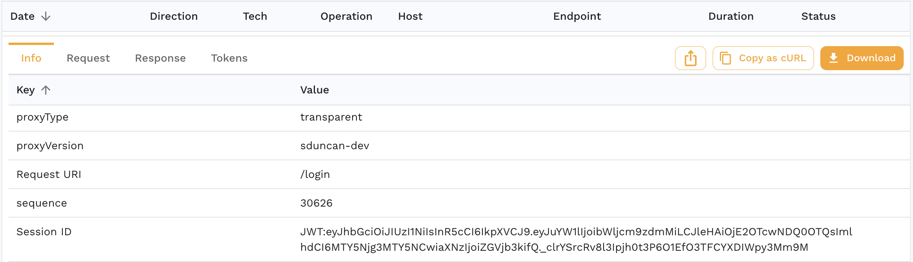
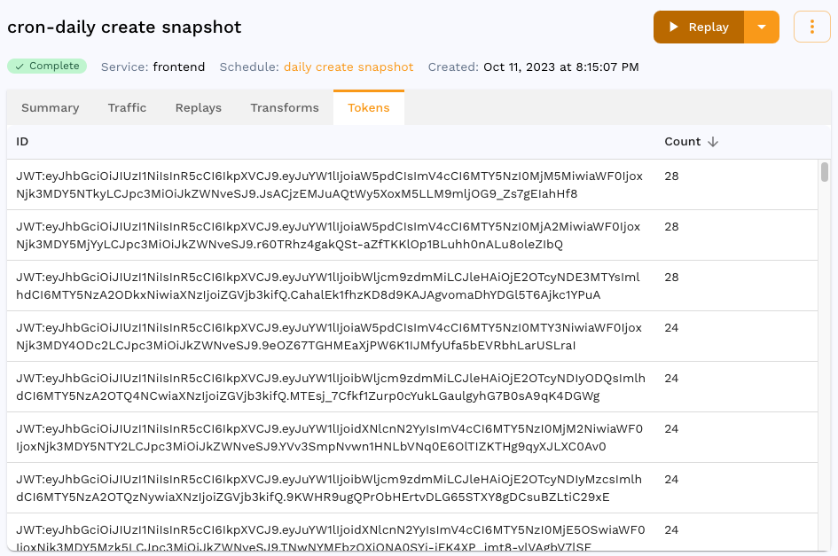

Front end applications and APIs typically have back and forth conversations that can be grouped into sessions.  Speedscale automatically tracks sessions for common patterns like OAuth2. If Speedscale detects a session it will assign a session ID to each RRPair involved in the conversation during capture for easy sorting/filtering. During replay, sessions are handled automatically.

## Session detection

In many cases, sessions are automatically detected and given a unique identifier matching some aspect of the traffic. As an example, consider an OAuth2 login. In the RRPair viewer you will see a JSON response from the server like this:

Now click on the `Info` tab on that same RRPair. You can tell that Speedscale detected this token because it populates the JWT as the session ID.

When a snapshot is created data about the sessions will be aggregated into a summary. The list of detected tokens/sessions can be viewed in the snapshot summary page under `Tokens`:

## Replay

During replay, Speedscale will automatically replace session IDs with their new value as returned by the server. When the load generator "logs in" it will expect the server to produce a new `access_token` response. Speedscale will detect and re-use that token wherever it is used in subsequent calls.
