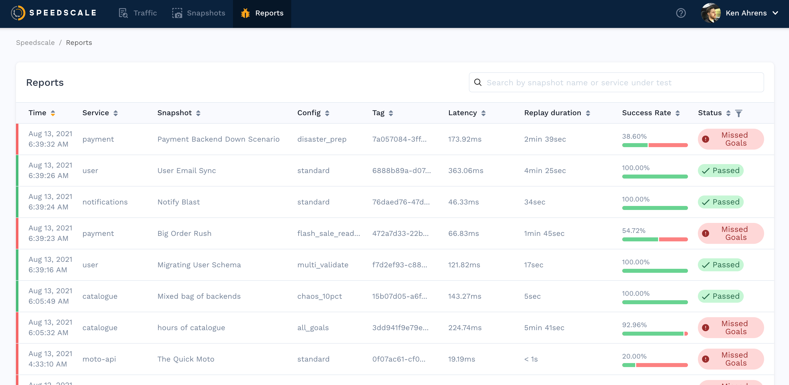

# Reports

Reports are an artifact of replays and a new report is created for every one.
After a replay is run the associated report will detail how successful the
replay was. Starting at the [reports page](https://app.speedscale.com/reports)
you can find reports sorted with the most recent at the top.

Use search to find a specific report:

Click into any report to see more detailed information.

