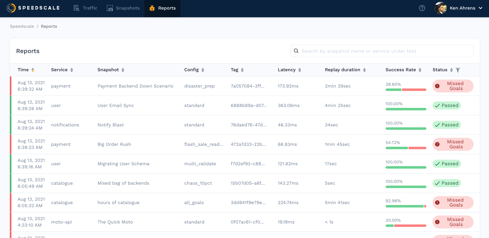
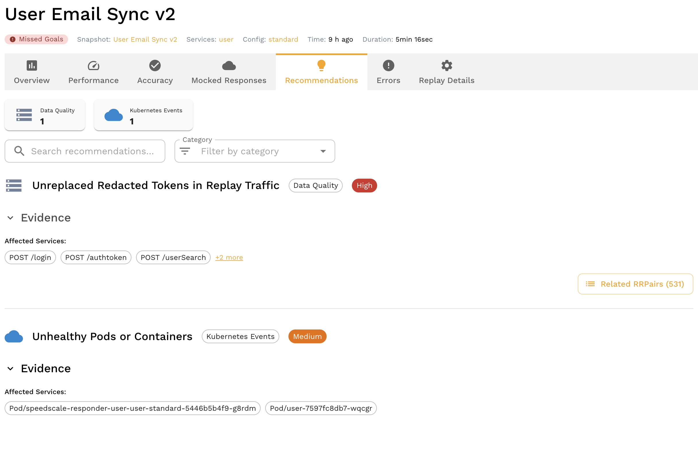

# Reports

Reports are an artifact of replays and a new report is created for every one.
After a replay is run the associated report will detail how successful the
replay was. Starting at the [reports page](https://app.speedscale.com/reports)
you can find reports sorted with the most recent at the top.

Use search to find a specific report:

Click into any report to see more detailed information.

## AI-Generated Summary

Each replay report includes an AI-generated summary at the top that highlights the most important findings. The summary provides a plain-language overview of what happened during the replay, calls out key failures or regressions, and suggests where to focus your attention. This is the fastest way to understand replay results without reading through every detail.

## Recommendations

The Recommendations panel surfaces automated insights about issues detected during the replay. Recommendations identify problems like memory growth, unreplaced tokens, latency regressions, error rate deviations, and more — along with suggested actions to fix them. See the [Traffic Recommendations guide](../recommendations.md) for a full reference of all recommendation types.

## Latency Percentiles

The performance section includes latency percentile graphs showing P50, P75, P90, P95, and P99 response times. These graphs help you understand the distribution of response times rather than just the average, making it easier to spot tail latency issues that affect a small percentage of requests.

## Throughput Timeslice Graphs

Throughput graphs show request volume over time during the replay, broken into timeslices. Use these to identify whether traffic was evenly distributed or whether there were bursts and gaps that might explain performance anomalies.

## Kubernetes Event Overlay

When replaying in a Kubernetes environment, the report can overlay cluster events (pod restarts, OOMKills, scheduling failures) on the performance timeline. This correlation makes it easy to see whether infrastructure issues coincided with performance regressions or errors during replay.

