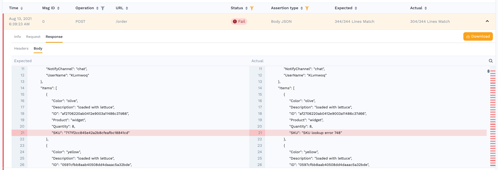

# Success Rate

Drill into the reasons for why this replay did not match the expected results.

The errors dashboard gives you a view into all the calls that were replayed against the service, and how they compared to the traffic snapshot. There are 3 high level KPIs that are tracked:

* **Response Rate** this helps confirm that the generator is able to send traffic to the service. If you have errors here it could be because the service was not ready or you have a misconfiguration in your clustuer.
* **Success Rate** how did the responses compare with the traffic snapshot? These comparisons are made automatically based upon your configuration.
* **Responder Matches** this is present if the responder was used during your traffic replay and is an indication if it was able to match the incoming calls.

Below that you can find a summary of failures by URL. Alternatively it may be interesting to understand what failure types happened in the environment regardless of URL.

And finally there is a list of every single assertion that was performed automatically. You can click on any one of these to see the actual and expected results.

If your application has an unexpectedly low success rate, or displays other unusual behavior, reach out on the Speedscale Slack [community](http://slack.speedscale.com) or via [email](mailto:support@speedscale.com). We will be happy to walk through your specific use case. The Speedscale team is working on a configuration UI but for now we're happier to do the work for you than to have you stumble through this complex topic. If you're feeling adventurous, you can jump over to [transforms](../../../reference/transform-traffic/README.md) to learn more.
